[TOC]

# unit 01-MySQL

数据库概述
----------

### 什么是数据库？

所谓的数据库就是指存储和管理数据的仓库

扩展内容1：数据库有哪些分类？(了解)

```
早期: 层次式数据库、网络型数据库
现在：关系型数据库、非关系型数据库
```

### 什么是关系型数据库？

底层以二维表的形式保存数据的库就是关系型数据库

stu-学生表

| 学生编号 | 姓名   | 年龄 |
|----------|--------|------|
| 1001     | 刘沛霞 | 35   |
| 1002     | 陈子枢 | 18   |

**扩展内容2：常见的关系型数据库有哪些？(了解)**

- Sql Server：微软提供，收费，适用于一些中型或大型的项目中，在java中的使用占比不高（.NET中使用的较多）

- Oracle：甲骨文公司提供，收费，适用于一些大型或者超大型的项目中，在java中的使用占比非常高


- mysql：瑞典MySQLAB公司提供，免费开源，适用于一些小型或者中型的项目中，在Java中的使用占比较高（小巧轻量）
  mariadb其实就是MySQL的一个分支，用法和MySQL完全一样。

- DB2：IBM公司提供，收费，在一些银行、金融等行业中使用较多。在java中的使用占比也不高。


- Sqlite：迷你数据库，嵌入式设备中（安卓、苹果手机、pad）


### 数据库相关概念

**1、什么是数据库服务器**

数据库服务器就是一个软件（比如mysql软件）将数据库软件安装在电脑上，当前电脑就是一个数据库服务器。就可以对外提供存取数据的服务

在一个数据库服务器中可以创建多个数据库（dataBases），每一个数据库都是一个单独的仓库。

**2、什么是数据库**

数据库就是存储和管理数据的仓库，通常情况下，一个网站的中的所有数据会存放在一个数据库中。例如：

```
jd.com 				db_jd(数据库)
taobao.com 		db_taobao(数据库)
...
```

**3、什么是表**

一个数据库中可以创建多张表，每张表用于存储一类信息（数据库），例如：

jd.com中的用户数据		tb_user(表)

jd.com中的商品数据		tb_product(表)

jd.com中的订单数据		tb_order(表)

...

**4、什么表记录**·

一张表中可以包含多行表记录，每一行表记录用于存储某一个具体的数据

| 学生编号 | 姓名   | 年龄   |
|----------|--------|--------|
| 1001     | 刘沛霞 | 35     |
| 1002     | 陈子枢 | 18     |
| 。。。   | 。。。 | 。。。 |

### 什么是SQL语言？

SQL是一们用于操作关系型数据库的通用的语言（使用SQL可以操作所有的关系型数据库）

使用SQL可以操作数据库、表、表记录

(1)创建数据库、删除数据库、修改数据库、查询数据库

(2)创建表、删除表、修改表、查询表

(3)新增表记录、删除表记录、修改表记录、查询表记录

使用SQL也可以操作存储过程/视图/索引等。

提示：SQL是一个标准通用的操作关系型数据库的语言（普通话），每个数据库厂商为了增强自己数据库的功能，都提供了支持自己数据库的语言，称之为数据库的方言。方言不通用！

连接mysql服务器
---------------

通过命令行工具可以登录MySQL客户端，连接MySQL服务器，从而访问服务器中的数据。

**1、连接mysql服务器：**

```
mysql -uroot -p密码
```

**-u：**后面的root是用户名，这里使用的是超级管理员root；

**-p：(小写的p)**后面的root是密码，这是在安装MySQL时就已经指定的密码；

**2、连接mysql服务器并指定IP和端口**:

```
mysql -uroot -proot -h127.0.0.1 -P3306
```

**-h：**后面给出的127.0.0.1是服务器主机名或ip地址，可以省略的，默认连接本机；

**-P：(大写的P)**后面的3306是连接端口，可以省略，默认连接3306端口；

**3、退出客户端命令：quit或exit或 \\q**

**4、FAQ：常见问题:**

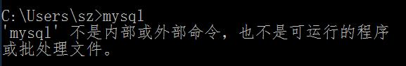

解决方法：复制mysql安装目录下的bin目录的路径，将bin目录的路径添加到path环境变量中!!

**扩展内容3：**

(1)在cmd中连接mysql服务器之后，可以使用 \#、/**/、-- 等符号添加注释，例如:

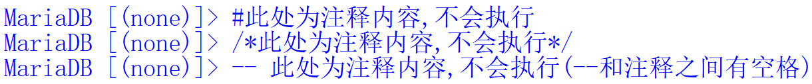

(2)在cmd中连接mysql服务器之后，在书写SQL语句时，可以通过 \\c 取消当前语句的执行。例如：


数据库及表操作
--------------

### 创建、删除、查看数据库

提示： (1)SQL语句对大小写不敏感。推荐关键字使用大写，自定义的名称（库名，表名，列名等）使用小写。

```sql
SHOW DATABASES; -- 查看当前数据库服务器中的所有库
CREATE DATABASE mydb1; -- 创建mydb1库
```

(2)并且在自定义名称时，针对多个单词不要使用驼峰命名，而是使用下划线连接。(例如：tab_name，而不是 tabName )

-- 01.查看mysql服务器中所有数据库

```sql
show databases;
```

-- 02.进入某一数据库（进入数据库后，才能操作库中的表和表记录）

-- 语法：USE 库名;

```sql
use test;
```

-- 查看已进入的库

```sql
SELECT DATABASE();
```

-- 03.查看当前数据库中的所有表

```sql
-- 先进入某一个库,再查看当前库中的所有表
show tables;
```

-- 04.删除mydb1库

-- 语法：DROP DATABASE 库名;

```sql
drop database mydb1;
```

`-- 思考：当删除的库不存在时，如何避免错误产生?`

```sql
drop database if exists mydb1;
```

-- 05.重新创建mydb1库，指定编码为utf8

-- 语法：CREATE DATABASE 库名 CHARSET 编码;

-- 需要注意的是，mysql中不支持横杠（-），所以utf-8要写成utf8；

```sql
-- 如果存在mydb1,则先删除,再重建
create database mydb1 charset utf8;
```

-- 如果不存在则创建mydb1;

```sql
create database if not exists mydb1 charset utf8;
```

-- 06.查看建库时的语句（并验证数据库库使用的编码）

-- 语法：SHOW CREATE DATABASE 库名;

```sql
show create database mydb1; -- 查看建库时的语句
show create table stu; -- 查看建表时的语句
```


### 创建、删除、查看表

-- 07.进入mydb1库，删除stu学生表(如果存在)

-- 语法：DROP TABLE 表名;

```sql
use mydb1;
drop table if exists stu;
```

-- 08.创建stu学生表（编号[数值类型]、姓名、性别、出生年月、考试成绩[浮点型]），建表的语法：

```sql
CREATE TABLE 表名(
	列名 数据类型,
	列名 数据类型,
	...
  列名 数据类型
);
```

SQL语句:

```sql
drop table if exists stu;
create table stu(
	id int primary key auto_increment, -- 将id设置为主键(唯一且不能为空),并且设置为自增
  name varchar(50),
  gender varchar(10),
  birthday date,
  score double
);
```

-- 09.查看stu学生表结构

-- 语法：desc 表名

```sql
desc stu;
```
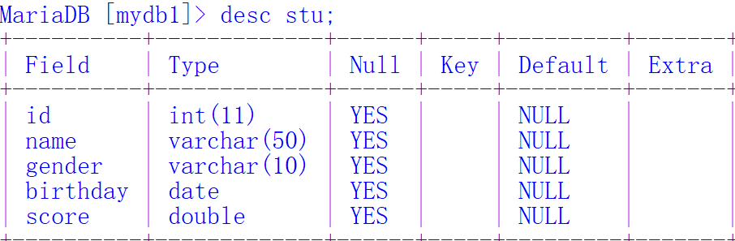

新增、更新、删除表记录
----------------------

-- 10.往学生表(stu)中插入记录(数据)

-- 语法：INSERT INTO 表名(列名1,列名2,列名3...) VALUES(值1,值2,值3...);

```sql
-- 如果是在cmd中执行插入记录的语句,先 set names gbk; 再插入记录!
insert into stu(id,name,gender,birthday,score) value (null,'tom','male','1985-1-1',78);
insert into stu value(null,'刘沛霞','female','1985-2-2',88);
insert into stu value(null,'陈子枢','male','1999-3-3',68);
```
提示：

```
(1)当为所有列插入值时，可以省写列名，但值的个数和顺序必须和声明时列的个数和顺序保持一致！
(2)SQL语句中的值为字符串或日期时，值的两边要加上单引号（有的版本的数据库双引号也可以，但推荐使用单引号）。
(3)(针对cmd窗口)在插入数据之前，先设置编码：set names gbk;
```

或者用一下命令连接mysql服务器：

`mysql --default-character-set=gbk -uroot -proot`

等价于：

`mysql -uroot -proot`

`set names gbk;`

-- 11.查询stu表所有学生的信息

-- 语法：SELECT 列名 | * FROM 表名

```sql
select * from stu;
```
-- 12.修改stu表中所有学生的成绩，加10分特长分

-- 修改语法: UPDATE 表名 SET 列=值,列=值,列=值...[WHERE子句];

```sql
update stu set score=score+10;
```
-- 13.修改stu表中编号为1的学生成绩，将成绩改为83分。

```sql
update stu set score=83 where id=1;
```
提示：where子句用于对记录进行筛选过滤，保留符合条件的记录，将不符合条件的记录剔除。

-- 14.删除stu表中所有的记录

-- 删除记录语法: DELETE FROM 表名 [where条件]

```sql
delete from stu;
```
-- 仅删除符合条件的

```sql
delete from stu where id>1;
```
查询表记录
----------

**-- 准备数据： 以下练习将使用db10库中的表及表记录，请先进入db10数据库!!!**

### 基础查询

SELECT 语句用于从表中选取数据。结果被存储在一个结果表中（称为结果集）。

语法：SELECT 列名称 | * FROM 表名

提示：(1) *（星号）为通配符，表示查询所有列。

(2)但使用 *（星号）有时会把不必要的列也查出来了，并且效率不如直接指定列名

-- 15.查询emp表中的所有员工，显示姓名，薪资，奖金

```sql
select name,sal,bonus from emp;
```
-- 16.查询emp表中的所有部门和职位
```sql
select dept,job from emp;
```
思考：如果查询的结果中，存在大量重复的记录，如何剔除重复记录，只保留一条？ */

-- 在select之后、列名之前，使用DISTINCT 剔除重复的记录

```sql
select distinct dept,job from emp;
```
### WHERE子句查询

WHERE子句查询语法：SELECT 列名称 | * FROM 表名称 WHERE 列 运算符 值

WHERE子句后面跟的是条件，条件可以有多个，多个条件之间用连接词（or | and）进行连接

下面的运算符可在 WHERE 子句中使用：

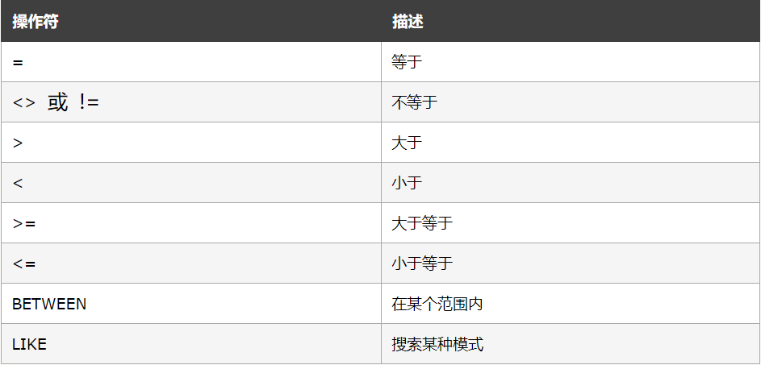

-- 17.查询emp表中薪资大于3000的所有员工，显示员工姓名、薪资

```sql
select name,sal from emp 
where sal>3000;
```
-- 18.查询emp表中总薪资(薪资+奖金)大于3500的所有员工，显示员工姓名、总薪资

```sql
select name,sal+bonus from emp
where sal+bonus > 3500; -- 结果是错误的!
```
-- ifnull(列, 值)函数: 判断指定的列是否包含null值，如果有null值，用第二个值替换null值

```sql
select name,ifnull(sal,0)+ifnull(bonus,0) from emp
where ifnull(sal,0)+ifnull(bonus,0) > 3500;
```
-- 注意查看上面查询结果中的表头，如何将表头中的 sal+bonus 修改为 "总薪资"

-- 使用as可以为表头指定别名

```sql
select name as 姓名,ifnull(sal,0)+ifnull(bonus,0) as 总薪资 from emp
where ifnull(sal,0)+ifnull(bonus,0) > 3500;
```
-- 另外as可以省略

```sql
select name 姓名,ifnull(sal,0)+ifnull(bonus,0) 总薪资 from emp
where ifnull(sal,0)+ifnull(bonus,0) > 3500;
```
-- 19.查询emp表中薪资在3000和4500之间的员工，显示员工姓名和薪资

```sql
select name,sal from emp
where sal>=3000 and sal<=4500;
```
-- 提示: between...and... 在...之间

```sql
select name,sal from emp
where sal between 3000 and 4500;
```
-- 20.查询emp表中薪资为 1400、1600、1800的员工，显示员工姓名和薪资

```sql
select name,sal from emp
where sal=1400 or sal=1600 or sal=1800;
```
-- 或者

```sql
select name,sal from emp
where sal in(1400,1600,1800);
```

-- 21.查询薪资不为1400、1600、1800的员工

方式一:
```sql
select name,sal from emp
where not(sal=1400 or sal=1600 or sal=1800);
```
方式二:
```sql
select name,sal from emp
where sal!=1400 and sal!=1600 and sal!=1800;
```
方式三:
```sql
select name,sal from emp
where sal not in(1400,1600,1800);
```
-- 22.(自己完成) 查询emp表中薪资大于4000和薪资小于2000的员工，显示员工姓名、薪资。

```sql
select name,sal from emp
where sal>4000 or sal<2000;
```
-- 23.(自己完成) 查询emp表中薪资大于3000并且奖金小于600的员工，显示员工姓名、薪资、奖金。

```sql
select name,sal,bonus from emp
where sal>3000 and bonus<600;
```
-- 处理null值
```sql
select name,sal,ifnull(bonus,0) from emp
where sal>3000 and ifnull(bonus,0)<600;
```
-- 24.查询没有部门的员工（即部门列为null值）

```sql
select * from emp where dept is null;
```
-- 思考：如何查询有部门的员工（即部门列不为null值）
```sql
select * from emp where dept is not null;
```
### 模糊查询

LIKE 操作符用于在 WHERE 子句中搜索列中的指定模式。

可以和通配符（%、\_）配合使用，其中"%"表示0或多个任意的字符。"_"表示一个任意的字符。

语法：SELECT 列 | * FROM 表名 WHERE 列名 LIKE 值

示例：

-- 25.查询emp表中姓名中包含"涛"字的员工，显示员工姓名。

```sql
select name from emp
where name like '%涛%';
select name from emp
where name like '%王%';
```
-- 26.查询emp表中姓名中以"刘"字开头的员工，显示员工姓名。

```sql
select name from emp
where name like '刘%'; -- 查询以'刘'开头的

select name from emp
where name like '%涛'; -- 查询以'涛'结尾的
```
-- 27.查询emp表中姓名以"刘"开头，并且姓名为两个字的员工，显示员工姓名。

```sql
select name from emp
where name like '刘_'; -- 以"刘"开头，并且姓名为两个字
select name from emp
where name like '刘__'; -- 以"刘"开头，并且姓名为三个字
```
### 多行函数查询

多行函数也叫做聚合(聚集)函数，根据某一列或所有列进行统计。

常见的多行函数有：

| 多行函数           | 作用                             |
| ------------------ | -------------------------------- |
| COUNT( 列名 \| * ) | 统计结果集中指定列的记录的行数。 |
| MAX( 列名 )        | 统计结果集中某一列值中的最大值   |
| MIN( 列名 )        | 统计结果集中某一列值中的最小值   |
| SUM( 列名 )        | 统计结果集中某一列所有值的和     |
| AVG( 列名 )        | 统计结果集中某一列值的平均值     |

提示：(1)多行函数不能用在where子句中

(2)多行函数和是否分组有关，分组与否会直接影响多行函数的执行结果。

(3)多行函数在统计时会对null进行过滤，直接将null丢弃，不参与统计。

-- 28.统计emp表中薪资大于3000的员工个数

```sql
select count(*) from emp where sal>3000;
select count(id) from emp where sal>3000;
```
-- 29.求emp表中的最高薪资

```sql
select sal from emp; -- 查询emp表中的所有薪资
select max(sal) from emp; -- 统计emp表中的最高薪资
select min(sal) from emp; -- 统计emp表中的最低薪资
```
-- 30.统计emp表中所有员工的薪资总和(不包含奖金)

```sql
select sum(sal) from emp; -- 统计sal这一列中的所有值的和
select sum(bonus) from emp; -- 统计bonus这一列中的所有值的和

select sum(sal)+sum(bonus) from emp; -- 统计 薪资总和+奖金总和
select sum(sal+bonus) from emp; -- 因为bonus列中有null值,所以结果有误差
select sum(sal+ifnull(bonus,0)) from emp; -- 处理null值,结果正确
```
-- 31.统计emp表员工的平均薪资(不包含奖金)

```sql
select avg(sal) from emp;
```
**多行函数需要注意的问题:**

- 多行函数和是否分组有关，如果查询结果中的数据没有经过分组，默认整个查询结果是一个组，多行函数就会默认统计当前这一个组的数据。产生的结果只有一个。


- 如果查询结果中的数据经过分组（分的组不止一个），多行函数会根据分的组进行统计，有多少个组，就会统计出多少个结果。

select * from emp;


例如：统计CGB2003班的人数
```sql
select count(*) from emp;
```
结果返回的就是CGB2003班的所有人数

再例如：根据性别进行分组，再统计CGB2003每组的人数
```sql
select gender,count(*) from emp group by gender;
```
### 分组查询

GROUP BY 语句根据一个或多个列对结果集进行分组。

在分组的列上我们可以使用 COUNT，SUM，AVG，MAX，MIN等函数。

语法：SELECT 列 | * FROM 表名 [WHERE子句] GROUP BY 列;

-- 32.对emp表按照部门对员工进行分组，查看分组后效果。

```sql
select * from emp group by dept; -- 按照部门分组, 部门相同的是一组
```
-- 33.对emp表按照职位进行分组，并统计每个职位的人数，显示职位和对应人数

```sql
select * from emp group by job; -- 按照职位分组, 职位相同的是一组
select job,count(*) from emp group by job; -- 按照职位分组, 统计每个职位的人数
```
-- 34.对emp表按照部门进行分组，求每个部门的最高薪资(不包含奖金)，显示部门名称和最高薪资

```sql
select dept,max(sal) from emp group by dept;
```
### 排序查询

使用 ORDER BY 子句将结果集中记录根据指定的列排序后再返回

语法：SELECT 列名 FROM 表名 `ORDER BY 列名 [ASC|DESC]`

ASC(默认)升序，即从低到高；DESC 降序，即从高到低。

-- 35.对emp表中所有员工的薪资进行升序(从低到高)排序，显示员工姓名、薪资。

```sql
select name,sal from emp order by sal asc; -- 升序排序
select name,sal from emp order by sal; -- 默认是升序排序,因此asc可以省略
```
-- 36.对emp表中所有员工的奖金进行降序(从高到低)排序，显示员工姓名、奖金。

```sql
select name,bonus from emp order by bonus desc; -- 按照奖金降序排序

-- 按照奖金降序排序,如果奖金相同,则按照薪资升序排序
select name,bonus,sal from emp order by bonus desc, sal asc;
-- 按照奖金降序排序,如果奖金相同,则按照薪资奖金排序
select name,bonus,sal from emp order by bonus desc, sal desc;
```
### 分页查询

在mysql中，通过limit进行分页查询：

`limit (页码-1)*每页显示记录数, 每页显示记录数`

-- 37.查询emp表中的所有记录，分页显示：每页显示3条记录，返回第 1 页。

```sql
select * from emp limit 0,3; -- 每页显示3条, 查询第1页
select * from emp limit 3,3; -- 每页显示3条, 查询第2页
select * from emp limit 6,3; -- 每页显示3条, 查询第3页
```
-- 38.查询emp表中的所有记录，分页显示：每页显示3条记录，返回第 2 页。

```sql
select * from emp limit 3,3; -- 每页显示3条, 查询第2页
```
-- 补充练习：求emp表中薪资最高的前3名员工的信息，显示姓名和薪资

```sql
-- 按照薪资降序排序查询员工信息
select name,sal from emp order by sal desc;
-- 在上面查询的基础上分页查询,每页显示3条, 查询第1页
select name,sal from emp order by sal desc limit 0,3; 
```

### 其他函数

| 函数名               | 解释说明                                                     |
| -------------------- | ------------------------------------------------------------ |
| curdate()            | 获取当前日期，格式是：年月日                                 |
| curtime()            | 获取当前时间 ，格式是：时分秒                                |
| sysdate()/now()      | 获取当前日期+时间，格式是：年月日 时分秒                     |
| year(date)           | 返回date中的年份                                             |
| month(date)          | 返回date中的月份                                             |
| day(date)            | 返回date中的天数                                             |
| hour(date)           | 返回date中的小时                                             |
| minute(date)         | 返回date中的分钟                                             |
| second(date)         | 返回date中的秒                                               |
| CONCAT(s1,s2..)      | 将s1,s2 等多个字符串合并为一个字符串                         |
| CONCAT_WS(x,s1,s2..) | 同CONCAT(s1,s2,..)函数，但是每个字符串之间要加上x，x是分隔符 |

-- 39.查询emp表中所有在1993和1995年之间出生的员工，显示姓名、出生日期。

```sql
select name,birthday from emp
where birthday>='1993-1-1' and birthday<='1995-12-31';
-- 或 将birthday中的年份取出来, 和1993及1995进行比较!
select name,birthday from emp
where year(birthday)>=1993 and year(birthday)<=1995;
```
-- 40.查询emp表中下个月过生日的所有员工

```sql
select * from emp
where month(birthday)=month(now()); -- 查询本月过生日的员工
select * from emp
where month(birthday)=month(now())+1; -- 查询下个月过生日的员工
```
-- 41.查询emp表中员工的姓名和薪资（薪资格式为: xxx(元) ）

```sql
select name, sal from emp;
select name, concat(sal,'(元)') from emp;
```
-- 补充练习：查询emp表中员工的姓名和薪资（薪资格式为: xxx/元 ）

```sql
select name, concat_ws('/', sal, '元') from emp;
```

mysql的数据类型
---------------

### 数值类型

MySQL中支持多种整型，其实很大程度上是相同的，只是存储值的大小范围不同而已。

**tinyint**：占用1个字节，相对于java中的byte

**smallint**：占用2个字节，相对于java中的short

**int**：占用4个字节，相对于java中的int

**bigint**：占用8个字节，相对于java中的long

其次是浮点类型即：float和double类型

**float**：4字节单精度浮点类型，相对于java中的float

**double**：8字节双精度浮点类型，相对于java中的double

### 字符串类型

**1、char(n)** 定长字符串，最长255个字符。n表示字符数，例如：

-- 创建user表，指定用户名为char类型，字符长度不超过10

```sql
create table user(
    username char(10),
    ...
);
```
所谓的定长，是当插入的数据的长度小于指定的长度时，剩余的空间会用空格填充。（这样会浪费空间）  


**2、varchar(n)** 变长字符串，最长不超过65535个字节，n表示字符数，一般超过255个字符，会使用text类型，例如：

```
iso8859-1码表：一个字符占用1个字节，1*n <= 65535， n最多等于 65535
utf8码表：一个中文汉字占用3个字节，3*n<=65535，n最多等于 65535/3
GBK码表：一个中文汉字占用2个字节，2*n<65535，n最多等于 65535/2
```

-- 创建user表，指定用户名为varchar类型，长度不超过10

```sql
create table user(
	username varchar(10)
);
```
所谓的不定长，是当插入的数据的长度小于指定的长度时，剩余的空间可以留给别的数据使用。（节省空间）


**3、大文本（长文本）类型**

最长65535个字节，一般超过255个字符列的会使用text。

-- 创建user表：
```sql
create table user(
	resume text
);
```
另，text也分多种，其中bigtext存储数据的长度约为4GB。

**扩展内容3**：(面试题)char(n)、varchar(n)、text都可以表示字符串类型，其区别在于：

(1)char(n)在保存数据时，如果存入的字符串长度小于指定的长度n，后面会用空格补全，因此可能会造成空间浪费，但是char类型的存储速度较varchar和text快。

因此char类型适合存储长度固定的数据，这样就不会有空间浪费，存储效率比后两者还快！

(2)varchar(n)保存数据时，按数据的真实长度存储，剩余的空间可以留给别的数据用，因此varchar不会浪费空间。

因此varchar适合存储长度不固定的数据，这样不会有空间的浪费。

(3)text是大文本类型，一般文本长度超过255个字符，就会使用text类型存储。

### 日期类型

**date**：年月日

**time**：时分秒

**datetime**：年月日 时分秒

**timestamp**：时间戳(实际存储的是一个时间毫秒值)，与datetime存储日期格式相同。两者的区别是：

- timestamp最大表示2038年，而datetime范围是1000\~9999


- timestamp在插入数据、修改数据时，可以自动更新成系统当前时间(后面用到时再做讲解)

mysql的字段约束
---------------

字段约束/列约束 --> 约束: 限制

### 主键约束

主键约束：如果为一个列添加了主键约束，那么这个列就是主键，主键的特点是唯一且不能为空。

主键的作用: 作为一个唯一标识，唯一的表示一条表记录（作用类似于人的身份证号，可以唯一的表示一个人一样。）

添加主键约束，例如将id设置为主键：
```sql
create table stu(
	id int primary key,
	...
);
```

如果主键是数值类型，为了方便插入主键（并且保证插入数据时，主键不会因为重复而报错），可以设置一个主键自增策略。

主键自增策略是指：设置了自增策略的主键，可以在插入记录时，不给id赋值，只需要设置一个null值，数据库会自动为id分配一个值（AUTO_INCREMENT变量，默认从1开始，后面依次+1），这样既可以保证id是唯一的，也省去了设置id的麻烦。

将id主键设置为自增：

```sql
create table stu(
	id int primary key auto_increment,
	...
);
```

### 非空约束

非空约束：如果为一个列添加了非空约束，那么这个列的值就不能为空，但可以重复。

添加非空约束，例如为password添加非空约束：
```sql
create table user(
	password varchar(50) not null,
	...
);
```
### 唯一约束

唯一约束：如果为一个列添加了唯一约束，那么这个列的值就必须是唯一的（即不能重复），但可以为空。

添加唯一约束，例如为username添加唯一约束及非空约束：
```sql
create table user(
	username varchar(50) unique not null,
	...
);
```
### 外键约束

外键其实就是用于通知数据库两张表数据之间对应关系的这样一个列。

这样数据库就会帮我们维护两张表中数据之间的关系。

**(1) 创建表的同时添加外键**

```sql
create table emp(
	id int,
	name varchar(50),
	dept_id int,
	foreign key(dept_id) references dept(id)
);
```


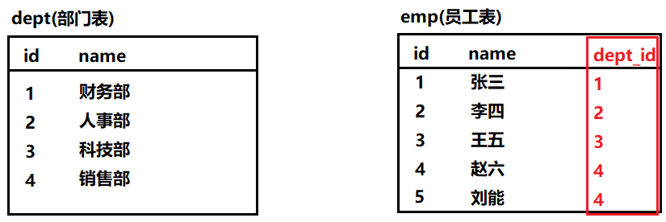

（1）如果是要表示两张表的数据之间存在对应关系，只需要在其中的一张表中添加一个列，保存另外一张表的主键，就可以保存两张表数据之间的关系。

但是添加的这个列（dept_id）对于数据库来说就是一个普通列，数据库不会知道两张表存在任何关系，因此数据库也不会帮我们维护这层关系。

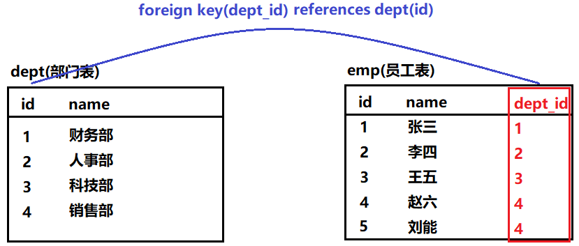

（2）如果将dept_id列设置为外键，等同于通知数据库，部门表和员工表之间存在对应关系，dept_id列中的数据要参考部门的主键，数据库一旦知道部门和员工表之间存在关系，就会帮我们维护这层关系。

思考：如果在创建表时没有指定外键，那么后期该如何指定外键？以及如何删除外键？

表关系
------

**常见的表关系分为以下三种：**

一对多(多对一)、一对一、多对多

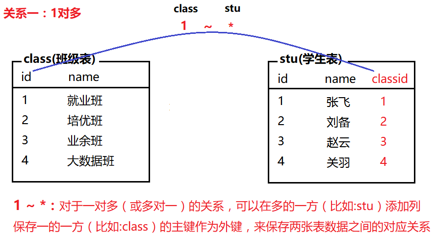

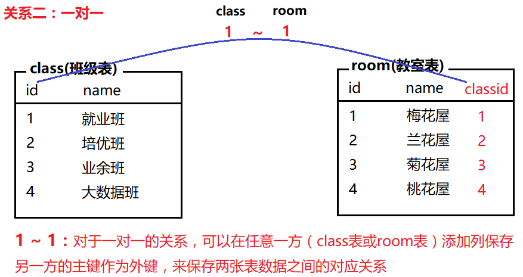

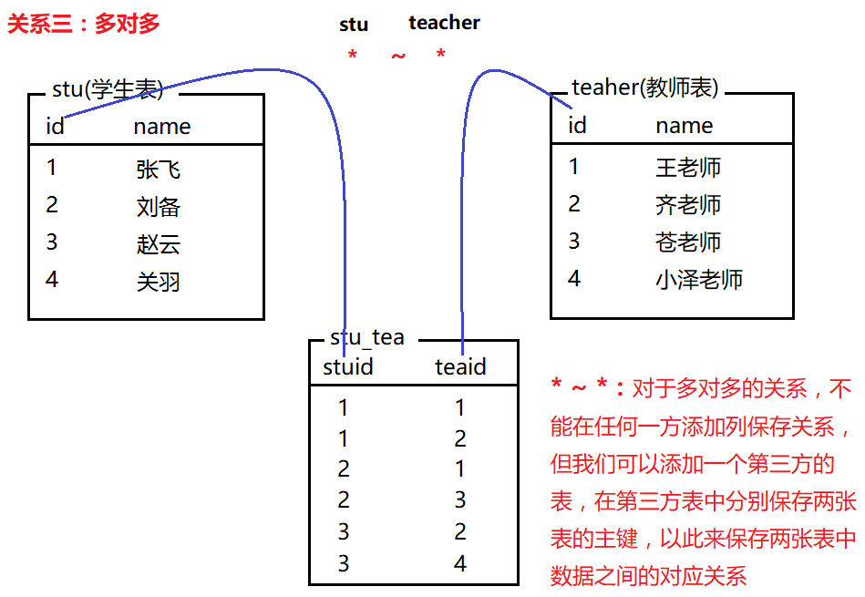

多表查询
--------

**-- 准备数据： 以下练习将使用db30库中的表及表记录，请先进入db30数据库!!!**

### 连接查询

-- 42.查询部门和部门对应的员工信息

```sql
select * from dept,emp;
```
上面的查询中存在大量错误的数据，一般我们不会直接使用这种查询。

笛卡尔积查询：所谓笛卡尔积查询就是指，查询两张表，其中一张表有m条记录，另一张表有n条记录，查询的结果是m*n条。

虽然笛卡尔积查询中包含大量错误数据，但我们可以通过where子句将错误数据剔除，保留下来的就是正确数据。
```sql
-- 条件: 员工所属的部门编号等于部门的编号
select * from dept,emp 
where emp.dept_id=dept.id;
```
通过where子句将笛卡尔积查询中的错误数据剔除,保留正确的数据,这就是连接查询!

上面的查询可以换成下面的查询：

```sql
select * from dept inner join emp 
on emp.dept_id=dept.id; -- 内连接查询
```

### 左外连接查询

-- 43.查询**所有部门**和部门下的员工，如果部门下没有员工，员工显示为null

```sql
select * from dept left join emp 
on emp.dept_id=dept.id; -- 左外连接查询
```
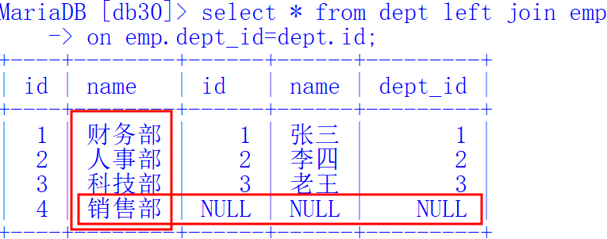

左外连接查询：可以将左边表中的所有记录都查询出来，右边表只显示和左边相对应的数据，如果左边表中某些记录在右边没有对应的数据，右边显示为null即可。

### 右外连接查询

-- 44.查询部门和**所有员工**，如果员工没有所属部门，部门显示为null

```sql
select * from dept right join emp
on emp.dept_id=dept.id;
```
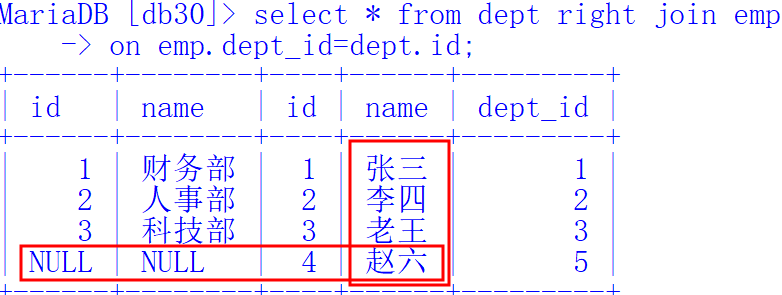

右外连接查询：可以将右边表中的所有记录都查询出来，左边表只显示和右边相对应的数据，如果右边表中某些记录在左边没有对应的数据，可以显示为null。

扩展：如果想将两张表中的所有数据都查询出来(左外+右外并去除重复记录)，可以使用全外连接查询，但是mysql又不支持全外连接查询。

```sql
select * from dept left join emp on emp.dept_id=dept.id
union
select * from dept right join emp on emp.dept_id=dept.id;
```

可以使用union将左外连接查询的结果和右外连接查询的结果合并在一起，并去除重复的记录。例如：

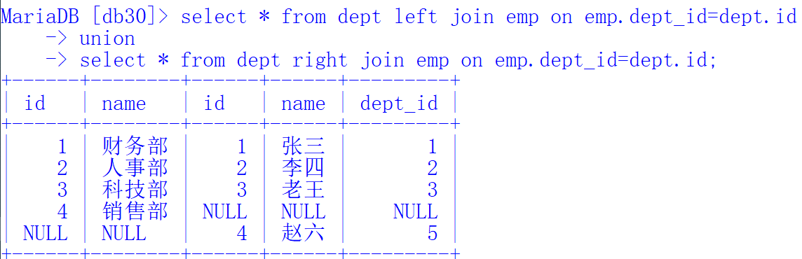

需要注意的是：union可以将两条SQL语句执行的结果合并有前提:

(1)两条SQL语句查询的结果列数必须一致

(2)两条SQL语句查询的结果列名、顺序也必须一致

并且union默认就会将两个查询中重复的记录去除(如果不希望去除重复记录，可以使用union all)

### 子查询练习

**-- 准备数据：以下练习将使用db40库中的表及表记录，请先进入db40数据库!!!**

-- 45.列出薪资比'王海涛'的薪资高的所有员工，显示姓名、薪资

```sql
-- 求出'王海涛'的薪资
select sal from emp where name='王海涛'; -- 2450
-- 列出比'王海涛'薪资还高的员工
select name,sal from emp 
where sal>(select sal from emp where name='王海涛');
```
-- 46.列出与'刘沛霞'从事相同职位的所有员工，显示姓名、职位。

```sql
-- 求出'刘沛霞'的职位
select job from emp where name='刘沛霞'; -- 推销员
-- 求出和'刘沛霞'从事相同职位的员工
select name,job from emp
where job=(select job from emp where name='刘沛霞');
```
-- 47.列出薪资比'大数据部'部门(已知部门编号为30)所有员工薪资都高的员工信息，显示员工姓名、薪资和部门名称。

如果不考虑没有部门的员工

```sql
-- 1、连接查询员工和部门
select e.name,e.sal,d.name from dept d,emp e
where e.dept_id=d.id;
-- 2、求出大数据部门的最高薪资(查询员工表中部门编号为30的最高薪资)
select max(sal) from emp where dept_id=30;
-- 3、求出比大数据部门最高薪资还高的员工信息
select e.name,e.sal,d.name from dept d,emp e
where e.dept_id=d.id 
	and sal>(select max(sal) from emp where dept_id=30);
```
如果加上没有部门的员工

```sql
-- 1、用外连接查询所有员工和对应的部门
select e.name,e.sal,d.name from dept d right join emp e
on e.dept_id=d.id;
-- 2、求出大数据部门的最高薪资
select max(sal) from emp where dept_id=30;
-- 3、求出比大数据部门最高薪资还高的员工信息
select e.name,e.sal,d.name from dept d right join emp e
on e.dept_id=d.id and
sal>3000;
```
### 多表查询练习

\-- 48.列出在'培优部'任职的员工，假定不知道'培优部'的部门编号，显示部门名称，员工名称。

```sql
-- 关联查询两张表
select d.name,e.name from dept d, emp e
where e.dept_id=d.id;
-- 求出在培优部的员工
select d.name,e.name from dept d, emp e
where e.dept_id=d.id and d.name='培优部';
```
-- 49.(自查询)列出所有员工及其直接上级，显示员工姓名、上级编号，上级姓名

```sql
/* emp e1 员工表, emp e2 上级表
 * 查询的表: emp e1, emp e2
 * 显示的列: e1.name, e2.id, e2.name
 * 连接条件: e1.topid=e2.id
 */
select e1.name, e2.id, e2.name
from emp e1, emp e2
where e1.topid=e2.id;
```
-- 50.列出最低薪资大于1500的各种职位，显示职位和该职位的最低薪资

```sql
-- 根据职位进行分组，求出每种职位的最低薪资
select job,min(sal) from emp group by job;
-- 求出最低薪资大于1500的职位
select job,min(sal) from emp where min(sal)>1500 group by job; -- 错误写法

select job,min(sal) from emp group by job having min(sal) > 1500; -- 正确
```
**补充内容：where和having子句的区别:**

```
(1)相同点: where和having都可以对记录进行筛选过滤。
(2)区别：where是在分组之前,对记录进行筛选过滤,并且where子句中不能使用多行函数以及列别名(但是可以使用表别名)
(3)区别：having是在分组之后,对记录进行筛选过滤,并且having子句中可以使用多行函数以及列别名、表别名。
```

-- 51.列出在每个部门就职的员工数量、平均工资。显示部门编号、员工数量，平均薪资。

```sql
-- 根据部门对员工进行分组, 统计每个组(部门)的人数和平均薪资
select dept_id, count(*), avg(sal) from emp group by dept_id;
```
-- 52.查出至少有一个员工的部门，显示部门编号、部门名称、部门位置、部门人数。

```sql
-- 连接查询部门表和员工表
select d.id,d.name,d.loc from emp e,dept d
where e.dept_id=d.id;
-- 按照部门进行分组,统计部门人数
select d.id,d.name,d.loc,count(*) from emp e,dept d
where e.dept_id=d.id 
group by d.id 
having count(*) >= 1;
```
-- 53.列出受雇日期早于直接上级的所有员工，显示员工编号、员工姓名、部门名称。

```sql
/* emp e1 员工表, emp e2 上级表, dept d 部门表
 * 显示的列: e1.id, e1.name, d.name
 * 查询的表: emp e1,emp e2,dept d
 * 连接条件: e1.topid=e2.id  e1.dept_id=d.id
 * 筛选条件: e1.hdate<e2.hdate
 */
select e1.id, e1.name, d.name
from emp e1,emp e2,dept d
where e1.topid=e2.id and e1.dept_id=d.id
	and e1.hdate<e2.hdate;
```
-- 补充：查询员工表中薪资最高的员工信息

```sql
select name, max(sal) from emp; -- 错误写法
select name,sal from emp order by sal desc limit 0,1; -- 正确写法
-- 求出emp表中的最高薪资
select max(sal) from emp;
-- 根据最高薪资到emp表中查询, 该薪资对应的员工信息
select * from emp where sal=(select max(sal) from emp);
```

数据库备份与恢复
----------------

### 备份数据库

在cmd窗口中(未登录的状态下)，可以通过如下命令对指定的数据库进行备份：

`mysqldump -u用户名 -p 数据库的名字 > 备份文件的位置`

示例1: 对`db40`库中的数据(表，表记录)进行备份，备份到 `d:/db40.sql`文件中

`mysqldump -uroot -p db40 > d:/db40.sql`

键入密码，如果没有提示，即表示备份成功！

也可以一次性备份所有库，例如：

对mysql服务器中所有的数据库进行备份，备份到 d:/all.sql文件中

`mysqldump -uroot -p --all-database > d:/all.sql`

键入密码，如果没有提示错误(警告信息不是错误，可以忽略)，即表示备份成功！

### 恢复数据库

**1、恢复数据库方式一：**

在cmd窗口中(未登录的状态下)，可以通过如下命令对指定的数据库进行恢复：

`mysql -u用户名 -p 数据库的名字 < 备份文件的位置`

示例：将d:/db40.sql文件中的数据恢复到db60库中

-- 在cmd窗口中（已登录的状态下），先创建db60库：

```sql
create database db60 charset utf8;
```

-- 在cmd窗口中（未登录的状态下）

`mysql -uroot -p db60 < d:/db40.sql`


**2、恢复数据库方式二：**

在cmd窗口中(已登录的状态下)，可以通过source执行指定位置的SQL文件：

`source sql文件的位置`

示例：将d:/db40.sql文件中的数据恢复到db80库中

-- 在cmd窗口中（已登录的状态下），先创建db80库，进入db80库：

```sql
create database db80 charset utf8;
use db80;
```

-- 再通过source执行指定位置下的sql文件：

```sql
source d:/db40.sql
```

Navicat软件的使用
-----------------

Navicat Premium是一套带图形用户界面的数据库管理工具，让你从单一应用程序中同时连接MySQL、MariaDB、MongoDB、SQL Server、Oracle、PostgreSQL 和 SQLite数据库。使用Navicat可以快速、轻松地创建、管理和维护数据库。

```
1、使用navicat连接mysql服务器（使用cmd连接mysql服务器）
2、查看所有库、进入数据库、创建数据库、删除数据库、修改数据库
3、创建表、查看表、修改表、删除表
4、新增表记录、查询表记录、修改表记录、删除表记录
5、使用navicat书写SQL语句操作数据库、表和表记录
...
```

哔哩哔哩视频链接：https://www.bilibili.com/video/BV1yA41147Vi/


扩展内容
--------

现创建学生表：

```
use test; -- 进入test库
drop table if exists stu; -- 删除学生表(如果存在)
create table stu( -- 创建学生表
    id int, -- 学生id
    name varchar(20), -- 学生姓名
    gender char(1), -- 学生性别
    birthday date -- 出生年月
);
```

### 修改表—新增列

语法：ALTER TABLE tabname ADD col_name datatype [DEFAULT expr][,ADD col_name datatype...];

1、往stu表中添加score列，double类型

```sql
alter table stu add score double;
```

### 修改表—修改列

语法：ALTER TABLE tabname MODIFY (col_name datatype [DEFAULT expr][,MODIFY
col_name datatype]...);

1、修改id列，将id设置为主键
```sql
alter table stu modify id int primary key;
```
2、修改id列，将id主键设置为自动增长
```sql
alter table stu modify id int auto_increment;
```
### 修改表—删除列

语法：ALTER TABLE tabname DROP [COLUMN] col_name;

1、删除stu表中的score列
```sql
alter table stu drop score;
```
### 添加或删除主键及自增

思考：a) 在建表时，如何为id指定主键约束和自增?

b) 建好的表，如何通过修改添加主键约束和自增?

c) 如何删除表中的主键约束和自增?

1、创建stu学生表，不添加主键自增, 查看表结果
```sql
use mydb1; -- 切换到mydb1库
drop table if exists stu; -- 删除stu学生表(如果存在)
create table stu( -- 重建stu学生表，没有主键自增
    id int,
    name varchar(20),
    gender char(1),
    birthday date
);
desc stu; -- 查看表结构
```
表结构如下: 没有主键约束和自增。

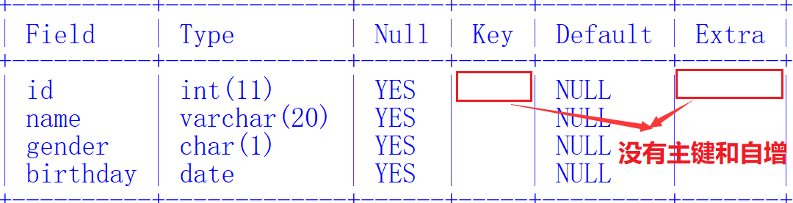

2、如果表没有创建，或者要删除重建，在创建时可以指定主键或主键自增
```sql
drop table if exists stu; -- 删除stu表
create table stu( -- 重新创建stu表时，指定主键自增
    id int primary key auto_increment,
    name varchar(20),
    gender char(1),
    birthday date
);
desc stu; -- 查看表结构
```
表结构如下: 已经添加了主键约束和自增。

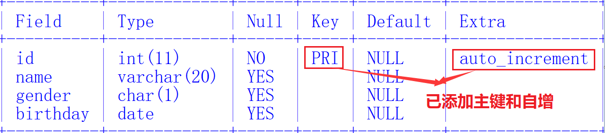

3、如果不想删除重建表，也可以通过修改表添加主键或主键自增

再次执行第1步，创建stu学生表，不添加主键自增，查看表结果

-- 例如: 将stu学生表中的id设置为主键和自动增长
```sql
alter table stu modify id int primary key auto_increment;
desc stu; -- 查看表结构
```


如果只添加主键约束，不设置自增
```sql
alter table stu modify id int **primary key**;
```
如果已经添加主键约束，仅仅设置自增，但需注意:

(1)如果没有设置主键，不可添加自增

(2)只有当主键是数值时，才可以添加自增
```sql
alter table stu modify id int **auto_increment**;
```
4、如果想删除主键自增

-- 删除主键自增时，要先删除自增
```sql
alter table stu modify id int;
```
-- 再删除主键约束
```sql
alter table stu drop primary key;
desc stu; -- 查看表结构
```


### 添加外键约束

**1、添加外键方式一：建表时添加外键**

现有部门表如下：

-- 创建部门表
```sql
create table dept(
	id int primary key auto_increment, -- 部门编号
	name varchar(20) -- 部门名称
);
```
要求创建员工表，并在员工表中添加外键关联部门主键

-- 创建员工表
```sql
create table emp(
    id int primary key auto_increment, -- 员工编号
    name varchar(20), -- 员工姓名
    dept_id int, -- 部门编号
    foreign key(dept_id) references dept(id) -- 指定dept_id为外键
);
```
**2、添加外键方式二：建表后添加外键**

现有部门表和员工表：

-- 创建部门表
```sql
create table dept(
    id int primary key auto_increment, -- 部门编号
    name varchar(20) -- 部门名称
);
```
-- 创建员工表
```sql
create table emp(
    id int primary key auto_increment, -- 员工编号
    name varchar(20), -- 员工姓名
    dept_id int -- 部门编号
);
```
-- 如果表已存在，可以使用下面这种方式：
```sql
alter table emp add constraint fk_dept_id foreign key(dept_id) references dept(id);
```
其中 **fk_dept_id** (名字由自己定义)，是指外键约束名称，也可以将【constraint fk_dept_id】省略，MySQL会自动分配一个外键名称，将来可以通过该名称删除外键。

foreign key(dept_id)中的dept_id为外键

### 删除外键约束

1、首先通过 “show create table 表名”语法，查询含有外键表的建表语句，例如：
```sql
show create table emp;
```
显示结果如下：

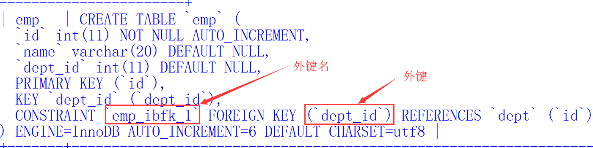

其中，emp_ibfk_1是在创建表时，数据库为外键约束指定的一个名字，删除这个名字即可删除外键关系，例如：
```sql
alter table emp drop foreign key emp_ibfk_1;
```
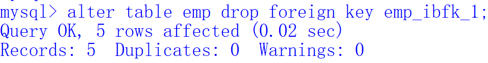

外键删除成功！

### 添加外键约束(多对多)

-- 现有学生(stu)表和教师(tea)表：

-- 创建学生表
```sql
create table stu(
    stu_id int primary key auto_increment, -- 学生编号
    name varchar(20) -- 学生姓名
);
```
-- 创建教师表
```sql
create table tea(
	tea_id int primary key auto_increment, -- 教师编号
	name varchar(20) -- 教师姓名
);
```
-- 添加第三方表(stu_tea)表示学生表和教师表关系

-- 创建学生和教师关系表
```sql
create table stu_tea(
    stu_id int, -- 学生编号
    tea_id int, -- 教师编号
    primary key(stu_id,tea_id), -- 设置联合主键
    foreign key(stu_id) references stu(stu_id), -- 添加外键
    foreign key(tea_id) references tea(tea_id) -- 添加外键
);
```
其中为了防止重复数据，将stu_id和tea_id设置为联合主键。

将stu_id设置为外键，参考stu表中的stu_id列

并将tea_id设置为外键，参考tea表中的tea_id列

### 级联更新、级联删除

-- 创建db20库、dept表、emp表并插入记录

-- 删除db20库(如果存在)，并重新创建db20库
```sql
drop database if exists db20;
create database db20 charset utf8;
use db20;
```
-- 创建部门表, 要求id, name字段
```sql
create table dept(
	id int primary key auto_increment, -- 部门编号
	name varchar(20) -- 部门名称
);
```
-- 往部门表中插入记录
```sql
insert into dept values(null, '财务部');
insert into dept values(null, '人事部');
insert into dept values(null, '科技部');
insert into dept values(null, '销售部');
```
-- 创建员工表, 要求id, name, dept_id
```sql
create table emp(
    id int primary key auto_increment, -- 员工编号
    name varchar(20), -- 员工姓名
    dept_id int, -- 部门编号
    foreign key(dept_id) references dept(id) -- 指定外键
    on update cascade -- 级联更新
    on delete cascade -- 级联删除
);
insert into emp values(null, '张三', 1);
insert into emp values(null, '李四', 2);
insert into emp values(null, '老王', 3);
insert into emp values(null, '赵六', 4);
insert into emp values(null, '刘能', 4);
```
级联更新：主表(dept表)中的主键发生更新时（例如将销售部的id改为40），从表（emp表）中的记录的外键数据也会跟着该表(即赵六和刘能的部门编号也会更新为40)

级联删除：如果不添加级联删除，当删除部门表中的某一个部门时（例如删除4号部门），若该部门在员工表中有对应的员工（赵六和刘能），删除会失败！

若果添加了级联删除，当删除部门表中的某一个部门时，若该部门在员工表中有对应的员工，会在删除部门的同时，将员工表中对应的员工也删除！

### where中不能使用列别名

SQL语句的书写顺序:
```sql
select * | 列名 -- 确定要查询的列有哪些
from 表名 -- 确定查询哪张表
where 条件 -- 通过筛选过滤，剔除不符合条件的记录
group by 分组的列 -- 指定根据哪一列进行分组
having 条件 -- 通过条件对分组后的数据进行筛选过滤
order by 排序的列 -- 指定根据哪一列进行排序
limit (countPage-1)*rowCount, rowCount -- 指定返回第几页记录以及每页显示多少条
```
SQL语句的执行顺序:
```sql
from 表名 -- 确定查询哪张表
where 条件 -- 通过筛选过滤，剔除不符合条件的记录
select * | 列名 列别名 -- 确定要查询的列有哪些，
group by 分组的列 -- 指定根据哪一列进行分组
having 条件 -- 通过条件对分组后的数据进行筛选过滤
order by 排序的列 -- 指定根据哪一列进行排序
limit (countPage-1)*rowCount, rowCount
```
**** 关于where中不能使用列别名但是可以使用表别名?**

是因为，表别名是声明在from中，from先于where执行，先声明再使用没有问题，但是列别名是声明在select中，where先于select执行，如果先使用列别名，再声明，这样执行会报错!!

## MySQL作业和总结

`04-28作业：`

1、将课堂上讲过的 第 01~24 题再过一遍！

2、完成 “day01.02-mysql作业.txt” 文件中的 第01~16题！

--------------

`04-29作业：`

1、将课堂上讲过的 第 25~44 题再过一遍！

2、完成 “day01.02-mysql作业.txt” 文件中的 第17~26题！

----

`04-30作业：`

1、将课堂上讲过的 第 45~53 题再过一遍！

2、完成 “day01.02-mysql作业.txt” 文件中的 第27~34题！

3、独立的完成JDBC的快速入门程序！

`04-28总结:`

1、数据库及相关的概念(数据库，关系型数据库，数据库服务器、数据库、表、表记录)

2、如何连接mysql服务器：

```
mysql -uroot -p密码
mysql -uroot -p密码 -h主机名或ip地址 -P端口
```

3、SQL语言：用于操作关系型数据库的通用的语言

4、如何查询所有数据库、创建数据库、删除数据库、进入数据库

5、如何查询所有表、创建表、删除表、修改表（扩展内容中有）

6、新增表记录、修改表记录、删除表记录

7、查询表记录（基础查询、where子句查询）

8、mysql的数据类型（数值、字符串、日期）、mysql的字段约束（主键、唯一、非空约束）

`04-29总结:`

9、查询表记录（模糊查询、多行函数查询、分组查询、排序查询、分页查询）

10、外键约束（什么是外键：用于通知数据库两张表之间的数据存在对应关系的列）

11、表关系（一对多、多对一、一对一、多对多）

12、多表查询（两张表连接查询、左外连接查询、右外连接查询、使用union模拟全外连接查询）

`04-30总结:`

13、多表查询练习（子查询、多表查询、自查询）

14、navicat软件的使用、数据库的备份和恢复

15、什么是Jdbc? 为什么要学习Jdbc? Jdbc快速入门案例

unit 02-JDBC
=============

JDBC概述
--------

### 什么是JDBC？为什么要学习JDBC？

JDBC(Java DataBase Connectivity) Java数据库连接

其实就是`利用Java语言/程序连接并访问数据库的一门技术`

之前我们可以通过CMD或者navicat等工具连接数据库

但在企业开发中，更多的是通过程序（Java程序）连接并访问数据库，通过Java程序访问数据库，就需要用到JDBC这门技术。

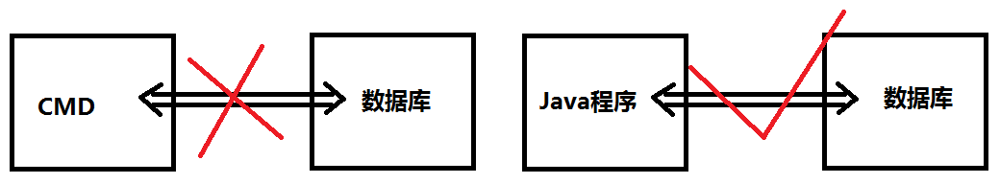


### 如何通过JDBC程序访问数据库?

**1、提出需求：**

创建一个 jt_db 数据库，在库中创建一个account表，并插入三条记录，然后利用Java程序查询出account表中所有的记录，并将查询的结果打印在控制台上。

**2、开发步骤:**

(1)准备数据, 创建jt_db库, 创建account表

```
drop database if exists jt_db;
create database jt_db charset utf8;
use jt_db;
create table account(
    id int primary key auto_increment,
    name varchar(50),
    money double
);
insert into account values(null, 'tom', 1000);
insert into account values(null, 'andy', 1000);
insert into account values(null, 'tony', 1000);
```

如果已经执行过课前资料中的"SQL脚本文件"，此步骤可以跳过。

(2)创建JAVA工程：

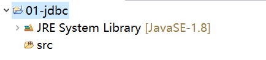

(3)导入jar包——mysql驱动包：

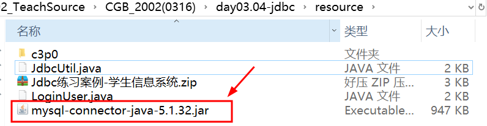

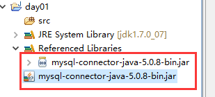

(4)创建类并实现JDBC程序(六个步骤)

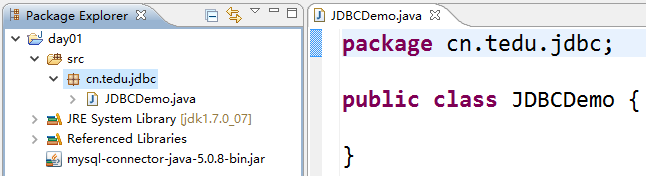

代码实现:

```java
public static void main(String[] args) throws Exception {
    //1.注册数据库驱动
    Class.forName("com.mysql.jdbc.Driver");
    //2.获取数据库连接
    Connection conn = DriverManager.getConnection(
        "jdbc:mysql://localhost:3306/jt_db?characterEncoding=utf-8",
        "root", "root");
    //3.获取传输器
    Statement stat = conn.createStatement();
    //4.发送SQL到服务器执行并返回执行结果
    String sql = "select * from account";
    ResultSet rs = stat.executeQuery( sql );
    //5.处理结果
    while( rs.next() ) {
        int id = rs.getInt("id");
        String name = rs.getString("name");
        double money = rs.getDouble("money");
        System.out.println(id+" : "+name+" : "+money);
    }
    //6.释放资源
    rs.close();
    stat.close();
    conn.close();
    System.out.println("TestJdbc.main()....");
}
```

**3、执行结果:**

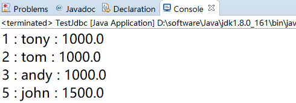

### JDBC API总结

**1、注册数据库驱动**

Class.forName("com.mysql.jdbc.Driver");

所谓的注册驱动，就是让JDBC程序加载mysql驱动程序，并管理驱动

驱动程序实现了JDBC API定义的接口以及和数据库服务器交互的功能，加载驱动是为了方便使用这些功能。

**2、获取连接之数据库URL**

```java
Connection conn = DriverManager.getConnection(
    "jdbc:mysql://localhost:3306/jt_db?characterEncoding=utf-8",
    "root", "root" );
```

DriverManager.getConnection() 用于获取数据连接，返回的Connection连接对象是JDBC程序连接数据库至关重要的一个对象。

**参数2**和**参数3**分别是所连接数据库的用户名和密码。

**参数1**："jdbc:mysql://localhost:3306/jt_db" 是连接数据库的URL，用于指定访问哪一个位置上的数据库服务器及服务器中的哪一个数据库，其写法为:

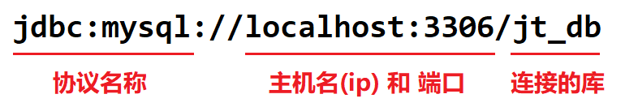

当连接本地数据库，并且端口为3306，可以简写为如下形式：

```
jdbc:mysql:///jt_db
```

**3、Statement传输器对象**

```
Statement stat = conn.createStatement();
该方法返回用于向数据库服务器发送sql语句的Statement传输器对象
```
该对象上提供了发送sql的方法：
```
executeQuery(String sql) --
用于向数据库发送查询类型的sql语句，返回一个ResultSet对象中
executeUpdate(String sql) --
用于向数据库发送更新(增加、删除、修改)类型的sql语句，返回一个int值，表示影响的记录行数
```

**4、ResultSet结果集对象**

ResultSet对象用于封装sql语句查询的结果，也是一个非常重要的对象。该对象上提供了遍历数据及获取数据的方法。

(1)遍历数据行的方法

next() – 使指向数据行的箭头向下移动一行，并返回一个布尔类型的结果，true表示箭头指向了一行数据，false表示箭头没有指向任何数据（后面也没有数据了）

(2)获取数据的方法

```java
getInt(int columnIndex)
getInt(String columnLable)
getString(int columnIndex)
getString(String columnLable)
getDouble(int columnIndex)
getDouble(String columnLable)
getObject(int columnIndex)
getObject(String columnLable)
```

**5、释放资源**

```java
rs.close();
stat.close();
conn.close();
```

此处释放资源必须按照一定的顺序释放，越晚获取的越先关闭。所以先关闭
rs对象，再关闭stat对象，最后关闭conn对象。

另，为了避免上面的程序抛出异常，释放资源的代码不会执行，应该把释放资源的代码放在finally块中.

```java
try{
	...
}catch(Exception e){
	...
}finally{
    if (rs != null) {
        try {
        	rs.close();
        } catch (SQLException e) {
            e.printStackTrace();
        } finally {
            rs = null;
        }
    }
    if (stat != null) {
        try {
        	stat.close();
        } catch (SQLException e) {
            e.printStackTrace();
        } finally {
            stat = null;
        }
    }
    if (conn != null) {
        try {
        	conn.close();
        } catch (SQLException e) {
            e.printStackTrace();
        } finally {
            conn = null;
        }
    }
}
```

增删改查
--------

**1、新增:往account表中添加一个名称为john、money为3500的记录**

```java
/* 1、新增:往account表中添加一个名称为john、money为3500的记录 */
@Test
public void testInsert() {
	Connection conn = null;
	Statement stat = null;
	ResultSet rs = null;
	try {
		//注册驱动并获取连接
		conn = JdbcUtil.getConn();
		//获取传输器
		stat = conn.createStatement();
		//发送sql语句到服务器执行,并返回执行结果
		String sql = "insert into account values(null, 'john', 3500)";
		int rows = stat.executeUpdate( sql );
		//处理结果
		System.out.println( "影响行数: "+rows );
	} catch (Exception e) {
		e.printStackTrace();
	} finally {
		//通过JdbcUtil工具类中的close方法释放资源
		JdbcUtil.close(conn, stat, rs);
	}
}
```

**2、修改:将account表中名称为john的记录，money修改为1500**

```java
/* 2、修改:将account表中名称为john的记录，money修改为1500 */
@Test
public void testUpdate() {
	Connection conn = null;
	Statement stat = null;
	ResultSet rs = null;
	try {
		//注册驱动并获取连接
		conn = JdbcUtil.getConn();
		//获取传输器
		stat = conn.createStatement();
		//发送sql语句到服务器执行,并返回执行结果
		String sql = "update account set money=1500 where name='john'";
		int rows = stat.executeUpdate( sql );
		//处理结果
		System.out.println( "影响行数: "+rows );
	} catch (Exception e) {
		e.printStackTrace();
	} finally {
		//通过JdbcUtil工具类中的close方法释放资源
		JdbcUtil.close(conn, stat, rs);
	}
}
```

**3、查询:查询account表中名称为john的记录**

```java
/* 3、查询:查询account表中id为1的记录 */
@Test
public void testFindById() {
	Connection conn = null;
	Statement stat = null;
	ResultSet rs = null;
	try {
		//注册驱动并获取连接
		conn = JdbcUtil.getConn();
		//获取传输器
		stat = conn.createStatement();
		//执行sql语句,返回执行结果
		String sql = "select * from account where id=1";
		rs = stat.executeQuery( sql );
		//处理结果
		if( rs.next() ) {
			int id = rs.getInt("id");
			String name = rs.getString("name");
			double money = rs.getDouble("money");
			System.out.println( id+" : "+name+" : "+money);
		}
	} catch (Exception e) {
		e.printStackTrace();
	} finally {
		JdbcUtil.close(conn, stat, rs);
	}
}
```

**4、删除:删除account表中名称为john的记录**

```java
/* 4、删除:删除account表中名称为john的记录 */
@Test
public void testDelete() {
	Connection conn = null;
	Statement stat = null;
	ResultSet rs = null;
	try {
		//注册驱动并获取连接
		conn = JdbcUtil.getConn();
		//获取传输器
		stat = conn.createStatement();
		//发送sql语句到服务器执行,并返回执行结果
		String sql = "delete from account where name='john'";
		int rows = stat.executeUpdate( sql );
		//处理结果
		System.out.println( "影响行数: "+rows );
	} catch (Exception e) {
		e.printStackTrace();
	} finally {
		//通过JdbcUtil工具类中的close方法释放资源
		JdbcUtil.close(conn, stat, rs);
	}
}
```

### 单元测试补充：

单元测试：不用创建新的类，也不用提供main函数，也不用创建类的实例，就可以直接执行一个方法

加了@Test注解的方法，可以通过单元测试（junit）框架测试该方法。底层会创建该方法所在类的实例，通过实例调用该方法。

```java
@Test
public void testInsert() {
	System.out.println("TestPreparedStatement.testInsert()");
}
```

能够使用@Test单元测试测试的方法必须满足如下几个条件:

```
(1)方法必须是公共的
(2)方法必须是非静态的
(3)方法必须是无返回值的
(4)方法必须是无参数的
(5)进行单元测试的方法或类，命名时不要命名为 Test/test
```

PreparedStatement
-----------------

在上面的增删改查的操作中，使用的是Statement传输器对象，而在开发中我们用的更多的传输器对象是PreparedStatement对象，PreparedStatement是Statement的子接口，比Statement更加安全，并且能够提高程序执行的效率。

Statement 父对象

PreparedStatement 子对象

### 模拟用户登录案例

(1)准备数据

```sql
use jt_db;
create table user(
    id int primary key auto_increment,
    username varchar(50),
    password varchar(50)
);
insert into user values(null,'张三','123');
insert into user values(null,'李四','234');
```

(2)创建LoginUser 类，提供 main 方法 和 login 方法。

```java
public static void main(String[] args) {
	/* 1、提示用户登录，提示用户输入用户名并接收用户名
	 *  2、提示用户输入密码并接收密码
	 *  3、根据用户名和密码查询用户信息
	 */
	// 1、提示用户登录，提示用户输入用户名并接收用户名
	Scanner sc = new Scanner(System.in);
	System.out.println( "请登录：" );
	System.out.println( "请输入用户名：" );
	String user = sc.nextLine();
	
	// 2、提示用户输入密码并接收密码
	System.out.println( "请输入密码：" );
	String pwd = sc.nextLine();
	
	// 3、根据用户名和密码查询用户信息
	login( user, pwd );
}
/**
 * 根据用户名和密码查询用户信息
 * @param user 用户名
 * @param pwd 密码
 */
private static void login(String user, String pwd) {
	Connection conn = null;
	Statement stat = null;
	ResultSet rs = null;
	try {
		//1.注册驱动并获取连接
		conn = JdbcUtil.getConn();
		//2.获取传输器，执行sql并返回执行结果
		stat = conn.createStatement();
		String sql = "select * from user where username='"+user+"' and password='"+pwd+"'";
		rs = stat.executeQuery(sql);
		System.out.println( sql );
		//3.处理结果
		if( rs.next() ) { //有数据 -- 用户名密码都正确
			System.out.println("恭喜您登录成功!");
		}else { //没数据 -- 用户名或密码不正确
			System.out.println("登录失败, 用户名或密码不正确!");
		}
	} catch (Exception e) {
		e.printStackTrace();
	} finally {
		//4.释放资源
		JdbcUtil.close(conn, stat, rs);
	}
}
```

**执行时，输入：**

```
请登录：
请输入用户名：
张飞'#'
请输入密码：

select * from user where username='张飞'#'' and password=''
恭喜您登录成功了!
```

**或输入**：

```
请登录：
请输入用户名：
张飞' or '1=1
请输入密码：

select * from user where username='张飞' or '1=1' and password=''
恭喜您登录成功了!
```

**或输入**：

```
请登录：
请输入用户名：

请输入密码：
' or '2=2
select * from user where username='' and password='' or '2=2'
恭喜您登录成功了!
```

### SQL注入攻击

通过上面的案例，我们发现在执行时，不输入密码只输入用户名也可以登陆成功。这就是SQL注入攻击。

SQL注入攻击产生的原因: 由于后台执行的SQL语句是拼接而来的：

```
select * from user where username='"+user+"' and password='"+pwd+"'
```

其中的参数是用户提交过来的，如果用户在提交参数时，在参数中掺杂了一些SQL关键字（比如or）或者特殊符号（#、-- 、' 等），就可能会导致SQL语句语义的变化，从而执行一些意外的操作（用户名或密码不正确也能登录成功）！

### 防止SQL注入攻击

如何防止SQL注入攻击？

(1)使用正则表达式对用户提交的参数进行校验。如果参数中有（# -- ' or等）这些符号就直接结束程序，通知用户输入的参数不合法

(2)使用PreparedStatement对象来替代Statement对象。

下面通过第二种方式解决SQL注入攻击：添加loginByPreparedSatement方法，在方法中，使用PreparedStatement来代替Statement作为传输器对象使用，代码示例：

```java
/**
 * 根据用户名和密码查询用户信息
 * @param user 用户名
 * @param pwd 密码
 */
private static void login(String user, String pwd) {
	Connection conn = null;
	PreparedStatement ps = null;
	ResultSet rs = null;
	try {
		//1.注册驱动并获取连接
		conn = JdbcUtil.getConn();
		//2.获取传输器，执行sql并返回执行结果
		String sql = "select * from user where username=? and password=?";
		ps = conn.prepareStatement( sql );
		//设置SQL语句中的参数
		ps.setString( 1 , user );
		ps.setString( 2 , pwd );
		//执行SQL语句
		rs = ps.executeQuery();//这里不要再传输SQL语句
		
		//3.处理结果
		if( rs.next() ) { //有数据 -- 用户名密码都正确
			System.out.println("恭喜您登录成功!");
		}else { //没数据 -- 用户名或密码不正确
			System.out.println("登录失败, 用户名或密码不正确!");
		}
	} catch (Exception e) {
		e.printStackTrace();
	} finally {
		//4.释放资源
		JdbcUtil.close(conn, ps, rs);
	}
}
```

再次执行程序，按照上面的操作登录。此时，已经成功的防止了SQL注入攻击问题了。

PreparedStatement对象是如何防止SQL注入攻击的：

使用PreparedStatement对象是先将SQL语句的骨架发送给服务器编译并确定下来，编译之后SQL语句的骨架和语义就不会再被改变了，再将SQL语句中的参数发送给服务器，即使参数中再包含SQL关键字或者特殊符号，也不会导致SQL语句的骨架或语义被改变，只会被当作普通的文本来处理！

--------------------------------------------------

使用PreparedStatement对象可以防止SQL注入攻击

而且通过方法设置参数更加的方便且不易出错!

还可以从某些方面提高程序执行的效率!


数据库连接池
------------

### 什么是连接池

池：指内存中的一片空间（容器，比如数组、集合）

连接池：就是将连接存放在容器中，供整个程序共享，可以实现连接的复用，减少连接创建和关闭的次数，从而提高程序执行的效率！


### 为什么要使用连接池

**1、传统方式操作数据库**

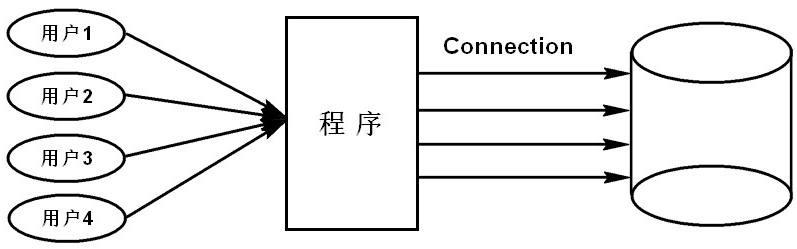

```
Connection conn = DriverManager.getConnection( url, user, pwd ); 
//创建连接对象
conn.close(); //关闭连接, 销毁连接
```

在传统方式中，每次用户需要连接访问数据库时，都是`创建一个连接`对象，基于这个连接对象访问数据库，用完连接后，会将`连接关闭`（conn.close）。

由于每次创建连接和关闭连接非常的耗时间而且耗资源，因此会导致程序执行的效率低下。

**2、使用连接池操作数据库**

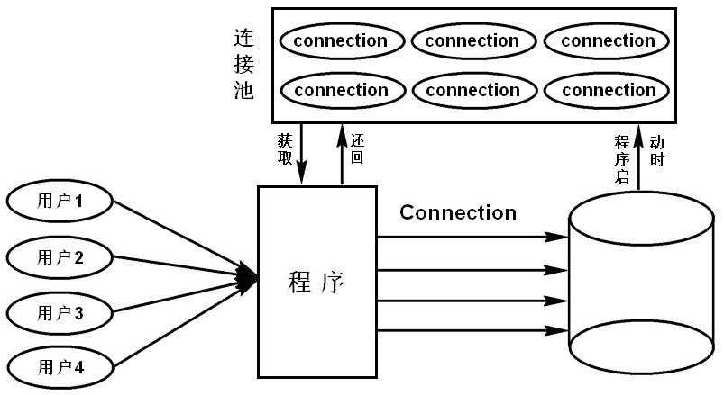

可以在程序一启动时，就创建一批连接放在一个连接池中（容器），当用户需要连接时，就从连接池中获取一个连接对象，用完连接后，不要关闭，而是将连接再还回连接池中，这样一来，用来用去都是池中的这一批连接，实现了连接的复用，减少了连接创建和关闭的次数，从而提高了程序执行的效率！

### 如何使用C3P0连接池

dbcp/c3p0/druid

使用C3P0连接池开发步骤：

**1、导入开发包**

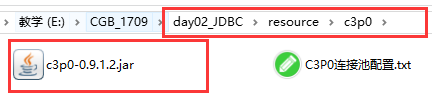

**2、创建数据库连接池(对象)**

```java
ComboPooledDataSource cpds = new ComboPooledDataSource();
```

**3、设置连接数据库的基本信息**

(1)方式一：(不推荐) 直接将参数通过 pool.setXxx方法设置给c3p0程序

这种方式直接将参数写死在了程序中，后期一旦参数发生变化，就要修改程序，要重新编译项目、重新发布项目，非常麻烦。

```java
//设置连接数据库的基本信息
pool.setDriverClass( "com.mysql.jdbc.Driver" );
pool.setJdbcUrl( "jdbc:mysql:///jt_db?characterEncoding=utf-8" );
pool.setUser( "root" );
pool.setPassword( "root" );
```

(2)方式二：将连接参数提取到properties文件中(推荐)

文件必须放在src(源码根目录)目录下 !

文件名必须叫做 c3p0.properties !

在类目录下(开发时可以放在src或者类似的源码目录下)，添加一个c3p0.properties文件，配置内容如下：

```properties
c3p0.driverClass=com.mysql.jdbc.Driver
c3p0.jdbcUrl=jdbc:mysql:///jt_db?characterEncoding=utf-8
c3p0.user=root
c3p0.password=root
```

这种方式由于是c3p0到指定的位置下寻找指定名称的properties文件，所以文件的位置必须是放在src或其他源码根目录下，文件名必须是c3p0.properties。

(3)方式三：将连接参数提取到xml文件中(推荐)

文件必须放在src(源码根目录)目录下 !

文件名必须叫做 c3p0-config.xml

在类目录下(开发时可以放在src或者类似的源码目录下)，添加一个c3p0-config.xml文件，配置内容如下：

```xml
<?xml version="1.0" encoding="UTF-8"?>
<c3p0-config>
    <default-config>
        <property name="driverClass">com.mysql.jdbc.Driver</property>
        <property
        name="jdbcUrl">jdbc:mysql:///jt_db?characterEncoding=utf-8</property>
        <property name="user">root</property>
        <property name="password">root</property>
    </default-config>
</c3p0-config>
```

这种方式由于是c3p0到指定的位置下寻找指定名称的xml文件，所以文件的位置必须是放在src或其他源码根目录下，文件名必须是c3p0-config.xml。

**4、从连接池中获取一个连接对象并进行使用**

```java
Connection conn = pool.getConnection();
```

**5、用完连接后将连接还回连接池中**

```java
JdbcUtil.close(conn, ps, rs);
//conn.close()
/* 如果是自己创建的连接对象，这个连接对象没有经过任何的改动，调用
* conn.close方法，是将连接对象关闭
* 如果是从连接池中获取的连接对象，该连接对象在返回时就已经被连接池
* 改造了，将连接对象的close方法改为了还连接到连接池中
*/
```

扩展:切换工作空间,修改默认编码
--------------------------------

### 切换新的工作空间，设置工作空间编码为utf-8

(1)切换到新的工作空间目的：若旧的工作空间内容过多，可能会导致eclipse不编译，甚至进入休眠状态。

(2)设置工作空间编码为utf-8，此后在当前工作空间下创建的项目编码也默认是utf-8。

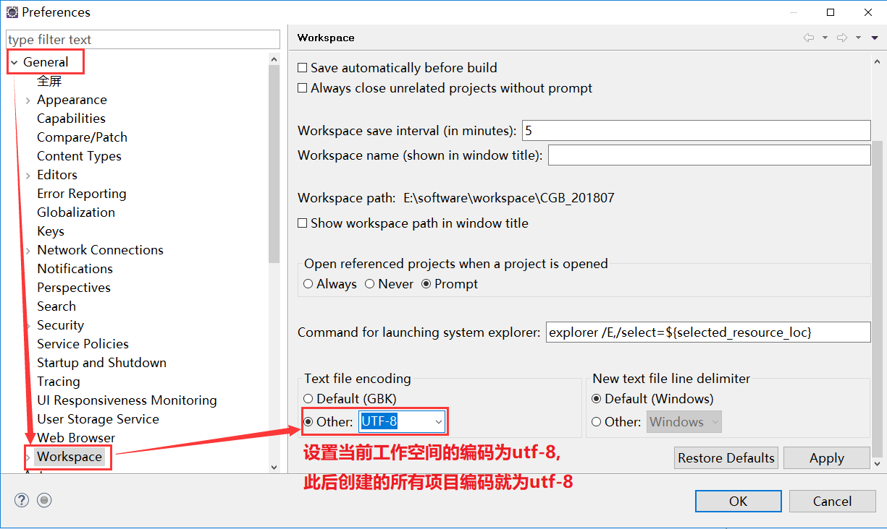

### 设置JSP文件的编码为utf-8

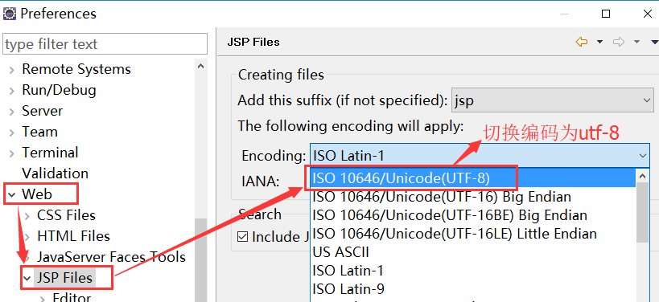

扩展:JDBC实现学生信息管理系统
------------------------------

B站视频链接：https://www.bilibili.com/video/BV1ka4y1x7M6

### 准备数据

建库建表语句如下：

```sql
-- 1、创建数据库jt_db数据库(如果不存在才创建)
create database if not exists jt_db charset utf8;
use jt_db; -- 选择jt_db数据库
-- 2、在 jt_db 库中创建 stu 表(学生表)
drop table if exists stu;
create table stu(
    id int,
    name varchar(50),
    gender char(2),
    addr varchar(50),
    score double
);
-- 3、往 stu 表中, 插入记录
insert into stu values(1001,'张三','男', '北京', 86);
```


### 功能实现

运行程序控制台提示如下：

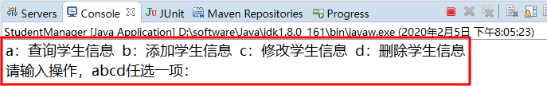

输入a：查询所有学生信息

输入b：添加学生信息

输入c：根据id修改学生信息

输入d：根据id删除学生信息

### 查询所有学生信息

在控制台中输入操作代码"a"，效果如下：

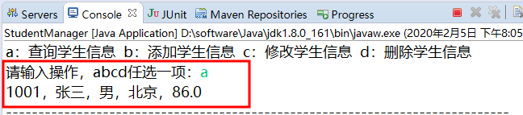

### 添加学生信息

在控制台中输入操作代码"b"，效果如下：

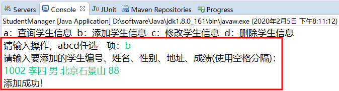

### 根据id修改学生信息

在控制台中输入操作代码"c"，效果如下：


### 根据id删除学生信息

在控制台中输入操作代码"d"，效果如下：

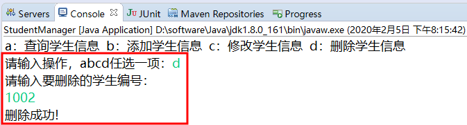

## Jdbc作业

`05-07作业：`

1、为什么要学习或使用JDBC?

2、JDBC开发程序的步骤（六步）

3、使用Statement对象完成对Account表的增删改查操作!

```
(1)新增:往account表中添加一个名称为john123、money为5500的记录
(2)查询:查询account表中名称为john123的记录
```

4、使用PreparedStatement对象完成对user表的增删改查操作!

```
(1)新增:往user表中添加一个username为赵云、password为123123的记录
(2)修改:将user表中username为赵云的记录，password修改为111
```

5、在上面第4题中加入c3p0，使用c3p0获取连接，用完连接后再将连接还回连接池中。

`05-07作业：`

1、新增:（使用c3p0）往account表中添加一个名称为john、money为2500的记录

2、查询:（使用c3p0）查询account表中名称为john的记录

3、什么是连接池? 为什么要使用连接池?

4、c3p0连接池的开发步骤?

5、完成“day03.04-jdbc作业”文件中的"JDBC练习题"（单选题+多选题）


unit 03-HTML、CSS
===============
HTML: 用于开发网页的一门技术

CSS: 用于修饰、渲染网页的一门技术

HTML+CSS可以开发一个非常美观、非常漂亮的网页

开发网页											  盖房子

HTML标签搭建网页的结构		 砖块(搭建房子的结构)

CSS属性												石灰、油漆等涂料

HTML概述
--------

### HTML是什么

HTML(Hyper Text Markup Language): 超文本标记语言

超文本: 超级文本、超过文本（其中可以包含除了文本以外的其他数据，例如图片、音频、视频等各种格式）

标记：也叫标签、元素、节点等，就是用尖括号(<>)括起来的一组内容，例如：

```
<head> <body> <div> <span> <table>等
```

HTML是最基础的开发网页的语言。

HTML由W3C组织提供(CSS/xml)

关于HTML的细节:

(1)使用HTML开发的网页文件通常以 .htm或.html 为后缀!

(2)使用HTML开发的网页文件由浏览器负责解析并显示（浏览器就是一个html解析器）

(3)HTML是文档的一种(txt/word/ppt/pdf等)

总结: HTML就是用于开发网页的一门语言!!

### HTML的结构

**1、案例：编写我的第一个HTML网页，并用浏览器打开**

新建一个txt文档，将后缀名改为.html，代码实现如下：

```html
<!DOCTYPE html>
<html>
	<head>
		<title>网页的标题</title>
	</head>
	<body>
    <h1>Hello CGB2003...</h1>
	</body>		
</html>
```

**2、HTML结构详解**

```
(1)<!DOCTYPE HTML> 文档声明, 用来声明HTML文档所遵循的HTML规范和版本
	上面是html5.0的声明, 也是目前最常用的版本
(2)<head></head> 头部分, 用来存放HTML文档的基本属性信息, 比如网页的标题, 文档使用的编码等, 这部分信息会被浏览器优先加载.
(3)<body></body> 体部分, 用来存放网页可视化数据. 即真正的网页数据
(4)<title></title> 声明网页的标题
(5)<meta charset="utf-8"/> 用来通知浏览器使用哪一个编码来打开HTML文档, 这个编码一定要和文件保存时的编码保持一致, 才不会出现中文乱码问题.
```


### HTML语法(了解)

**1、html标签**

标签：也叫做标记、元素等，标签分为开始标签，例如：

```html
<head>、<body>
```

和结束标签，例如: 

```html
</head>、</body>
```

开始标签和结束标签之间还可以包含其他内容。

```html
<head>
	<titile>声明网页的标题</title>
	<meta charset="utf-8"/>
</head>
```

有些标签开始标签和结束标签之间没有内容要包裹，通常可以写成自闭标签，例如：

```html
<meta/> <br/> <hr/> <input/> 等
```

**2、html属性**

在标签上可以声明属性(属性不能独立存在,必须声明在标签上)

```html
<div id="d1" class="c1" style="color:red;"></div>
```

标签上可以声明多个属性，多个属性之间用空格分隔

标签上的属性的值可以使用单引号或者双引号引起来

```html
<meta charset="UTF-8" id="m1"/>
<meta charset='UTF-8' id='m1'/>
```

**3、html注释**

格式: `<!-- 注释内容 -->`

注释的作用: (1)为代码添加解释说明

(2)将一些暂时不需要执行的代码注释

浏览器对于html注释中的内容不会解析，也不会显示！

**4、html空格和换行**

在浏览器中，多个连续的空白字符（空格、制表符tab、换行）会被浏览器显示为一个空格。那么：

如何在网页中做一个换行：可以使用 `<br/>` 标签做换行

如何在网页中做一个空格：可以使用`&nbsp;`或`&emsp;`做空格

补充: HTML中是不区分大小写的！

HTML中对语法要求非常不严格！（比如大小写混用，或者标签只有开始没有结束，或者标签的不合理嵌套），但是我们在书写HTML时要按照规范来写。

HTML标签
--------

### 图像标签

通过img标签可以在网页中插入一副图像

```html
<!-- 
	不推荐写带盘符的绝对路径,因为将来项目发布,位置会改变,到时还要修改图片的路径

 -->
<!-- 
	./: 表示当前目录(当前文件所在的目录),由于当前html在WebContent目录下
	因此 ./叫表示WebContent目录, 另外 ./ 可以省略!
	../: 表示当前目录的上一级目录里(也就是当前目录的父目录)
	../../: 表示当前目录的上一级目录的上一级目录(也就是当前目录的父目录的父目录)
 -->


```

其中src属性用于指定图片的路径（图片的路径不要是带盘符的绝对路径，推荐使用相对路径）

width属性用于指定图片的宽度

height属性用于指定图片的高度

### 超链接标签

超链接就是a标签，通过a标签可以在网页中创建指向另外一个文档的超链接

点击超链接可以跳转到另外一个网页(图片/下载路径等)，示例:

```html
<!-- 跳转到本地的一个网页 -->
<a href="01-第一个网页.html">01-第一个网页.html</a>
<!-- 跳转到百度首页 -->
<a href="http://www.baidu.com">百度一下，你就不知道</a>
<br/>
<!-- 点击图片跳转到tmooc -->
<a target="_blank" href="http://www.tmooc.cn">
	
</a>
```

其中 href 属性用于指定点击超链接后将要跳转到的URL地址

target属性用于指定以何种方式打开超链接

_self：默认值, 表示在当前窗口中打开超链接

_blank：表示在新的窗口中打开超链接

### 表格标签

**1.案例：在网页中插入一个3*3的表格**

```html
<h1>案例：在网页中插入一个3*3的表格</h1>
<table><!-- 用于在网页中定义一个表格 -->
    <tr><!-- 用于定义一个表格行 -->
        <th>表头1</th>
        <th>表头2</th>
        <th>表头3</th>
    </tr>
    <tr>
        <td>11</td><!-- 用于定义一个单元格 -->
        <td>12</td>
        <td>13</td>
    </tr>
    <tr>
        <td>21</td>
        <td>22</td>
        <td>23</td>
    </tr>
    <tr>
        <td>31</td>
        <td>32</td>
        <td>33</td>
    </tr>
</table>
```
**在浏览器中显示效果如下：**


**在head标签内添加如下内容：**

```html
<style>
    /* style标签内只能书写css注释和css代码 */
    table{
        border:*2px solid red; /* 为表格添加边框 */
        border-collapse: collapse; /* 设置边框合并 */
        background-color: pink; /* 为表格设置背景颜色 */
        width: 70%; /* 为表格设置宽度 */
        /* margin-left: 15%; */
        /* 设置表格的左外边距和右外边距自适应(保证两者始终相等) */
        margin-left: auto;
        margin-right: auto;
    }
    td,th{
        border:2px solid red; /* 为单元格添加边框 */
        border-collapse: *collapse*; /* 设置边框合并 */
        padding: 5px; /* 设置单元格边框和内容的距离(内边距) */
    }
    h1{
        /* border: 2px solid blue; */
        text-align: *center*; /* 设置元素中的内容水平居中 */
    }
</style>
```

**再次刷新浏览器显示效果为：**

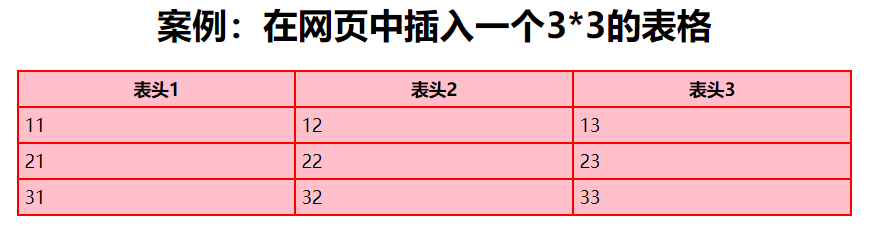

**2、表格标签介绍**

```
table -- 用于在网页中定义一个表格
tr -- 用于定义表格中的行
td -- 用于定义表格中的单元格
th -- 用于定义表头行中的单元格（th中的文本默认居中，并且加粗）
```

**3、练习：使用表格标签在网页中生成一个表格，如下图：**

要求如下:

```
(1) 表格内容如下图, 并设置表格边框
(2) 设置单元格之间没有缝隙, 并设置单元格边框和内容之间的距离为5px
(3) 设置表格的背景颜色为pink, 并设置表格的宽度为70%
(4) 设置表格在网页中居中显示, 并为表格添加表头以及标题
```

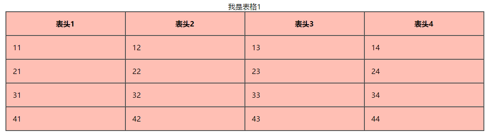

### 表单标签

**1、表单的作用: 用于向服务器提交数据**

向服务器提交数据的两种方式：

**(1)通过表单向服务器提交数据**

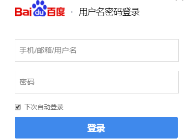

表单中可以包含表单项标签，在表单项中可以填写数据（比如用户名、密码等），填写完成后通过提交表单，可以将表单中的数据提交给相应的服务器。

**(2)通过超链接向服务器提交数据**

```html
http://www.baidu.com?username=张三&pwd=123&like=篮球

<a href="http://www.baidu.com?username=张三&pwd=123&like=篮球" target="_blank">百度一下,你就不知道!</a>
```

在地址栏URL地址的后面通过问号(?)可以拼接参数，参数可以有多个，多个参数之间用`&`分隔，参数还分为参数名（例如：username/pwd/like）以及参数值(例如:张三/123/篮球)，在回车后访问百度服务器的同时，就可以将问号后面拼接的参数一并带给百度服务器。

**2、表单标签**

```html
<form action="url地址" method="提交方式"></form>
```

其中action属性用于**指定表单的提交地址，**例如，将action指向百度服务器，就意味着将来填写完表单后，提交表单将会把表单中的数据提交给百度服务器。

method="GET/POST" 属性是用于**指定表单的提交方式**，常用的就是GET和POST提交。

### 表单项标签

1、`input`元素：

(1)普通文本输入框(比如:用户名/昵称/邮箱/验证码等)

```html
<input type="text" name="username"/>
```

(2)密码输入框(比如:密码/确认密码等)
```html
<input type="password" name="pwd"/>
```
(3)单选框(比如:性别/部门等)
```html
<input type="radio" name="gender"/>男
```
(4)复选框/多选框(比如:爱好/岗位等)
```html
<input type="checkbox" name="like"/>
```
(5)普通按钮(比如:换一张图片)
```html
<input type="button" value="换一张"/>
```
普通按钮本身没有功能,但我们可以通过js为按钮添加功能或添加行为

(6)提交按钮(比如:提交/注册/登录)
```html
<input type="submit" value="提交/注册/登录"/>
```
提交按钮用于提交表单中的数据到服务器中!

2、`select、option`标签：

```html
<select name="city">
    <option value="beijing">北京</option>
    <option value="shanghai">上海</option>
    <option selected="selected">广州</option>
    <option>深圳</option>
</select>
```
select用于定义一个下拉选框

option用于定义下拉选框上的选项

selected设置当前option选项默认被选中

3、`textarea`多行文本输入区域：

```html
<textarea name="description" cols="30" rows="5"
placeholder="请输入描述信息..."></textarea>
```
cols属性: 用于设置文本输入框的列数(宽度)

rows属性: 用于设置文本输入框的行数(高度)

placeholder属性: 设置输入框中的提示消息!

### 表单细节问题

**1、提交表单时，表单中的数据为什么没有被提交？**

对于表单中的表单项标签，只要是需要向服务器提交数据，该表单项上必须添加name属性；如果表单项标签上没有name属性，在表单提交时，该项将会别忽略。例如：
```html
<input type="text" name="username"/>
<input type="password" name="pwd"/>
```
**2、如何让多个单选框只能有一个被选中？**

要求多个单选框必须具有相同的name属性值，如果多个单选框name属性值相同，则说明是一个组的内容，一个组中的单选框只能选择其中的一个！
```html
<td>性别:</td>
<td>
    <input type="radio" name="gender"/>男
    <input type="radio" name="gender"/>女
</td>
```
**3、为什么单选框、复选框选择某一项后提交的值都是on?**

因为单选框、复选框只能选择，不同于用户名、密码输入框，可以输入内容。

因此我们需要通过value属性为单选框或复选框设置提交的值(如果不设置默认值都是on)，例如：
```html
<input type="radio" name="gender" value="male"/>男
<input type="radio" name="gender" value="female"/>女
```
**4、如何设置单选框或复选框默认选中某一项?**

可以在单选框或复选框标签上添加一个checked="checked"属性，就可以让当前单选框或复选框默认被选中。例如：
```html
<input type="radio" checked="checked" name="gender" value="male"/>男
<input type="radio" name="gender" value="female"/>女
<!-- 爱好复选框/多选框 -->
<input type="checkbox" name="like" value="basketball"/>篮球
<input type="checkbox" checked="checked" name="like" value="football"/>足球
<input type="checkbox" name="like" value="volleyball"/>排球
```
**5、如何设置下拉选框默认选中某一项?**

在option标签上添加一个selected="selected"属性，可以让当前option选项默认被选中，例：
```html
<select name=*"city"*>
    <option>北京</option>
    <option>上海</option>
    <option selected="selected">广州</option>
    <option>深圳</option>
</select>
```
**6、下拉选框中option选项上的value属性的作用是什么？**

```html
<select name="city">
	<option value="beijing">北京</option>
	<option value="shanghai">上海</option>
	<option selected="selected">广州</option>
	<option>深圳</option>
</select>
```
如果某一个选项被选中，并且该选项上添加了value属性，在提交表单时，将会提交value属性的值。

如果某一个选项被选中，该选项上没有添加value属性，在提交表单时，将会提交标签中的内容

注册表单案例
------------
```html
<!DOCTYPE html>
<html>
<head>
<meta charset="UTF-8">
<title>Insert title here</title>
<style>
/* style标签内只能书写css注释和css代码 */
table {
	border: 2px solid red; /* 为表格添加边框 */
	border-collapse: collapse; /* 设置边框合并 */
	background-color: lightgrey; /* 为表格设置背景颜色 */
	/* margin-left: 15%; */
	/* 设置表格的左外边距和右外边距自适应(保证两者始终相等) */
	margin-left: auto;
	margin-right: auto;
}

td, th {
	border: 2px solid red; /* 为单元格添加边框 */
	border-collapse: collapse; /* 设置边框合并 */
	padding: 5px; /* 设置单元格边框和内容的距离(内边距) */
}

h1 {
	/* border: 2px solid blue; */
	text-align: center; /* 设置元素中的内容水平居中 */
}
</style>
</head>
<body>
	<h1>欢迎注册</h1>
	<form action="#">
		<table>
			<tr>
				<!-- 用户名输入框 -->
				<td>用户名:</td>
				<td><input type="text" name="username" /></td>
			</tr>
			<tr>
				<!-- 密码输入框 -->
				<td>密码:</td>
				<td><input type="password" name="pwd" /></td>
			</tr>
			<tr>
				<!-- 性别单选框 -->
				<td>性别:</td>
				<td><input type="radio" checked="checked" name="gender"
					value="male" />男 <input type="radio" name="gender" value="female" />女
				</td>
			</tr>
			<tr>
				<!-- 爱好复选框/多选框 -->
				<td>爱好:</td>
				<td><input type="checkbox" name="like" value="basketball" />篮球
					<input type="checkbox" checked="checked" name="like"
					value="football" />足球 <input type="checkbox" name="like"
					value="volleyball" />排球</td>
			</tr>
			<tr>
				<!-- 城市下拉选框 -->
				<td>城市:</td>
				<td><select name="city">
						<option value="beijing">北京</option>
						<option value="shanghai">上海</option>
						<option selected="selected">广州</option>
						<option>深圳</option>
				</select></td>
			</tr>
			<tr>
				<!-- 自我描述 多行文本输入框 -->
				<td>自我描述:</td>
				<td><textarea name="description" cols="30" rows="5"
						placeholder="请输入描述信息..."></textarea></td>
			</tr>
			<tr>
				<!-- 提交按钮 -->
				<!-- colspan: 设置单元格横跨的列数 -->
				<td colspan="2" style="text-align: center;"><input
					type="submit" value="提交" /></td>
			</tr>
		</table>
	</form>
</body>
</html>
```

CSS概述
-------

### 什么是CSS？(了解)

CSS: 层叠样式表，用于修饰、渲染网页的一门技术

使用css样式修饰网页，可以实现将设置样式的css代码和展示数据的html代码进行分离，增强了网页的展示能力！

### 在HTML中引入CSS

**方式1：通过style属性引入css（不推荐）**

```html
<!-- 
	1.通过标签上的style属性给div设置样式 
	边框:2px solid red 
	字体大小:26px
	背景颜色为:pink
-->
<div style="border:2px solid red;font-size:26px;background:pink;">这是一个div...</div>
```

由于上面这种方式是将css样式代码，直接写在标签上的style属性内部，如果属性太多，容易造成页面结构的混乱，不利于后期的维护。

将样式代码写在标签上，样式代码只对当前标签生效，代码无法复用！

并且使用这种方式无法将html标签和css样式进行分离!

因此不推荐使用这种方式！（这种通过style属性添加的样式，叫做行内样式/内联样式）

**方式2：通过style标签引入css**

在head标签内部可以添加一个style标签，在style标签内部可以直接书写css样式

这种方式是将所有的css样式代码集中在一个style标签内部统一管理，这种方式不会造成页面结构的混乱，并且可以实现代码的复用！

初步的实现了将html标签代码和css样式代码进行了分离!

代码示例 ：

```html
<!-- 2.通过style标签给span设置样式如下： 
	边框: 2px solid green
	字体大小: 30px
	字体加粗
-->
<head>
<meta charset="utf-8" />
<style type="text/css">
	/* ****** CSS样式 ****** */
	span{ /* 为当前html中的所有span标签设置样式 */
		border:2px solid green;
		font-size:30px;
		font-weight:bolder; /* bold/bolder */
	}
</style>
</head>
```


**方式3：通过link链接引入外部的css文件**

在head标签内部，通过一个link标签可以引入外部的CSS文件

这种方式是将所有的css代码集中在一个单独的css文件中统一管理，真正的实现了将css代码和html代码的分离，实现了代码的复用。

代码示例：html中引入demo.css文件

```html
<!-- 3.通过link标签引入外部的css文件，为p元素设置样式如下： 
	边框: 2px solid blue;
	字体颜色:red
	字体设置为华文琥珀
	设置首行文本缩进50px
-->
<!-- 引入demo.css文件(中的样式) -->
<link rel="stylesheet"  href="demo.css"  />
```

demo.css文件

```css
@charset "UTF-8";
p{
	border: 2px solid blue;
	color: red;
	font-family: 华文琥珀;
	text-indent: 50px;
}
```


CSS选择器
---------

所谓的选择器就是能够在html中帮助我们选中元素进行修饰的一门技术。

### 标签名选择器

通过元素名称(或标签名称)选中指定名称的所有标签

格式: **元素名/标签名{ css样式... }**

```css
/* ----- 1.标签名选择器练习 ----- 
将所有span标签的背景颜色设置为#efbdef, 设置字体大小为22px，字体加粗；*/
span{ /* 选中所有的span元素 */
	background-color:#efbdef; 
	font-size: 22px;
	font-weight: bolder;
}
```

### class选择器

可以为元素添加一个通用的属性 -- class，通过class属性为元素设置所属的组，class值相同的元素则为一组。通过class值可以选中这一组的元素，为元素添加样式。

格式：**.class值{ css样式... }**

实例:

```css
/* ----- 2.类选择器练习 ----- 
(1)将所有的span（但是不包括div和p标签下的span）的背景颜色设置为#faf77b，边框改为2px solid cyan；
(2)将div下的span和内容为"span111"的span，背景颜色设置为#5eff1e、字体颜色设置
#ec0e7e；*/
.s1{ /* 选中所有class值为s1的元素 */
	background: #faf77b;
	border: 2px solid cyan;
}
.s2{ /* 选中所有class值为s2的元素 */
	background: #5eff1e;
	color: #ec0e7e;
}
```

另外，一个元素也可以设置多个class值，多个class值中间用空格分隔，例如：

```html
<span class="s1 s2" >span111</span>
```

表示当前元素同时属于多个分组，多个分组上设置的样式也会同时作用在当前元素上。

如果多个分组设置了相同的样式（但是值不一样），样式会发生冲突，写在后面的样式会覆盖前面的样式！

---

内容补充：选择器优先级顺序：

（1）如果是同一类选择器，同时给某些元素设置了样式，如果样式冲突了，那么写在后面的样式会覆盖前面的样式。

（2）如果是不同的选择器，设置的样式优先级顺序是：id选择器(100) > 类选择器(10) > 元素名选择器(1)

---

### id选择器

通过标签上通用的属性id，可以为标签设置一个独一无二的编号（id值应该是唯一的），通过id值可以唯一的选中一个元素。

格式：**#id值{ css样式 }**

```css
/* ----- 3.id选择器练习 -----
用id选择器将第一个p标签设置字体大小为24px，字体颜色为#a06649, 首行文本缩进20px。*/
#p1{ /* 选中id值为p1的元素 */
	font-size:24px;
	color: #a06649;
	text-indent: 20px;
}
```

```html
<p id="p1">这是一个p元素!!!</p>
```

### 后代选择器

选中指定元素内部的指定后代元素

格式: **祖先 后代{ css样式... }**

```css
/* ----- 4.后代选择器练习 ----- 
为p元素内部的所有span元素，设置字体大小为18px,字体颜色为红色,背景颜色为pink;*/
p span{ /* 匹配所有p元素内部的所有span元素 */
	font-size:18px;
	color: red;
	background: pink;
}
/* p,span{} 匹配所有的p元素和所有的span元素 */
```

```html
<p id="p1">
	这是一个p元素!!!
	<span>这是一个span元素!!!</span>
</p>
```

### 属性选择器

在选择器选中元素的基础上，根据元素的属性条件筛选/过滤元素

格式：**选择器[属性条件]...{ css样式 }**

```css
/* ----- 5.属性选择器 ----- 
为所有的文本输入框，设置背景颜色为#FF7CCC、字体大小22px，首行文本缩进15px；*/
input[type='text']{ /* 匹配所有的input并且type值为text的元素 */
	background: #FF7CCC;
	font-size: 22px;
	text-indent: 15px;
}
input[type='text'][name='email']{ 
	/* 选中所有的input并且type值为text、并且name为email的元素 */
	background : yellow;
}
```


常用属性总结
------------

### 文本属性

1、`text-align`：设置元素中文本水平对齐方式，其常用取值为:

```
left: 默认值。左对齐
right: 右对齐
center: 居中对齐
justify: 两端对齐
```

2、`text-decoration`：设置文本的下划线样式，其常用取值为:

```
underline: 有下划线
none: 没有下划线
```

3、`text-indent`：设置文本首行缩进，单位: 像素/百分比

4、`letter-spacing`：设置字符间隔/间距，其常用取值为:

```
normal
像素值
```

5、`text-shadow`：设置字体阴影，其取值为:

```
像素值 像素值 像素值 颜色值
第一个值为阴影水平位移，第二个值为阴影垂直位移，第三个值为阴影扩散值，第四个值为阴影颜色
```

### 字体属性

`font-size`：设置字体大小

`font-weight`：设置字体粗细 bold、bolder、normal 100/200/300../900

`font-family`：设置字体，比如微软雅黑、黑体、楷体等

`color`：设置字体颜色

### 背景属性

`background-color`：设置背景颜色

`background-image`：设置背景图片，url('图片的路径');

`background-repeat`：设置或检索对象的背景图像是否及如何铺排，常用取值：

```
repeat(默认值,重复排列)
repeat-x(横向重复排列,但纵向不重复)
repaet-y(纵向重复排列,但横向不重复)
no-repeat(不重复)
```

`background-position`：设置或检索对象的背景图像位置

`background`: 背景颜色 背景图片 背景图片是否重复 背景图片的位置

### 边框（border）

border:2px solid red; -- 设置元素的边框(可以同时设置边框的宽度、样式、颜色)

border属性可以拆分为如下设置:

```
border-width: 2px; -- 设置元素边框的宽度
border-style: solid; -- 设置元素边框的样式
border-color: red; -- 设置元素边框的颜色
```

其中border-width、border-style、border-color也可以按照上右下左方向进行拆分，以border-width为例：

```
border-top-width: 2px; -- 设置上边框的宽度
border-left-width: 2px; -- 设置左边框的宽度
border-right-width: 2px; -- 设置右边框的宽度
border-bottom-width: 2px; -- 设置下边框的宽度
```

### 其他属性

width：设置元素的宽度

height：设置元素的高

### 补充: 颜色设置

颜色取值方式常见的方式有三种:

方式一：设置颜色名，例如：

```
red、green、blue、yellow、cyan、pink、white、black等
```

方式二：设置#加上六位的十六进制数值

```
#FF0000（red）、#00FF00（green）、#0000FF（blue）、#FFFF00（yellow）、#00FFFF（cyan）等
```

方式三：设置rgb颜色值

```
rgb(255,0,0) 、rgb(0,255,0) 、rgb(0,0,255) 、rgb(255,255,0) 、rgb(0,255,255) 等
（red） （green） （blue） （yellow） （cyan）
```

网页开发实战
------------

完成JT项目中的注册页面!(课下一定要自己独立完成!)

完成JT项目中的登录页面!(选作!)

扩展内容
--------

### display属性

display用来设置元素的类型，常用取值：

```
block：块级元素的默认值
    默认情况下独占一行
    可以设置宽高
inline：行内元素的默认值
    默认情况下多个行内元素可以处在同一行
    一般不能设置宽高
inline-block：行内块元素
    多个元素既可以显示在同一行, 也可以设置宽和高
none：表示隐藏元素
```


### 元素类型(了解)

div/span/p 都是一个容器标签，用于包裹其他内容（这些元素本身不具备太多的样式！）

p: 块级元素，默认独占一行，用于包裹一段文本（写文章时用于p标签包裹每一段内容）

div: 块级元素，默认独占一行，用于包裹其他内容，将样式设置在div上，就可以作用在div的内容上。

span：行内元素，默认可以和其他元素显示在同一行。

**(1)块级元素（block）**

默认情况下，块级元素独占一行

可以设置宽和高，如果设置了就是设置的宽和高

如果不设置宽和高，其中宽是默认填满父元素，而高是由内容决定(由内容支撑)

比如: div/p/h1~h6/form/table 等元素都是块级元素

**(2)行内元素（inline）**

默认情况下，多个行内元素可以处在同一行

不能设置宽和高

比如: span/input/img/i/b 等元素都是行内元素

**(3)行内块元素（inline-block）**

既具备行内元素的特征(可以同行显示)，还具备块级元素的特征(可以设置宽和高)

## htmlcss作业

`05-07作业：`

1、使用html+css实现一个4*4的表格, 并设置边框、背景等样式

2、完成课上讲的注册表单页面(能提交数据)

---

`05-08作业：`

1、练习CSS的三种引入方式、练习CSS选择器

2、完成课上讲的京淘注册页面（头部+尾部）

unit00-第二阶段课程介绍
================

## 讲师自我介绍

张慎政

`QQ: 731471199`

`Tel: 18518923147`


Web课程简介
-----------

1、学习数据库（**MySQL**）的相关知识

2、学习如何利用Java程序访问数据库，实现增删改查操作（**JDBC**）

3、学习前端页面开发的相关技术（html，css，**JavaScript**，**jQuery**）

4、学习**Servlet/JSP**相关知识，为后面的框架打基础

5、学习会话技术（**Cookie和Session**）

5、学习企业级开发项目管理工具-**Maven**，利用Maven构建项目

6、学习**Mybatis**框架（封装JDBC、简化JDBC）、**SpringMVC**框架（封装Servlet）、**spring**框架等三大框架的基础操作

7、学习**SSM三大框架整合**，使用SSM框架完成永和大王门店系统

关于SSM三大框架，Web阶段只是做一个框架的基础入门，只学习简单的框架使用及整合，框架的高级进阶和底层实现会在第三个阶段（框架阶段）进行学习！！！

学习方法建议
------------

1、课上以听为主，在听懂知识点的基础上，或者是理解程序的实现思路之后，再去写代码。

2、遇到不懂的、没跟上的先做标记，坚持把课听完整，课下再解决问题或者再补课上遗漏的内容。

3、遇到问题或BUG，自己通过查看错误信息，分析问题出现的原因（自己找5~10min），如果找不出原因，再求助他人。

```
~求助周围的同学
~求助项目经理
~求助讲师
```

4、多敲代码：通过多敲代码达到一定的熟练度，做到触类旁通！！！（误区：听懂了就以为自己会了）

```
~代码量和薪资成正比!!!
```

# unit00-MySQL环境检测

检查MySQL或mariadb环境
---------------------

mariadb是MySQL的一个分支，是由开发MySQL的团队成员之一，分离后开发的数据库产品，用法和MySQL完全一致，并且mariadb安装起来要比MySQL更不容易出现环境问题。

下面不再出现mariadb，统一用MySQL代替

**(1)打开CMD窗口，在cmd中输入：mysql -uroot -proot**

若提示如下效果：

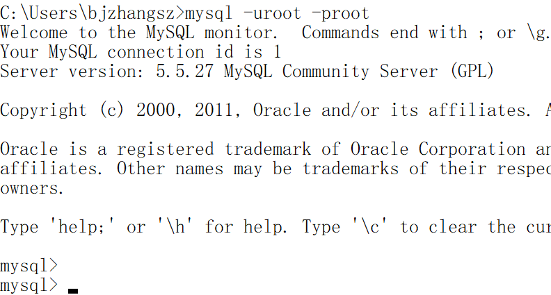

则说明MySQL环境正常，即当前电脑上安装了MySQL 软件，并且也配置了！！

**(2)如果提示“mysql不是内部或外部命令”则说明MySQL环境有问题**

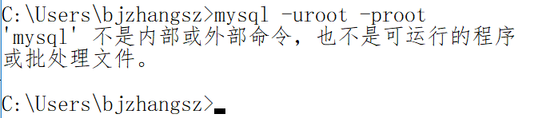

有如下两种可能：

**a）当前电脑安装了MySQL ，但没有配置环境变量**

**b）当前电脑既没有安装MySQL ，也没有配置环境变量**

下面先来验证第一种情况

检查电脑上是否安装MySQL  
---------------------------------

默认情况下，mysql 会安装在：C:\\Program Files\\ 目录下，

在C:\\Program Files\\目录下查看是否有MySQL 目录，如果有，并且目录结构如下，则说明当前电脑上安装了数据库软件。

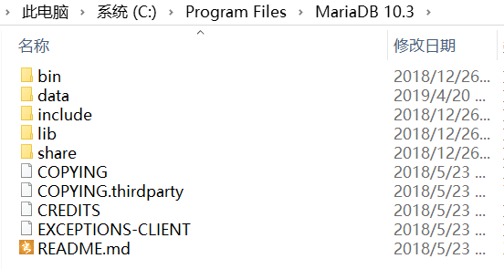

如果当前电脑上安装了数据库软件，则跳转第三步，直接执行第4步，配置mysql 的环境变量；

如果当前电脑上没有安装数据库软件，则执行第三步，先安装数据库软件，再执行第4步；

安装MySQL 数据库
------------------------

在 ftp://cgb2xxx/02-web/unit00-software/ 已经上传了 mariadb软件，大家可以下载下来进行安装，安装步骤如下。

**(1)在下面窗口中直接点击下一步即可**

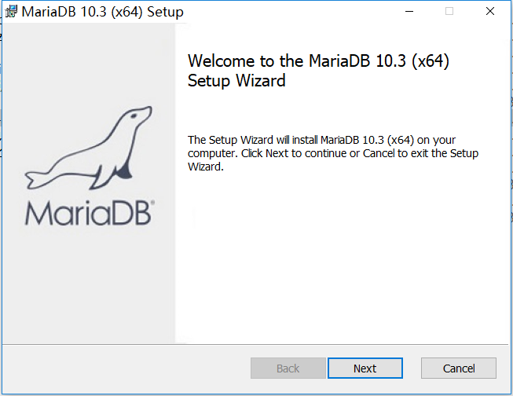

**(2)在下面窗口中勾选复选框，同意协议**

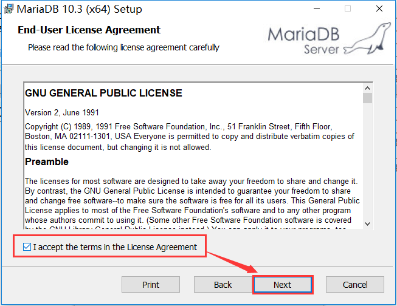

**(3)下面窗口要求设置软件安装路径，保持默认即可**

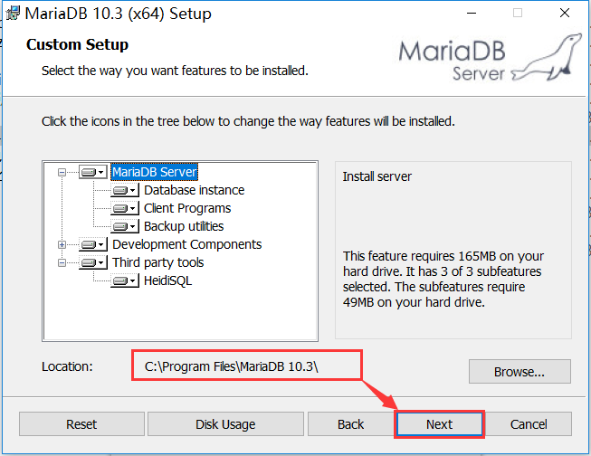

**(4)在下面窗口中设置密码和确认密码，可以统一设置为 root**

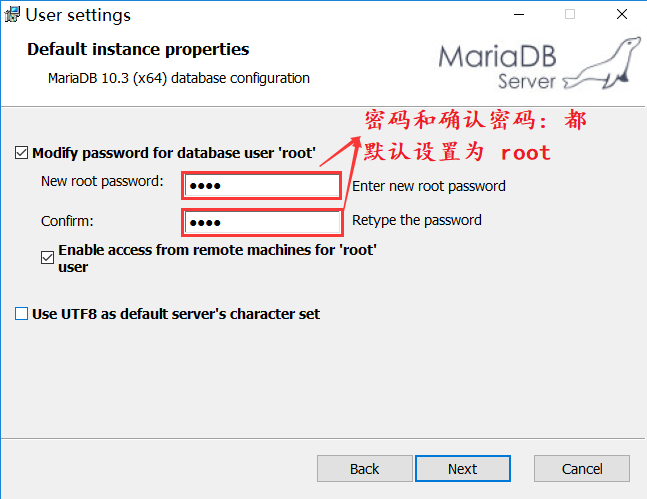

**(5)在下面窗口中设置服务的名称**（只要不和系统中存在的服务名称冲突即可） **和
端口**（只要不和系统中其他进程占用的端口冲突即可）

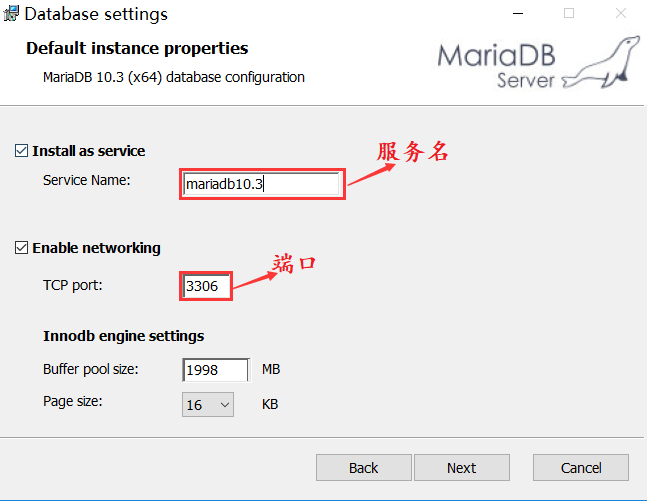

**(6)在下面窗口中直接点击下一步**

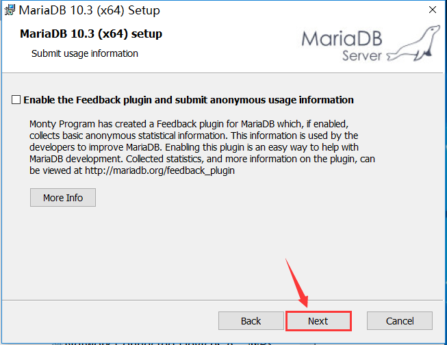

**(7)点击instal安装即可**

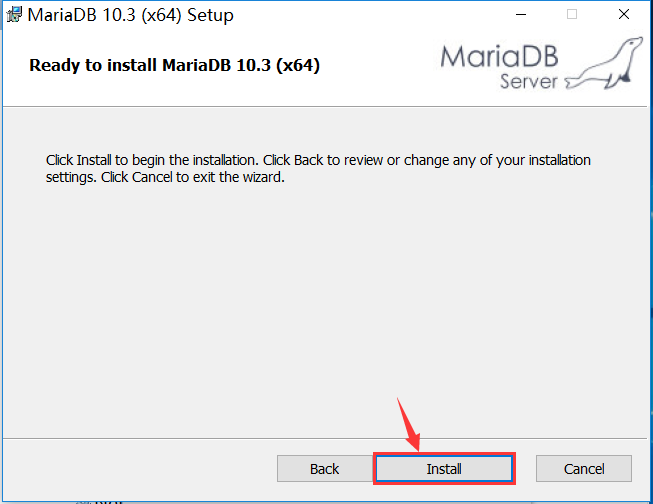

配置MySQL 环境变量
--------------------------

**(1)在 计算机/此电脑** 图标上**右键找属性**--->**高级系统设置** ---\>
**环境变量**，在弹出的窗口中找到 **系统变量**，在系统变量窗口中找到
**Path变量**，如图所示：

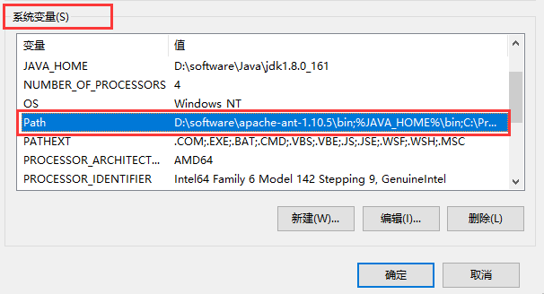

**(2)找到mysql 安装目录下的bin目录，复制bin目录的路径，例如：**

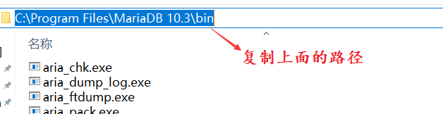

**(3)将复制的路径，配置到path环境变量中。如果是win7系统，配置如下：**

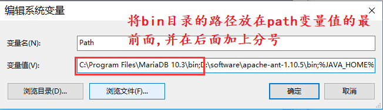

**(4)如果是win8或win10系统：**

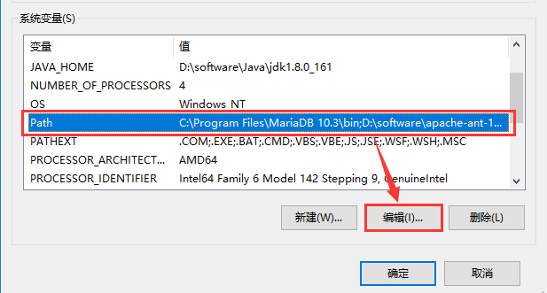

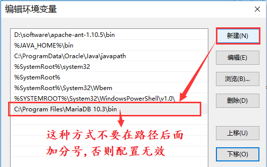


# unit00-typora软件配置

## 设置代码块前的序号

如何在代码块前面设置行号，如下图所示：

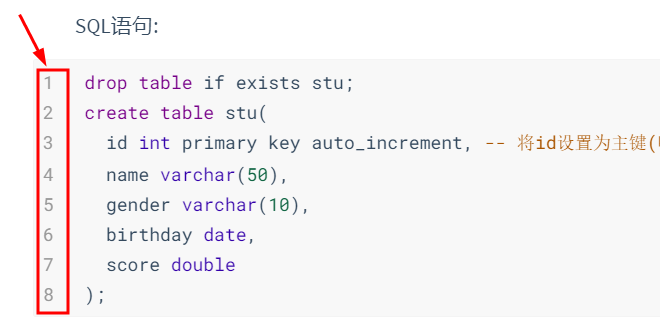

设置步骤如下：在 typora 软件的左上角，找到菜单中的 `文件` ---> `偏好设置`（或者直接 ctrl+逗号 ），会弹出如下窗口，选择 `markdown`，找到右侧中的`代码块`，勾选`显示行号选项`。

设置完后，关闭偏好设置窗口，重启typora软件即可！

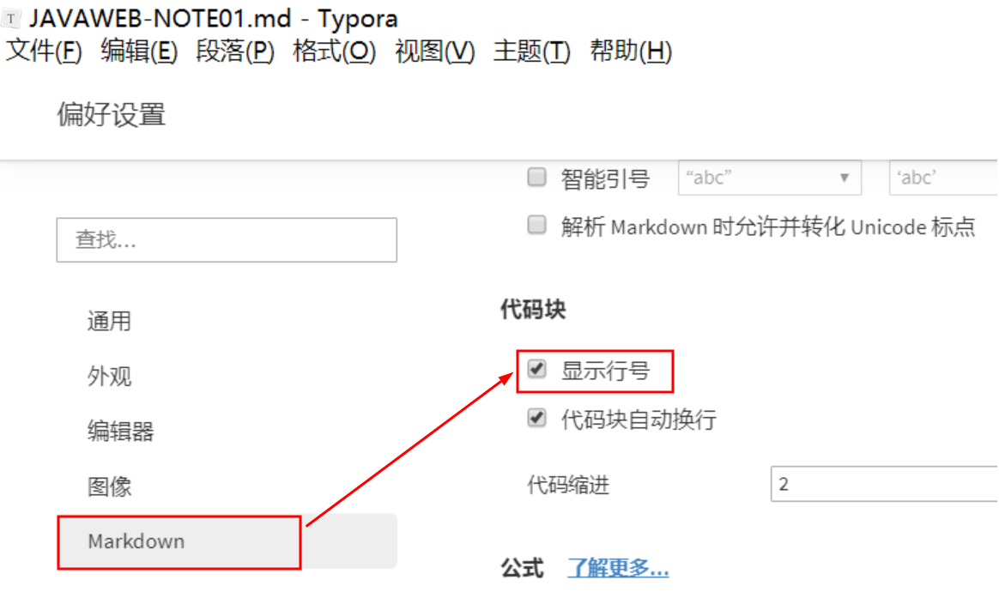

## 设置标题前的编号

如何在一级、二级、三级标题前显示编号，效果如下图所示：

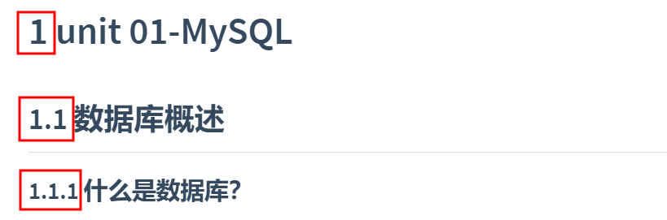

设置步骤如下：在 typora 软件的左上角，找到菜单中的 `文件` ---> `偏好设置`（或者直接 ctrl+逗号 ），会弹出如下窗口，选择 `外观`，找到右侧中的`打开主题文件夹`，并点击。

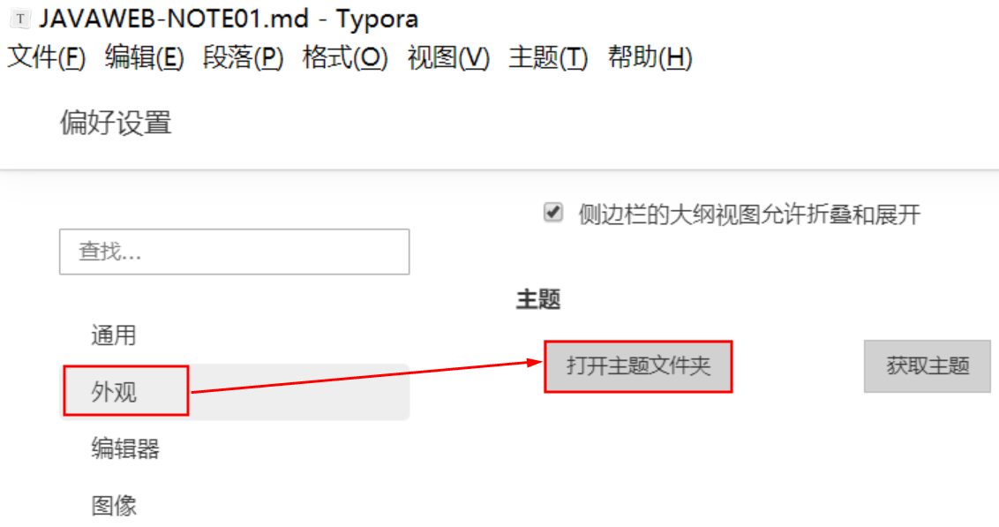

点击后，会出现如下文件夹（themes），找到并打开其中的`base.user.css`文件（如果没有就创建该文件）：

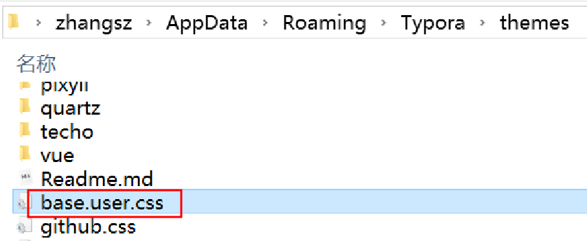

将该文件中的内容覆盖为如下内容即可：

```css
@charset "utf-8";
#write{counter-reset:h1}
h1{counter-reset:h2}
h2{counter-reset:h3}
h3{counter-reset:h4}
h4{counter-reset:h5}
h5{counter-reset:h6}
#write h1:before{counter-increment:h1;content:counter(h1) " "}
#write h2:before{counter-increment:h2;content:counter(h1) "." counter(h2) " "}
#write h3:before,
h3.md-focus.md-heading:before{counter-increment:h3;content:counter(h1) "." counter(h2) "." counter(h3) " "}
#write h4:before,
h4.md-focus.md-heading:before{counter-increment:h4;content:counter(h1) "." counter(h2) "." counter(h3) "." counter(h4) " "}
#write h5:before,
h5.md-focus.md-heading:before{counter-increment:h5;content:counter(h1) "." counter(h2) "." counter(h3) "." counter(h4) "." counter(h5) " "}
#write h6:before,
h6.md-focus.md-heading:before{counter-increment:h6;content:counter(h1) "." counter(h2) "." counter(h3) "." counter(h4) "." counter(h5) "." counter(h6) " "}
#write>h3.md-focus:before,
#write>h4.md-focus:before,
#write>h5.md-focus:before,
#write>h6.md-focus:before,
h3.md-focus:before,
h4.md-focus:before,
h5.md-focus:before,
h6.md-focus:before{ color:inherit;border:inherit;border-radius:inherit;position:inherit;left:initial;float:none;top:initial;font-size:inherit;padding-left:inherit;padding-right:inherit;vertical-align:inherit;font-weight:inherit;line-height:inherit}
img{border:2px dashed #333;border-radius:10px;zoom:80%}
```

或者直接到：`C:/用户/{当前系统用户}/AppData/Roaming/Typora/themes/`这个目录下，找到并打开其中的`base.user.css`文件（如果没有就创建该文件），并将内容覆盖为如上内容。

设置完后，关闭偏好设置窗口，重启typora软件即可！