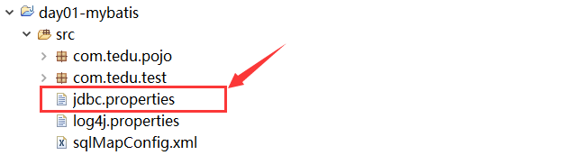

[TOC]

unit12-mybatis框架
===========


**课程计划：**

1、MyBatis快速入门

2、MyBatis对数据库中数据的增删改查操作

3、#{}占位符的应用

4、动态SQL的应用

5、MyBatis的Mapper接口开发

MyBatis简介(了解)
-----------------

### 什么是MyBatis

MyBatis 本是apache的一个开源项目iBatis, 2010年这个项目由apache software foundation 迁移到了google code，并且改名为MyBatis 。2013年11月迁移到Github。

MyBatis是一个优秀的持久层框架，它对jdbc的操作数据库的过程进行封装，使开发者只需要关注SQL本身，而不需要花费精力去处理例如注册驱动、创建connection、创建statement、手动设置参数、结果集检索等jdbc繁杂的过程代码。

Mybatis通过xml或注解的方式将要执行的各种statement（statement、preparedStatemnt）配置起来，并通过java对象和statement中的sql进行映射生成最终执行的sql语句，最后由mybatis框架执行sql并将结果映射成java对象并返回。

总之，Mybatis对JDBC访问数据库的过程进行了封装，简化了JDBC代码，解决JDBC将结果集封装为Java对象的麻烦。

下图是MyBatis架构图：


(1)mybatis-config.xml是Mybatis的核心配置文件，通过其中的配置可以生成SqlSessionFactory,也就是SqlSession工厂

(2)基于SqlSessionFactory可以生成SqlSession对象

(3)SqlSession是一个既可以发送SQL去执行，并返回结果，类似于JDBC中的Connection对象，也是Mybatis中至关重要的一个对象。

(4)Executor是SqlSession底层的对象，用于执行SQL语句

(5)MapperStatement对象也是SqlSession底层的对象，用于接收输入映射（SQL语句中的参数），以及做输出映射（即将SQL查询的结果映射成相应的结果）

### 为什么要使用MyBatis

*思考：在开始之前，思考下如何通过JDBC查询Emp表中的所有记录，并封装到一个List<Emp>集合中返回。（演示：准备数据、导包、导入JDBC程序）*

`1、使用传统方式JDBC访问数据库：`

(1)使用JDBC访问数据库有大量重复代码（比如注册驱动、获取连接、获取传输器、释放资源等）；

(2)JDBC自身没有连接池，会频繁的创建连接和关闭连接，效率低；

(3)SQL是写死在程序中，一旦修改SQL，需要对类重新编译；

(4)对查询SQL执行后返回的ResultSet对象，需要手动处理，有时会特别麻烦；

...

`2、使用mybatis框架访问数据库：`

(1)Mybatis对JDBC对了封装，可以简化JDBC代码；

(2)Mybatis自身支持连接池（也可以配置其他的连接池），因此可以提高程序的效率；

(3)Mybatis是将SQL配置在mapper文件中，修改SQL只是修改配置文件，类不需要重新编译。

(4)对查询SQL执行后返回的ResultSet对象，Mybatis会帮我们处理，转换成Java对象。

...

总之，JDBC中所有的问题（代码繁琐、有太多重复代码、需要操作太多对象、释放资源、对结果的处理太麻烦等），在Mybatis框架中几乎都得到了解决！！

MyBatis快速入门
---------------

### 准备数据，创建库和表

创建yonghedb库、emp表，并插入若干条记录

```sql
-- 1、创建数据库 yonghedb 数据库
create database if not exists yonghedb charset utf8;
use yonghedb; -- 选择yonghedb数据库
-- 2、删除emp表（如果存在）
drop table if exists emp;
-- 3、在 yonghedb 库中创建 emp 表
create table emp(
    id int primary key auto_increment,
    name varchar(50),
    job varchar(50),
    salary double
);
-- 4、往 emp 表中, 插入若干条记录
insert into emp values(null, '王海涛', '程序员', 3300);
insert into emp values(null, '齐雷', '程序员', 2800);
insert into emp values(null, '刘沛霞', '程序员鼓励师', 2700);
insert into emp values(null, '陈子枢', '部门总监', 4200);
insert into emp values(null, '刘昱江', '程序员', 3000);
insert into emp values(null, '董长春', '程序员', 3500);
insert into emp values(null, '苍老师', '程序员', 3700);
insert into emp values(null, '韩少云', 'CEO', 5000);
```


### 创建工程，导入所需jar包、创建测试类

`1、创建Maven的java工程`


`2、导入junit、mysql、mybaits等开发包`

在pom.xml文件中引入相关依赖包即可

```xml
<dependencies>
    <!-- junit单元测试 -->
    <dependency>
        <groupId>junit</groupId>
        <artifactId>junit</artifactId>
        <version>4.9</version>
    </dependency>
    <!-- mysql驱动 -->
    <dependency>
        <groupId>mysql</groupId>
        <artifactId>mysql-connector-java</artifactId>
        <version>5.1.32</version>
    </dependency>
    <!-- mybatis -->
    <dependency>
        <groupId>org.mybatis</groupId>
        <artifactId>mybatis</artifactId>
        <version>3.2.8</version>
    </dependency>
    <!-- 整合log4j -->
    <dependency>
        <groupId>org.slf4j</groupId>
        <artifactId>slf4j-log4j12</artifactId>
        <version>1.6.4</version>
    </dependency>
</dependencies>
```

3、创建com.tedu.mybatis.TestMybatis01测试类，并提供findAll方法（查询emp表中所有的员工信息），开发步骤如下：


```java
/** 练习1(快速入门): 查询emp表中的所有员工, 返回一个List<Emp>集合
* @throws IOException */
@Test
public void findAll() throws IOException {
    //1.读取mybatis的核心配置文件(mybatis-config.xml)
    //2.通过配置信息获取一个SqlSessionFactory工厂对象
    //3.通过工厂获取一个SqlSession对象
    //4.通过namespace+id找到要执行的sql语句并执行sql语句
    //5.输出结果
}
```

### 添加mybatis-config.xml文件

**1、在src/main/resources目录下，创建mybatis-config.xml文件**（MyBatis的核心配置文件）


**2、mybatis-config.xml文件配置如下:**

`mybatis-config文件头信息如下：`

```xml
<?xml version="1.0" encoding="UTF-8"?>
<!DOCTYPE configuration
    PUBLIC "-//mybatis.org//DTD Config 3.0//EN"
    "http://mybatis.org/dtd/mybatis-3-config.dtd">
    
<!-- MyBatis的全局配置文件 -->
<configuration >
	
</configuration>
```

`mybatis-config文件详细配置如下：`

```xml
<?xml version="1.0" encoding="UTF-8"?>
<!DOCTYPE configuration
    PUBLIC "-//mybatis.org//DTD Config 3.0//EN"
    "http://mybatis.org/dtd/mybatis-3-config.dtd">
    
<!-- MyBatis的全局配置文件 -->
<configuration >
	<!-- 1.配置环境，可配置多个环境（比如：develop开发、test测试） -->
	<environments default="develop">
		<environment id="develop">
			
			<!-- 1.1.配置事务管理方式：JDBC/MANAGED
			JDBC：将事务交给JDBC管理（推荐）
			MANAGED：自己管理事务
			  -->
			<transactionManager type="JDBC"></transactionManager>
			
			<!-- 1.2.配置数据源，即连接池 JNDI/POOLED/UNPOOLED
				JNDI：已过时
				POOLED：使用连接池（推荐）
				UNPOOLED：不使用连接池
			 -->
			<dataSource type="POOLED">
				<property name="driver" value="com.mysql.jdbc.Driver"/>
				<property name="url" value="jdbc:mysql://localhost:3306/yonghedb?characterEncoding=utf-8"/>
				<property name="username" value="root"/>
				<property name="password" value="root"/>
			</dataSource>
		</environment>
	</environments>
	
	<!-- 2.导入Mapper配置文件，如果mapper文件有多个，可以通过多个mapper标签导入 -->
	<mappers>
		<mapper resource="EmpMapper.xml"/>
	</mappers>
</configuration>
```


### 添加EmpMapper.xml文件

**1、在src/main/resources目录下，创建EmpMapper.xml文件 （实体类的映射文件）**


**2、EmpMapper.xml文件配置如下:**

`EmpMapper文件头信息如下：`

```xml
<?xml version="1.0" encoding="UTF-8"?>
<!DOCTYPE mapper
	PUBLIC "-//mybatis.org//DTD Mapper 3.0//EN"
	"http://mybatis.org/dtd/mybatis-3-mapper.dtd">

<!-- 
	不同Mapper文件的namespace值应该保证唯一
	在程序中通过[ namespace + id ]定位到要执行哪一条SQL语句
 -->
<mapper namespace="">
	
	
</mapper>
```

`EmpMapper文件详细配置如下：`

```xml
<?xml version="1.0" encoding="UTF-8"?>
<!DOCTYPE mapper
	PUBLIC "-//mybatis.org//DTD Mapper 3.0//EN"
	"http://mybatis.org/dtd/mybatis-3-mapper.dtd">

<!-- 
	不同Mapper文件的namespace值应该保证唯一
	在程序中通过[ namespace + id ]定位到要执行哪一条SQL语句
 -->
<mapper namespace="EmpMapper">
	<!-- 通过select、insert、update、delete标签声明要执行的SQL -->
	<!-- 练习1: 查询emp表中的所有员工信息
		resultType指定查询的结果将会封装到什么类型中
		即使最终返回的结果是集合(List<Emp>),resultType也只需要指定集合中的泛型即可!
 	-->
	<select id="findAll" resultType="com.tedu.pojo.Emp">
		select * from emp
	</select>

</mapper>
```

### 添加并编写Emp实体类

注意：在当前实例中，Emp类中的属性和数据库表的字段名称必须一致，否则将会无法将结果集封装到Java对象中。

在src/main/java目录下创建 com.tedu.pojo.Emp类，并编辑Emp类：提供私有属性以及对应的getter方法、setter方法，并重写toString方法

```java
package com.tedu.pojo;
/**
 * 实体类,用于封装Emp表中的一条用户信息
 */
public class Emp {
	//1.声明实体类中的属性
	private Integer id;
	private String name;
	private String job;
	private Double salary;
	
	//2.提供对应的getter和setter方法
	public Integer getId() {
		return id;
	}
	public void setId(Integer id) {
		this.id = id;
	}
	public String getName() {
		return name;
	}
	public void setName(String name) {
		this.name = name;
	}
	public String getJob() {
		return job;
	}
	public void setJob(String job) {
		this.job = job;
	}
	public Double getSalary() {
		return salary;
	}
	public void setSalary(Double salary) {
		this.salary = salary;
	}
	
	//3.重写toString方法
	@Override
	public String toString() {
		return "Emp [id=" + id + ", name=" + name + ", job=" + job + ", salary=" + salary + "]";
	}
}
```


### 实现测试类,并测试

**1、实现findAll方法，代码如下：**

```java
/** 练习1(快速入门):  查询emp表中的所有员工, 返回一个List<Emp>集合
 * @throws IOException */
@Test
public void findAll() throws IOException {
	//1.读取mybatis的核心配置文件(mybatis-config.xml)
	InputStream in = Resources
			.getResourceAsStream("mybatis-config.xml");
	//2.通过配置信息获取一个SqlSessionFactory工厂对象
	SqlSessionFactory fac = 
			new SqlSessionFactoryBuilder().build( in );
	//3.通过工厂获取一个SqlSession对象
	SqlSession session = fac.openSession();
	//4.通过namespace+id找到要执行的sql语句并执行sql语句
	List<Emp> list = session
			.selectList("EmpMapper.findAll");
	//5.输出结果
	for(Emp e : list) {
		System.out.println( e );
	}
}
```

**2、执行findAll方法，输出结果为：**

```
Emp [id=1, name=王海涛, job=程序员, salary=3300.0]
Emp [id=2, name=齐雷, job=程序员, salary=2800.0]
Emp [id=3, name=刘沛霞, job=程序员鼓励师, salary=2700.0]
Emp [id=4, name=陈子枢, job=部门总监, salary=4200.0]
Emp [id=5, name=刘昱江, job=程序员, salary=3000.0]
Emp [id=6, name=董长春, job=程序员, salary=3500.0]
Emp [id=7, name=苍老师, job=程序员, salary=3700.0]
Emp [id=8, name=韩少云, job=CEO, salary=5000.0]
```

MyBatis入门细节
---------------

### mybatis-config.xml配置文件

```xml
<?xml version="1.0" encoding="UTF-8"?>
<!DOCTYPE configuration
    PUBLIC "-//mybatis.org//DTD Config 3.0//EN"
    "http://mybatis.org/dtd/mybatis-3-config.dtd">
    
<!-- MyBatis的全局配置文件 -->
<configuration >
	<!-- 1.配置环境，可配置多个环境（比如：develop开发、test测试） -->
	<environments default="develop">
		<environment id="develop">
			
			<!-- 1.1.配置事务管理方式：JDBC/MANAGED
			JDBC：将事务交给JDBC管理（推荐）
			MANAGED：自己管理事务
			  -->
			<transactionManager type="JDBC"></transactionManager>
			
			<!-- 1.2.配置数据源，即连接池 JNDI/POOLED/UNPOOLED
				JNDI：已过时
				POOLED：使用连接池（推荐）
				UNPOOLED：不使用连接池
			 -->
			<dataSource type="POOLED">
				<property name="driver" value="com.mysql.jdbc.Driver"/>
				<property name="url" value="jdbc:mysql://localhost:3306/yonghedb?characterEncoding=utf-8"/>
				<property name="username" value="root"/>
				<property name="password" value="root"/>
			</dataSource>
		</environment>
	</environments>
	
	<!-- 2.导入Mapper配置文件，如果mapper文件有多个，可以通过多个mapper标签导入 -->
	<mappers>
		<mapper resource="EmpMapper.xml"/>
	</mappers>
</configuration>
```

`environments`标签：该标签内部可以配置多个environment，即多种环境，每种环境可以做不同配置或连接不同数据库。例如，开发、测试、生产环境可能需要不同的配置，连接的数据库可能也不相同，因此我们可以配置三个environment，分别对应上面三种不同的环境。

但是要记住，environment可以配置多个，但是最终要使用的只能是其中一个！

`environment`标签：内部可以配置多种配置信息，下面介绍事务管理配置和数据源配置。

`transactionManage`标签：事务管理配置，mybatis中有两种事务管理方式，也就是 

  type="[JDBC\|MANAGED]。

```
JDBC：这个配置就是直接使用了 JDBC的提交和回滚设置，它依赖于从数据源得到的连接来管理事务范围。推荐使用。
MANAGED：这个配置几乎没做什么。它从来不提交或回滚一个连接。需要自己手动添加并管理。不推荐使用。
```

`dataSource`标签：数据源，也就是连接池配置。这里type指定数据源类型，有三种内建的类型：JNDI、POOLED、UNPOOLED

```
JNDI：已过时，不推荐使用！
POOLED：使用连接池，mybatis会创建连接池，并从连接池中获取连接访问数据库，在操作完成后，将会把连接返回连池。
UNPOOLED：不使用连接池，该方式适用于只有小规模数量并发用户的简单应用程序上。
```

`mappers`标签：用于导入mapper文件的位置，其中可以配置多个mapper，即可以导入多个mapper文件。

### EmpMapper.xml配置文件

```xml
<?xml version="1.0" encoding="UTF-8"?>
<!DOCTYPE mapper
	PUBLIC "-//mybatis.org//DTD Mapper 3.0//EN"
	"http://mybatis.org/dtd/mybatis-3-mapper.dtd">

<!-- 
	不同Mapper文件的namespace值应该保证唯一
	在程序中通过[ namespace + id ]定位到要执行哪一条SQL语句
 -->
<mapper namespace="EmpMapper">
	<!-- 通过select、insert、update、delete标签声明要执行的SQL -->
	<!-- 练习1: 查询emp表中的所有员工信息
		resultType指定查询的结果将会封装到什么类型中
		即使最终返回的结果是集合(List<Emp>),resultType也只需要指定集合中的泛型即可!
 	-->
	<select id="findAll" resultType="com.tedu.pojo.Emp">
		select * from emp
	</select>

</mapper>
```

(1)第1行是xml的文档声明，用于声明xml的版本和编码

(2)第2、3、4行，引入了xml约束文档，当前xml文档将会按照mybatis-3-mapper.dtd文件所要求的规则进行书写。

(3)Mapper标签：根标签，其中namespace(名称空间，也叫命名空间)，要求不能重复。在程序中通过【namespace + id 】定位到要执行哪一条SQL语句

(4)select标签：用于指定将来要执行的各种SQL语句。标签上可以声明属性，下面介绍常用的属性：id、resultType、resultMap

- id属性：要求值不能重复。将来在执行SQL时，可以通过【namespace + id】找到指定SQL并执行。

- resultType属性：从这条SQL语句中返回所期望类型的类的完全限定名称（包名+类名）。注意如果是集合情形，那应该是集合可以包含的类型，而不能是集合本身。

  简而言之，resultType控制查询SQL执行后返回值的类型或集合中的泛型，例如查询emp表中的单条记录，返回值是一个Emp对象，因此，resultType="com.tedu.pojo.Emp"；

  如果查询emp表中的多条记录，返回值是一个List<Emp>，此时resultType的值应该集合中的泛型，因此resultType="com.tedu.pojo.Emp"；

- resultMap属性：复杂对象结构（例如多表关联查询等）。 使用 resultType 或 resultMap，但不能同时使用。

MyBatis增删改查
---------------

### 新增员工

**1、编辑EmpMapper.xml文件, 添加新增员工对应的sql.**

```xml
<!-- 练习2: 新增员工信息: 赵云 保安 6000
增删改的标签上不用指定resultType, 因为返回值都是int类型
-->
<update id="insert" >
	insert into emp value(null, '赵云', '保安', 6000)
</update>
```
**2、编写TestMybatis类，添加testInsert方法，实现新增员工操作。**
```java
/** 练习2: 新增员工信息: 赵云 保安 6000 */
@Test
public void testInsert() {
  //执行sql语句, 返回执行结果
  int rows = session.update("EmpMapper.insert");
  //提交事务
  session.commit();
  System.out.println("影响的行数: "+rows);
}
```
### 修改员工

**1、编辑EmpMapper.xml文件, 添加新增员工对应的sql。**

```xml
<!-- 练习3：修改员工信息：赵云 保镖 20000 -->
<update id="update">
	update emp set job='保镖', salary=20000 where name='赵云'
</update>
```

**2、编写TestMybatis类，添加testUpdate方法，实现修改员工信息。**

```java
/** 练习3: 修改员工信息, 将赵云的job改为'保镖'，salary改为20000 */
@Test
public void testUpdate() {
  //执行sql语句, 返回执行结果
  int rows = session.update("EmpMapper.update");
  //提交事务
  session.commit();
  System.out.println("影响行数:"+rows);
}
```
### 删除员工

**1、编辑EmpMapper.xml文件, 添加新增员工对应的sql。**

```xml
<!-- 练习4: 删除name为'赵云'的记录 -->
<update id="delete">
	delete from emp where name='赵云'
</update>
```
**2、编写TestMybatis类，添加**testDelete**方法，实现删除员工。**
```java
/** 练习4: 删除name为'赵云'的记录 */
@Test
public void testDelete() {
  //执行sql语句, 返回执行结果
  int rows = session.update("EmpMapper.delete");
  //提交事务
  session.commit();
  System.out.println("影响行数:"+rows);
}
```
## mybatis中的占位符

### #{}占位符

在上面的增删改查操作中，SQL语句中的值是写死在SQL语句中的，而在实际开发中，此处的值往往是用户提交过来的值，因此这里我们需要将SQL中写死的值替换为占位符。

在mybatis中占位符有两个，分别是 `#{}` 占位符 和 `${}` 占位符：

- `#{}：`相当于JDBC中的问号（?）占位符,是为SQL语句中的参数值进行占位,大部分情况下都是使用#{}占位符; 并且当#{}占位符是为字符串或者日期类型的值进行占位时,在参数值传过来替换占位符的同时,会进行转义处理(在字符串或日期类型的值的两边加上单引号)

- `${}`：是为SQL片段进行占位，将传过来的SQL片段直接拼接在${}占位符所在的位置,不会进行任何的转义处理。（由于是直接将参数拼接在SQL语句中，因此可能会引发SQL注入攻击问题）


**练习5：查询emp表中指定id的员工信息**

在mapper文件中编写SQL语句：
```xml
<!-- 练习5: 查询emp表中指定id的员工信息 -->
<select id="findById" resultType="com.tedu.pojo.Emp">
	select * from emp where id=#{id}
</select>
```
Java代码实现：
```java
/** 练习5: 查询emp表中指定id的员工信息 */
@Test
public void testFindById() {
  //执行sql语句, 返回执行结果
  Emp emp = session.selectOne( "EmpMapper.findById", 1 );
  System.out.println( emp );
}
```
**练习6：新增员工信息: 张飞 Java开发工程师 15000**

在mapper文件中编写SQL语句：
```xml
<!-- 练习6: 新增员工信息: 张飞 Java开发工程师 15000
  如果通过map集合传输参数, 需要保证占位符中的变量名
  和map集合中的key保持一致
  如果通过pojo对象传输参数, 需要保证占位符中的变量名
  和对象中的属性名保持一致, 或者在pojo中有对应的
  getXxx方法
-->
<update id="insert2">
	insert into emp values (null, #{name}, #{job}, #{salary})
</update>
```
Java代码实现：

```java
/** 练习6: 新增员工信息: 张飞 Java开发工程师 15000 */
@Test
public void testInsert2() {
  //将要传输的参数封装到map集合中
  //Map map = new HashMap();
  //map.put("name", "张飞");
  //map.put("job", "Java开发工程师");
  //map.put("salary", 15000);
  //也可以将要传输的参数封装到Emp对象中
  Emp emp = new Emp();
  emp.setName("关羽123");
  emp.setJob("保安");
  emp.setSalary(8000.0);
  //执行sql语句
  intsession rows = session.update("EmpMapper.insert2", emp);
  //提交事务
  session.commit();
  System.out.println( "影响的行数: "+rows );
}
```
**练习7：修改员工信息: 张飞 架构师 25000**

在mapper文件中编写SQL语句：
```xml
<!-- 练习7: 修改员工信息: 张飞 架构师 25000 -->
<update id="update2">
  update emp set job=#{job}, salary=#{salary}
  where name=#{name}
</update>
```
Java代码实现：

```java
/** 练习7: 修改员工信息: 张飞 架构师 25000 */
@Test
public void testUpdate2() {
  //将参数封装到Emp对象中
  Emp emp = new Emp();
  emp.setName("张飞");
  emp.setJob("架构师");
  emp.setSalary(25000.0);
  //执行sql语句
  intsession rows = session.update("EmpMapper.update2", emp);
  //提交事务
  session.commit();
  System.out.println("影响的行数: "+rows);
}
```
**练习8：删除emp表中指定id的员工信息**

mapper文件配置:
```xml
<!-- 练习8：删除emp表中指定id的员工信息 -->
<insert id="delete2" parameterType="String">
	delete from emp where id=#{id}
</insert>
```
java代码示例:
```java
/*  练习8：删除emp表中指定id的员工信息 */
public void testDelete2() throws IOException{
  ......
  //执行SQL语句
  int rows = session.delete("EmpMapper.delete2", 1);
  //提交事务
  session.commit();
  System.out.println("影响行数:"+rows);
}
```
在上面的增删改查练习中，当SQL语句中包含的参数值是传递过来的，在SQL语句中我们会通过`#{}`占位符进行占位，在SQL语句真正执行时，再将传递过来的值替换SQL语句中的占位符。

其实，`#{}`就是JDBC中的问号（**?**）占位符，因此为了安全考虑，在执行时会对传递过来的字符串和日期类型高的值进行转译处理。

例如：查询指定name的员工信息，SQL语句为：

```sql
select * from emp where name=#{name}
```

其实就等价于JDBC中： `select * from emp where name=?`，

如果传过来的参数值为：王海涛，那么最终执行的SQL语句为：

```sql
-- 在参数替换占位符的同时进行了转义处理(在值的两边加上了单引号)
select * from emp where name='王海涛' 
```


### ${}占位符

那么如果我们在传递的时候不是一个参数值，而是一个SQL片段呢？

例如：在查询时，我们想动态的传递查询的列：

```sql
select #{columns} from emp
```

此时传递过来的应该是一个SQL片段，不同于上面的参数值，如果此时还用`#{}`，也会像上面一样被转译处理：`select 'id,name,job' from emp`，这不是我们希望看到的！

如果不想让传过来的SQL片段被转译处理，而是直接拼接在SQL语句中，那么这里可以使用`${}`，例如：

```sql
select ${columns} from emp
```

拼接之后：`select id,name,job from emp`

**练习9：动态指定要查询的列**

在mapper文件中编写SQL语句：
```xml
<!-- 练习9: 动态指定要查询的列 -->
<select id="findAll2" resultType="com.tedu.pojo.Emp">
	select ${cols} from emp
</select>
```

java代码示例:
```java
/** 练习9: 动态指定要查询的列 */
@Test
public void testFindAll2() {
  Map map = new HashMap();
  //map.put("cols", "id, name");
  //map.put("cols", "id, name, salary");
  map.put("cols", "id,name,job,salary");
  //执行sql语句, 返回结果
  List<Emp> list = session.selectList("EmpMapper.findAll2", map);
  //输出结果
  for ( Emp e : list ) {
  	System.out.println( e );
  }
}
```
**示例2: 根据name模糊查询emp表**

在mapper文件中编写SQL语句：
```xml
<!-- 练习10: 根据name模糊查询emp表 -->
<select id="findAll3" resultType="com.tedu.pojo.Emp">
  select * from emp
  where name like '%${name}%'
</select>
```
```xml
<!-- 练习11: 根据name模糊查询emp表 -->
<select id="findAll4" resultType="com.tedu.pojo.Emp">
  select * from emp
  where name like #{name}
</select>
```
Java代码实现：
```java
/**
 * 练习10: 根据name模糊查询emp表
 * '%王%' '%刘%'
 */
@Test
public void testFindAll3() {
  //将参数封装到map集合中
  Map map = new HashMap();
  map.put("name", "涛");
  //执行sql, 返回结果
  List<Emp> list = session.selectList("EmpMapper.findAll3", map);
  //输出结果
  for (Emp emp : list) {
  	System.out.println( emp );
  }
}
```
```java
/**
 * 练习11: 根据name模糊查询emp表
 * '%王%' '%刘%'
 */
@Test
public void testFindAll4() {
  //将参数封装到map集合中
  Map map = new HashMap();
  map.put("name", "%刘%");
  //执行sql, 返回结果
  List<Emp> list = session.selectList("EmpMapper.findAll4", map);
  //输出结果
  for (Emp emp : list) {
  	System.out.println( emp );
  }
}
```
需要注意的是，在传递 `${}` 对应的值时，即使只有一个参数，也需要将值存入**map**集合中！！

总结：在大多数情况下还是使用#{}占位符，而${}多用于为SQL片段进行占位！

动态SQL标签
-------

### if、where标签

- `<if>`标签：是根据`test属性`中的布尔表达式的值，从而决定是否执行包含在其中的SQL片段。如果判断结果为true，则执行其中的SQL片段；如果结果为false，则不执行其中的SQL片段

- `<where>`标签：用于对包含在其中的SQL片段进行检索，在需要时可以生成where关键字，并且在需要时会剔除多余的连接词（比如and或者or）


**练习12：根据薪资查询员工信息（if标签）**

- `<if>`标签：是根据`test属性`中的布尔表达式的值，从而决定是否执行包含在其中的SQL片段。如果判断结果为true，则执行其中的SQL片段；如果结果为false，则不执行其中的SQL片段

在mapper文件中编写SQL语句：
```xml
<!-- 练习12: 根据薪资查询员工信息
* 如果没有参数, 则不执行where子句, 默认查询所有员工：
* 	select * from emp
* 如果参数中只有minSal(即minSal不为null), 则：
* 	... where salary > minSal
* 如果参数中只有maxSal(即maxSal不为null), 则：
* 	... where salary < maxSal
* 如果参数有 minSal、maxSal(即minSal、maxSal不为null), 则：
*		... where salary > minSal and salary < maxSal  -->
<select id="findAllBySal" resultType="com.tedu.pojo.Emp">
  select * from emp
  where 1=1
  <if test="minSal != null">
  	and salary>#{minSal}
  </if>
  <if test="maxSal != null">
  	and salary <![CDATA[ < ]]> #{maxSal}
  </if>
</select>
```

Java代码实现：

```java
/* 练习12: 根据薪资查询员工信息
* 如果没有参数, 则不执行where子句, 默认查询所有员工：
* 	select * from emp
* 如果参数中只有minSal(即minSal不为null), 则：
* 	... where salary > minSal
* 如果参数中只有maxSal(即maxSal不为null), 则：
* 	... where salary < maxSal
* 如果参数有 minSal、maxSal(即minSal、maxSal不为null), 则：
*	... where salary > minSal and salary < maxSal  */
@Test
public void testFindBySal() {
	Map<String, Object> map = new HashMap<String, Object>();
	//map.put( "minSal" , 3000 );
	//map.put( "maxSal", 4000 );
	List<Emp> list = session.selectList( "EmpMapper.findBySal", map );
	for (Emp emp : list) {
		System.out.println( emp );
	}
}
```


**练习13：根据薪资查询员工信息(where标签)**

- `<where>`标签：用于对包含在其中的SQL片段进行检索，在需要时可以生成where关键字，并且在需要时会剔除多余的连接词（比如and或者or）

```xml
<!-- 练习13: 根据薪资查询员工信息
* 如果没有参数, 则不执行where子句, 默认查询所有员工：
* 	select * from emp
* 如果参数中只有minSal(即minSal不为null), 则：
* 	... where salary > minSal
* 如果参数中只有maxSal(即maxSal不为null), 则：
* 	... where salary < maxSal
* 如果参数有 minSal、maxSal(即minSal、maxSal不为null), 则：
*		... where salary > minSal and salary < maxSal  -->
<select id="findAllBySal2" resultType="com.tedu.pojo.Emp">
  select * from emp
  <where>
    <if test="minSal != null">
    	and salary>#{minSal}
    </if>
    <if test="maxSal != null">
    	and salary <![CDATA[ < ]]> #{maxSal}
    </if>
  </where>
</select>
```
Java代码实现：
```java
/**
* 练习13: 根据薪资查询员工信息
* 如果没有参数, 则不执行where子句, 默认查询所有员工：
* 	select * from emp
* 如果参数中只有minSal(即minSal不为null), 则：
* 	... where salary > minSal
* 如果参数中只有maxSal(即maxSal不为null), 则：
* 	... where salary < maxSal
* 如果参数有 minSal、maxSal(即minSal、maxSal不为null), 则：
*	... where salary > minSal and salary < maxSal  */
@Test
public void testFindAllBySal() {
  //封装参数到map集合中
  Map map = new HashMap();
  map.put("minSal", 3000);
  map.put("maxSal", 4000.0);
  List<Emp> list = session.selectList("EmpMapper.findAllBySal2", map);
  for (Emp emp : list) {
  	System.out.println( emp );
  }
}
```
### foreach元素

foreach标签：可以对传过来的参数数组或集合进行遍历，以下是foreach标签上的各个属性介绍：

| 属性       | 属性描述                                                     |
| ---------- | ------------------------------------------------------------ |
| collection | 必需，值为遍历的集合类型，例如：如果参数只是一个数组或List集合，则collection的值为array或list；如果传的是多个参数，用map封装，collection则指定为map中的key。 |
| item       | 必需，若collection为数组或List集合时，item表示其中的元素，若collection为map中的key，item表示map中value（集合或数组）中的元素 |
| open       | 可选，表示遍历生成的SQL片段以什么开始，最常用的是左括号'('                                            |
| close      | 可选，表示遍历生成的SQL片段以什么结束，最常用的是右括号')'                                                          |
|  separator          |  可选，每次遍历后给生成的SQL片段后面指定间隔符                                                         |

**练习14: 根据员工的id批量删除员工信息**

在mapper文件中编写SQL语句：

```xml
<!-- 练习14: 根据员工的id批量删除员工信息
	delete from emp where id in (1,3,5,7)
	collection: 如果传的参数仅仅是一个数组或者List集合, collection可以指定为
		array或list; 如果传的是多个参数，用map封装，collection则指定为map中的key
	open: 指定生成的SQL片段以什么符号开始
	close: 指定生成的SQL片段以什么符号结束
	item: 指定变量接收数组或集合中的元素
	separator: 指定一个间隔符, 在将数组或集合中的每个元素拼接到SQL片段之后, 
		在后面拼接一个间隔符
 -->
<delete id="deleteByIds">
	delete from emp where id in
	<foreach collection="array" open="(" item="id" separator="," close=")">
		#{id}
	</foreach>
</delete>
```

Java代码实现：
```java
/* 练习14: 根据员工的id批量删除员工信息 */
@Test
public void testDeleteByIds() {
	//获取所要删除的员工的id数组
	Integer[] ids = {1,3,5,7};
	int rows = session.delete( "EmpMapper.deleteByIds", ids );
	System.out.println( "影响行数: "+rows );
}
```
**练习15：根据员工的id批量更新员工信息**

在mapper文件中编写SQL语句：

```xml
<!-- 练习15: 根据员工的id批量更新员工信息
 	将id为 2、4、6、8的员工的薪资在原有基础上增加1000
 	update emp set salary=salary + 1000
	where id in(2,4,6,8);
-->
<update id="updateByIds">
	update emp set salary=salary + #{sal}
	where id in
	<foreach collection="arrIds" open="(" item="id" separator="," close=")">
		#{id}
	</foreach>
</update>
```

Java代码实现：

```java
/* 练习15: 根据员工的id批量更新员工信息
 * 将id为 2、4、6、8的员工的薪资在原有基础上增加1000
 */
@Test
public void testUpdateByIds() {
	Integer[] ids = {2,4,6,8}; //获取所要更新的员工的id数组
	Double sal = 1000.0; //要涨的薪资
	//传递的参数超过1个, 将参数封装到map集合中再传递
	Map<String, Object> map = new HashMap<String, Object>();
	map.put( "arrIds" , ids );
	map.put( "sal", sal );
	int rows = session.update( "EmpMapper.updateByIds", map );
	System.out.println( "影响行数: "+rows );
}
```

下面练习自己完成：

```java
/* 练习16：根据员工的id批量查询指定id的员工信息
 * 查询id为 2、4、6、8的员工的信息
 */
@Test
public void testFindByIds() {}
```
Mapper接口开发
--------------

### Mapper接口开发介绍

在上面的Mybatis案例中, 通过SqlSession对象调用方法进行增删改查操作时，方法中需要传入的第一个参数是一个字符串值，该值对应的内容为: (Mapper文件中的)namespace + id, 通过这种方式，找到Mapper文件中映射的SQL语句并执行!!

这种方式由于传入的是字符串值, 很容易发生字符串拼写错误且编译时期不会提示。

这里我们将会讲解比上面更加简单的方式，也是我们企业开发中最常用的方式，即使用mapper接口开发。使用mapper接口开发需要注意以下几点：

```
1、创建一个接口，接口的全路径名和mapper文件的namespace值要相同
2、mapper文件中每条要执行的SQL语句，在接口中要添加一个对应的方法，并且接口中的方法名和SQL标签上的id值相同
3、Mapper接口中方法接收的参数类型，和mapper.xml中定义的sql的接收的参数类型要相同
4、接口中方法的返回值类型和SQL标签上的resultType即返回值类型相同(如果方法返回值是集合,resultType只需要指定集合中的泛型)
```

### Mapper接口开发实现

下面将使用mapper接口开发的方式，实现根据id查询指定的员工信息

**1、创建com.tedu.dao.EmpMapper接口**

由于接口的全路径名(com.tedu.dao.EmpMapper)要和EmpMapper.xml的namespace值保持一致，因此, 这里将namespace的值改为com.tedu.dao.EmpMapper：
```xml
<?xml version="1.0" encoding="UTF-8"?>
<!DOCTYPE mapper
  PUBLIC "-//mybatis.org//DTD Mapper 3.0//EN"
  "http://mybatis.org/dtd/mybatis-3-mapper.dtd">
<mapper namespace="com.tedu.dao.EmpMapper">

</mapper>
```
**2、在接口中提供findById方法**

```java
/**
* 根据id查询员工信息
* @param id
* @return Emp
*/
public Emp findById(Integer id);
```
注意:方法的名字要和映射的sql标签的id值保持一致

方法的返回值类型和resultType的类型要一致
```xml
<!-- 1.查询：查询Emp表中指定id的员工信息 -->
<select id="findById" resultType="com.tedu.pojo.Emp">
	select * from emp where id=#{id}
</select>
```

**3、提供实现类，测试Emp接口中的根据id查询员工的方法**

(1)创建com.tedu.test.TestMybatisInf类, 并提供testFindById方法
```java
public class TestMybatisInf {
	@Test
	public void testFindById() throws Exception{}
}
```
**4、实现testFindById方法并测试**

```java
@Test
public void testFindById() throws Exception{
  ......
  //3.获取Mapper接口对象
  EmpMapper map = session.getMapper(EmpMapper.class);
  //4.调用接口对象的方法进行查询
  Emp e = map.findById(2);
  //5.输出结果
  System.out.println(e);
}
```
**5、在接口中提供findAll方法**
```java
/**
* 查询所有的员工信息
* @return List<Emp>
*/
public List<Emp> findAll();
```
注意:方法的名字要和映射的sql标签的id值保持一致

方法的返回值类型和resultType的类型要一致, 例如:
```xml
<!-- 2.查询Emp表中所有员工的信息 -->
<select id="findAll" resultType="com.tedu.pojo.Emp">
	select * from emp
</select>
```

**6、提供实现类，测试Emp接口中的查询所有员工的方法**

(1)创建com.tedu.test.TestMybatisInf类, 并提供testFindAll方法
```java
public class TestMybatisInf {
  ...
  @Test
  public void testFindAll () throws Exception{}
}
```
**实现testFindAll方法并测试**
```java
@Test
public void testFindAll() throws Exception{
  ...
  //3.获取Mapper接口对象
  EmpMapper map = session.getMapper(EmpMapper.class);
  //4.调用接口对象的方法进行查询
  List<Emp> list = map.findAll();
  //5.输出结果
  for (Emp e : list) {
  	System.out.println(e);
  }
}
```
 几个可以优化的地方
-------------------

### 加入log4j日志框架 

在项目中加入log4j的配置文件，用于打印日志信息，便于开发调试。

在src（或相似的目录）下创建log4j.properties如下：
```properties
# Global logging configuration
log4j.rootLogger=DEBUG, stdout
# Console output...
log4j.appender.stdout=org.apache.log4j.ConsoleAppender
log4j.appender.stdout.layout=org.apache.log4j.PatternLayout
log4j.appender.stdout.layout.ConversionPattern=%5p [%t] - %m%n
```
mybatis默认使用log4j作为输出日志信息。

只要将该文件放在指定的位置，log4j工具会自动到指定位置加载上述文件，读取文件中的配置信息并使用！

### SQL语句中的特殊符号

**示例：添加一个查询功能：查询薪资小于3500的所有员工。**

1、编辑EmpMapper.xml文件, 添加查询对应的sql.
```xml
<!-- 练习12: 根据薪资查询员工信息 -->
<select id="findBySal" resultType="com.tedu.pojo.Emp">
	select * from emp
	where 2=2 
	<if test="minSal != null">
		and salary >= #{minSal}
	</if>
	<if test="maxSal != null">
		and salary <= #{maxSal}
	</if>
</select>
```
2、但在书写完后，xml文件提示有错误：


原来，小于号（<）在xml文件中是特殊字符，被xml文件当成了标签的开始符号。

3、解决方法：可以使用 `&lt;`代替 `<`，例如：

```xml
<select id="findBySal" resultType="com.tedu.pojo.Emp">
	select * from emp
	where 2=2 
	<if test="minSal != null">
		and salary >= #{minSal}
	</if>
	<if test="maxSal != null">
		and salary &lt;= #{maxSal}
	</if>
</select>
```

或者是将特殊符号包含在CDATA区（ <![CDATA[  ]]> ）中，这是因为放在CDATA区中的内容，只会被xml解析器当作普通文本来处理。而不是被当成标签的一部分处理。

```xml
<!-- 查询薪资小于3500的所有员工 -->
<select id="findBySal" resultType="com.tedu.pojo.Emp">
	select * from emp
	where 2=2 
	<if test="minSal != null">
		and salary >= #{minSal}
	</if>
	<if test="maxSal != null">
		and salary <![CDATA[ <= ]]> #{maxSal}
	</if>
</select>
```

### jdbc.properties文件

在开发中，通常我们会将连接数据库的配置信息单独放在一个properties文件中（方便管理和维护），
然后在MyBatis的mapper文件中引入properties文件的配置信息即可！

**1、在src目录下创建一个名称为jdbc.properties的文件**



**2、jdbc.properties文件内容如下:**

```properties
jdbc.driver=com.mysql.jdbc.Driver
jdbc.url=jdbc:mysql://localhost:3306/yonghedb?characterEncoding=utf-8
jdbc.username=root
jdbc.password=root
```

**3、在mybatis-config.xml文件中引入jdbc.properties文件**


1、其中 `<properties resource="jdbc.properties"/>`标签用于引入jdbc.properties文件，默认到classpath即类目录下寻找指定的文件；

2、properties标签上value属性中配置的 ${jdbc.xxx}：

`${jdbc.driver}`：其实就是jdbc.properties文件中的 jdbc.driver的值，即：

```
com.mysql.jdbc.Driver
```

`${jdbc.url}`：其实就是jdbc.properties文件中的 jdbc.url的值，即：

```
jdbc:mysql://localhost:3306/mybatisdb?characterEncoding=utf-8
```

`${jdbc.username}`：其实就是jdbc.properties文件中的 jdbc.username的值，即：

```
root
```

`${jdbc.password}`：其实就是jdbc.properties文件中的 jdbc.password的值，即：

```
root
```

扩展内容
--------

### Jdbc回顾

*通过JDBC查询Emp表中的所有记录，并封装到一个List<Emp>集合中返回*

**1、创建TestJdbc类，完成查询所有员工：**

```java
package com.tedu.jdbc;

import java.sql.Connection;
import java.sql.DriverManager;
import java.sql.ResultSet;
import java.sql.SQLException;
import java.sql.Statement;
import java.util.ArrayList;
import java.util.List;
import com.tedu.pojo.Emp;
/** Jdbc回顾 */
public class TestJdbc {
	public static void main(String[] args) {
		/* 查询emp表中的所有员工信息，将每个员工信息的封装到一个
		 * Emp对象中，再将封装了员工信息所有Emp对象存入List集合
		 * 中，并遍历输出所有的员工信息 
		 */
		List<Emp> empList = findAll();
		for(Emp emp : empList){
			System.out.println(emp);
		}
	}
	
	/**
	 * 查询emp表中的所有员工信息,封装到List集合并返回
	 */
	private static List<Emp> findAll() {
		Connection conn = null;
		Statement stat = null;
		ResultSet rs = null;
		try {
			//1.注册数据库驱动
			Class.forName("com.mysql.jdbc.Driver");
			//2.获取数据库连接(Connection)
			conn = DriverManager.getConnection(
					"jdbc:mysql:///yonghedb", 
					"root", "root");
			//3.获取传输器
			stat = conn.createStatement();
			//4.利用传输器发送sql到数据库执行,并返回执行结果
			String sql = "select * from emp";
			rs = stat.executeQuery(sql);
			//5.处理结果
			//5.1.声明List集合,用于封装所有的员工信息
			List<Emp> empList = new ArrayList();
			//5.2.遍历ResultSet结果集
			while(rs.next()) {
				//5.3.获取结果集中的每一条员工信息
				int id = rs.getInt("id");
				String name = rs.getString("name");
				String job = rs.getString("job");
				double salary = rs.getDouble("salary");
				//5.4.将每一条员工信息封装到一个Emp对象中
				Emp emp = new Emp();
				emp.setId(id);
				emp.setName(name);
				emp.setJob(job);
				emp.setSalary(salary);
				//5.5.将Emp对象存入List集合中
				empList.add(emp);
			}
			return empList;
		} catch (Exception e) {
			e.printStackTrace();
			System.out.println("查询失败!");
		} finally{
			//6.释放资源
			if(rs != null){
				try {
					rs.close();
				} catch (SQLException e) {
					e.printStackTrace();
				}finally{
					rs = null;
				}
			}
			if(stat != null){
				try {
					stat.close();
				} catch (SQLException e) {
					e.printStackTrace();
				}finally{
					stat = null;
				}
			}
			if(conn != null){
				try {
					conn.close();
				} catch (SQLException e) {
					e.printStackTrace();
				}finally{
					conn = null;
				}
			}
		}
		return null;
	}
}
```

**2、声明Emp实体类，用于封装员工信息：**

```java
package com.tedu.pojo;
/**
 * 实体类,用于封装Emp表中的一条用户信息
 */
public class Emp {
	//1.声明实体类中的属性
	private Integer id;
	private String name;
	private String job;
	private Double salary;
	
	//2.提供对应的getter和setter方法
	public Integer getId() {
		return id;
	}
	public void setId(Integer id) {
		this.id = id;
	}
	public String getName() {
		return name;
	}
	public void setName(String name) {
		this.name = name;
	}
	public String getJob() {
		return job;
	}
	public void setJob(String job) {
		this.job = job;
	}
	public Double getSalary() {
		return salary;
	}
	public void setSalary(Double salary) {
		this.salary = salary;
	}
	
	//3.重写toString方法
	@Override
	public String toString() {
		return "Emp [id=" + id + ", name=" + name + ", job=" + job + ", salary=" + salary + "]";
	}
}
```

### mybatis-config文件没有提示的解决办法

如果在没有网络(外网)的情况下，编写mybatis-config.xml文件没有提示，可以按照下面的步骤进行配置：

(1)找到mybatis-3-config.dtd的文件的位置，例如：


(2)复制下面的url地址：

```
http://mybatis.org/dtd/mybatis-3-config.dtd
```

(3)在eclipse菜单栏中: window --> Preferences --> 在搜索框中搜索 [ xml ] XML --> XML Catalog --> User Specified Entries --> Add…


(4)在弹出的窗口中:


### Mapper文件没有提示的解决办法

如果在没有网络(外网)的情况下，编写XxxMapper.xml文件没有提示，可以按照下面的步骤进行配置：

(1)找到mybatis-3-mapper.dtd的文件的位置，例如：


(2)复制上面的url地址，即：

```
http://mybatis.org/dtd/mybatis-3-mapper.dtd
```

(3)在eclipse菜单栏中: window --> Preferences --> 在搜索框中搜索 [ xml ] XML --> XML Catalog --> User Specified Entries --> Add…


(4)在弹出的窗口中:


### 配置达内XML Schema代理服务器

1、打开Eclipse的配置首选项


2、找到 XML -> XML Catalog, 添加配置项目：


3、添加URI代理配置, 比如：配置Spring Schema


**4、可以配置的代理有**

|   | http://ibatis.apache.org                                     | http://doc.tedu.cn |
|---|--------------------------------------------------------------|--------------------|
|   | http://www.springframework.org                               | http://doc.tedu.cn |
|   | http://mybatis.org                                           | http://doc.tedu.cn |
|   | http://hibernate.sourceforge.net, http://www.hibernate.org   | http://doc.tedu.cn |
|   | http://struts.apache.org                                     | http://doc.tedu.cn |

## mybatis作业

`04-03作业：`

理解什么是事务?

掌握事务四大特性(原子性、一致性、隔离性、持久性)

自己独立完成mybatis快速入门程序!!

`04-07作业：`

将课上讲过的mybatis练习自己再做一遍！


unit13-spring框架
==========

spring简介
----------

### 什么是Spring？

spring是分层的JavaSE及JavaEE应用于全栈的轻量级开源框架，以IoC（Inverse Of Control：控制反转/反转控制）和AOP（Aspact Oriented Programming：面向切面编程）为核心，提供了表现层SpringMVC和持久层Spring
JDBC以及业务层事务管理等众多模块的企业级应用技术，还能整合开源世界中众多著名的第三方框架和类库，逐渐成为使用最多的JavaEE企业应用开源框架。

SSH(struts2 spring hibernate)

SSM(springmvc spring mybatis)

Spring的本质是管理软件中的对象，即**创建对象**和**维护对象之间的关系**

### Spring的发展历程

1997 年 IBM提出了EJB 的思想

1998 年，SUN制定开发标准规范 EJB1.0

1999 年，EJB1.1 发布

2001 年，EJB2.0 发布

2003 年，EJB2.1 发布

2006 年，EJB3.0 发布

**Rod Johnson** （罗德·约翰逊，spring 之父）

>   Expert One-to-One J2EE Development without EJB(2004)
>
>   阐述了 J2EE 开发不使用 EJB的解决方式（Spring 雏形）

2017年9月份发布了spring的最新版本**spring 5.0**通用版

### Spring的优势

**1).方便解耦，简化开发**

通过 Spring提供的 IoC容器，可以将对象间的依赖关系交由Spring进行控制，避免硬编码所造成的过度程序耦合。用户也不必再为较为底层的需求编写代码，可以更专注于上层的应用。

**2).AOP 编程的支持**

通过 Spring的 AOP 功能，方便进行面向切面的编程，许多不容易用传统OOP（Object Oriented Programming：面向对象编程） 实现的功能可以通过 AOP 轻松应付。

**3).声明式事务的支持**

可以将我们从单调烦闷的事务管理代码中解脱出来，通过声明式方式灵活的进行事务的管理，提高开发效率和质量。

**4).方便程序的测试**

可以用非容器依赖的编程方式进行几乎所有的测试工作，测试不再是昂贵的操作，而是随手可做的事情。

**5).方便集成各种优秀框架**

Spring可以降低各种框架的使用难度，提供了对各种优秀框架（Struts、Hibernate、Hessian、Quartz等）的直接支持。

**6).降低 JavaEE API 的使用难度。**

Spring对 JavaEE API（如 JDBC、JavaMail、远程调用等）进行了薄薄的封装层，使这些API 的使用难度大为降低。

**7).Spring框架源码是经典学习范例**

Spring的源代码设计精妙、结构清晰、匠心独用，处处体现着大师对Java设计模式灵活运用以及对 Java技术的高深造诣。它的源代码无疑是Java技术的最佳实践的范例。

### spring的架构

Spring 最初的目标就是要整合一切优秀资源,然后对外提供一个统一的服务。Spring 模块构建在核心容器之上，核心容器定义了创建、配置和管理 bean 的方式，如下图所示：


组成 Spring 框架的每个模块（或组件）都可以单独存在，或者与其他一个或多个模块联合实现。每个模块的功能如下：

|   | 模块                | 说明                                                                                                                                                                                                                                                             |
|---|---------------------|------------------------------------------------------------------------------------------------------------------------------------------------------------------------------------------------------------------------------------------------------------------|
|   | 核心容器Spring Core | 核心容器，提供Spring框架的基本功能。核心容器的主要组件是BeanFactory，它是工厂模式的实现。BeanFactory 使用控制反转（IOC）模式，将应用程序的配置和依赖性规范与实际的应用程序代码分开。                                                                             |
|   | Spring Context      | Spring上下文，是一个配置文件，向 Spring 框架提供上下文信息。Spring 上下文包括企业服务，例如 JNDI、EJB、电子邮件、国际化、校验和调度功能。                                                                                                                        |
|   | Spring AOP          | 通过配置管理特性，Spring AOP 模块直接将面向切面的编程功能集成到了 Spring 框架中。可以很容易地使 Spring框架管理的任何对象支持AOP。Spring AOP模块为基于 Spring 的应用程序中的对象提供了事务管理服务。通过使用 Spring AOP，就可以将声明性事务管理集成到应用程序中。 |
|   | Spring DAO          | JDBC DAO 抽象层提供了有意义的异常层次结构，可用该结构来管理异常处理和不同数据库供应商抛出的错误消息。异常层次结构简化了错误处理，并且极大地降低了需要编写的异常代码数量（例如打开和关闭连接）。Spring DAO 的面向 JDBC 的异常遵从通用的 DAO 异常层次结构。        |
|   | Spring ORM          | Spring 框架插入了若干个 ORM 框架，从而提供了 ORM 的对象关系工具，其中包括JDO、Hibernate和iBatis SQL Map。所有这些都遵从 Spring 的通用事务和 DAO 异常层次结构。                                                                                                   |
|   | Spring Web          | Web上下文模块建立在应用程序上下文模块之上，为基于 Web 的应用程序提供了上下文。所以Spring 框架支持与 Jakarta Struts的集成。Web模块还简化了处理多部分请求以及将请求参数绑定到域对象的工作。                                                                        |
|   | Spring MVC框架      | MVC 框架是一个全功能的构建 Web 应用程序的 MVC 实现。通过策略接口，MVC 框架变成为高度可配置的，MVC 容纳了大量视图技术，其中包括 JSP、Velocity、Tiles、iText 和 POI。                                                                                              |

## 程序中的耦合和解耦

### 什么是程序的耦合

耦合性(Coupling)，也叫耦合度，是对模块间关联程度的度量。耦合的强弱取决于模块间接口的复杂性、调用模块的方式以及通过界面传送数据的多少。模块间的耦合度是指模块之间的依赖关系，包括控制关系、调用关系、数据传递关系。**模块间联系越多，其耦合性越强**，同时表明其独立性越差（降低耦合性，可以提高其独立性）。耦合性存在于各个领域，而非软件设计中独有的，但是我们只讨论软件工程中的耦合。

总结：在软件工程中，**耦合指的就是指对象之间的依赖关系。对象之间的依赖程度越高，耦合度就越高。对象之间的耦合越高，维护成本越高**。因此对象的设计应使类和构件之间的耦合最小。

降低程序之间的依赖程度，即降低程序之间的耦合度的过程就叫做解耦。

例如：早期的Jdbc操作中，在注册数据库驱动时，为什么采用的是Class.forName的方式，而不是采用DriverManager.registerDriver的方式?

```java
public class TestJdbc {
  public static void main(String[] args) throws Exception {
    //1.注册数据库驱动
    // DriverManager.registerDriver( new Driver() );
    Class.forName("com.mysql.jdbc.Driver");
    //2.获取数据库连接
    //3.获取传输器
    //4.发送sql到服务器执行并返回执行结果
    //5.处理结果
    //6.释放资源
  }
}
```

除了`DriverManager.registerDriver`会导致驱动注册两次外，更重要的是，如果使用这种方式，JDBC程序就会依赖于数据库的驱动类（MySQL的Driver类），如果后期程序因数据量和性能原因升级到Oracle数据库，就需要修改程序源代码——重新导入新的驱动类，这会增加很多不必要的麻烦！

而是用`Class.forName`方式注册驱动，这样的好处是Jdbc程序不再依赖具体的驱动类，即使删除（或不导入）mysql驱动包，程序依然可以编译（当然不可能运行，因为运行时肯定需要依赖驱动）。

此时类中仅仅是将mysql驱动类的全限定类名写死在程序中（只是一个字符串），可以将这个字符串提取到配置文件中，后期可以通过修改配置文件（而不用修改程序代码）轻松的替换数据库产品。

### 工厂模式解耦介绍

在实际开发中可以将三层（表现层、业务层、持久层）的对象都使用配置文件配置起来，当启动服务器加载应用时，可以通过工厂读取配置文件，根据配置文件中的配置将这些对象创建出来，在接下来使用的时候，直接拿过来使用即可。

那么，这个负责读取配置文件，根据配置文件创建并返回这些对象的类就是工厂。

可以通过【工厂+接口+配置文件】的方式解除程序中的耦合。

### 工厂模式解耦示例

--------------------------------------------------------------------------

解耦程序编写步骤：

--------------------------------------------------------------------------

1、创建一个Maven的Java工程（day16-spring）

2、创建持久层接口和接口实现类

>   com.tedu.dao.EmpDao （接口）

>   com.tedu.dao.EmpDaoImpl （实现类）

3、创建业务层接口和接口实现类

>   com.tedu.service.EmpService （接口）

>   com.tedu.service.EmpServiceImpl （实现类）

4、创建表现层测试程序（com.tedu.controller.EmpController）并运行测试程序

5、通过工程+配置文件+接口（已有）方式解耦

>   (1)创建工厂类（com.tedu.factory.BeanFactory）并实现

>   (2)提供配置文件，将service接口和dao接口的实现类的全限定类名编写到配置文件中。

6、使用工厂获取service接口和dao接口的实例，替换使用new的方式获取接口的实例。

--------------------------------------------------------------------------

详细代码如下：

--------------------------------------------------------------------------

**1、创建持久层接口（com.tedu.dao.EmpDao）**

```java
package com.tedu.dao;
/**
 * 员工模块的Dao(持久层)接口
 */
public interface EmpDao {
	/** 添加员工信息 */
	public void addEmp();
}
```

**2、创建持久层接口实现类（com.tedu.dao.EmpDaoImpl）**

```java
package com.tedu.dao;
/**
 * 员工模块的Dao(持久层)接口实现类
 */
public class EmpDaoImpl implements EmpDao {
	@Override
	public void addEmp() {
		System.out.println(
			"Dao层的addEmp()方法执行了..成功保存了一条员工信息.."
		);
	}
}
```

**3、创建业务层接口（com.tedu.service.EmpService）**

```java
package com.tedu.service;
/**
 * 员工模块的service(业务层)接口
 */
public interface EmpService {
	/** 添加员工信息 */
	public void addEmp();
}
```

**4、创建业务层接口实现类（com.tedu.service.EmpServiceImpl）**

```java
package com.tedu.service;
import com.tedu.dao.EmpDao;
import com.tedu.dao.EmpDaoImpl;
/**
 * 员工模块的service(业务层)接口实现类
 * service层 ---> dao层
 */
public class EmpServiceImpl implements EmpService {
	/* 获取Dao接口的子类实例
	 * ——这里使用new对象的方式造成了程序之间的耦合性提升 */
	private EmpDao dao = new EmpDaoImpl();
	
	@Override
	public void addEmp() {
		System.out.println("调用dao层的方法添加员工信息...");
		dao.addEmp();
	}
}
```

**5、创建表现层测试类（com.tedu.controller.EmpController）**

```java
package com.tedu.controller;
import org.junit.Test;
import com.tedu.service.EmpService;
import com.tedu.service.EmpServiceImpl;
/**
 * 模拟表现层 
 * controller --> service --> dao
 */
public class EmpController {
	/* 获取Service接口的子类实例
	 * ——这里使用new对象的方式造成了程序之间的耦合性提升 */
	private EmpService service = new EmpServiceImpl();
	
	@Test
	public void testAddEmp() {
		System.out.println("调用service层的方法添加员工信息...");
		service.addEmp();
	}
}
```

在上面的程序中，EmpController中要调用Service层的方法，所以通过new对象的形式获取了EmpService接口子类的实例，代码如下：

```java
private EmpService service = new EmpServiceImpl();
```

在EmpService的实现类中要调用Dao层的方法，所以通过new对象的形式获取了EmpDao接口子类的实例，代码如下：

```java
private EmpDao dao = new EmpDaoImpl();
```

如果在上面的程序中将EmpDaoImpl或者EmpServiceImpl移除，会导致其他类中的代码编译错误。此时表现层和业务层，及业务层和持久层之间的依赖程度过高，如果将来替换某一层，很可能会造成其他层无法运行，只能通过修改程序代码保证程序运行，这样依赖就会提高维护成本以及造成不必要的麻烦。

而在程序中new对象的方式造成了这种程序之间的依赖程度提升，即提升了程序之间的耦合性。

使用工厂+配置文件+接口解耦代码如下：

--------------------------------------------------------------------------

6、创建com.tedu.factory.BeanFactory类，用于创建各个层所需要的对象。
```java
package com.tedu.factory;

import java.io.InputStream;
import java.util.Properties;
/**
 * ---------------------------------------------------------
 * Bean: 可重用组件(计算机英语)
 * JavaBean：使用Java语言编写的可重用组件，例如：service层、dao层等
 * JavaBean：通常分为业务Bean和实体Bean
 * 		业务Bean：处理业务逻辑，service层、dao层
 * 		实体Bean：封装数据，例如，为了封装员工信息而编写的Emp实体类.
 * ---------------------------------------------------------
 * 解除耦合:
 * (1)需要提供配置文件，在配置文件中配置service和dao的实现类
 * 		配置内容为：唯一标识=实现类的全限定类名（key=value结构）
 * (2)通过工厂读取配置文件中配置的全限定类名，利用反射创建对象。
 * 		xml配置文件、properties配置文件
 */
public class BeanFactory {
	//声明一个Properties对象，在静态代码块中对其进行初始化
	private static Properties prop;
	static {
		try {
			//为prop进行实例化
			prop = new Properties();
			//获取配置文件的流对象
			InputStream in = BeanFactory.class.getClassLoader()
					.getResourceAsStream("config.properties");
			//将配置文件中的内容读取到Properties对象中
			prop.load( in );
		} catch (Exception e) {
			e.printStackTrace();
			throw new RuntimeException("初始化Properties对象失败!");
		}
	}
	
	/**
	 * 根据config.xml文件中的key获取对应class类的实例
	 * @param key 
	 * @return
	 */
	public static Object getBean(String key) {
		Object bean = null;
		try {
			String className = prop.getProperty( key );
			bean = Class.forName(className).newInstance();
		} catch (Exception e) {
			e.printStackTrace();
		}
		return bean;
	}
}
```

7、在源码目录下创建一个config.properties文件，文件内容配置如下：
```properties
EmpService=com.tedu.service.EmpServiceImpl
EmpDao=com.tedu.dao.EmpDaoImpl
```
**8、将EmpController类中通过 "new对象的形式获取了EmpService接口子类的实例" 以及在EmpServiceImpl类中通过 "new对象的形式获取了EmpDao接口子类的实例" 改为使用BeanFactory工厂获取Service和Dao层的实例。如下：**

```java
/* 获取Service接口的子类实例
 * ——这里使用new对象的方式造成了程序之间的耦合性提升 */
//private EmpService service = new EmpServiceImpl();
private EmpService service = (EmpService)BeanFactory.getBean("EmpService");
```
```java
/* 获取Dao接口的子类实例
 * ——这里使用new对象的方式造成了程序之间的耦合性提升 */
//private EmpDao dao = new EmpDaoImpl();
private EmpDao dao = (EmpDao)BeanFactory.getBean( "EmpDao" );
```
Spring IOC控制反转
------------------

### 什么是控制反转

**IOC**（Inverse Of Control）**控制反转**，即，把创建对象的权利交给框架。

也就是指将对象的创建、对象的存储、对象的管理交给了spring容器。

（spring容器是spring中的一个核心模块，用于管理对象，底层可以理解为是一个map集合）

--------------------------------------------------------------------------


--------------------------------------------------------------------------

在此之前，当需要对象时，通常是利用new关键字创建一个对象：

```java
/* 获取Service接口的子类实例
 * ——这里使用new对象的方式造成了程序之间的耦合性提升 */
private EmpService service = new EmpServiceImpl();
//private EmpService service = (EmpService)BeanFactory.getBean("EmpService");
```

但由于new对象，会提高类和类之间的依赖关系，即代码之间的耦合性。

而现在我们可以将对象的创建交给框架来做：

```java
/* 获取Service接口的子类实例
 * ——这里使用new对象的方式造成了程序之间的耦合性提升 */
//private EmpService service = new EmpServiceImpl();
private EmpService service = (EmpService)BeanFactory.getBean("EmpService");
```

只需要将类提前配置在配置文件中，就可以将对象的创建交给框架来做。当需要对象时，不需要自己创建，而是通过框架直接获取即可，省去了new对象的过程，自然就降低类和类之间的依赖关系，也就是耦合性。

IOC入门案例
-----------

下面将使用spring的IOC解决程序间的耦合

### 创建工程，引入jar包

创建Maven工程，引入spring相关依赖包

1、创建Maven—Java工程


2、引入junit、spring的jar包：在maven工程的pom.xml文件的根标签（project）内添加如下配置：

```xml
<dependencies>
	<!-- 添加junit的jar包 -->
	<dependency>
		<groupId>junit</groupId>
		<artifactId>junit</artifactId>
		<version>4.10</version>
	</dependency>
	<!-- 添加spring的jar包 -->
	<dependency>
		<groupId>org.springframework</groupId>
		<artifactId>spring-context</artifactId>
		<version>4.1.3.RELEASE</version>
	</dependency>
</dependencies>
```

导入后保存pom文件，项目如图所示：


### 创建spring配置文件

创建spring核心配置文件—applicationContext.xml

1、在工程的src/main/resources源码目录下，创建applicationContext.xml文件:


2、在applicationContext.xml中添加文件头信息：

```xml
<?xml version="1.0" encoding="UTF-8"?>
<beans xmlns="http://www.springframework.org/schema/beans"
    xmlns:xsi="http://www.w3.org/2001/XMLSchema-instance"
    xsi:schemaLocation="http://www.springframework.org/schema/beans
        http://www.springframework.org/schema/beans/spring-beans.xsd">
	
	
</beans>
```

3、将EmpService接口的实现类的实例
以及EmpDao接口的实现类的实例交给Spring容器创建，在核心配置文件中添加如下配置：

```xml
<?xml version="1.0" encoding="UTF-8"?>
<beans xmlns="http://www.springframework.org/schema/beans"
    xmlns:xsi="http://www.w3.org/2001/XMLSchema-instance"
    xsi:schemaLocation="http://www.springframework.org/schema/beans
        http://www.springframework.org/schema/beans/spring-beans.xsd">
	
	<!-- 将EmpService接口的实现类的实例交给spring创建 -->
    <bean id="empService" class="com.tedu.service.EmpServiceImpl"></bean>
	
	<!-- 将EmpDao接口的实现类的实例交给spring创建 -->
    <bean id="empDao" class="com.tedu.dao.EmpDaoImpl"></bean>
	
</beans>
```

### 创建测试类进行解耦

创建测试类—TestSpring，通过spring的IOC解决程序中的耦合问题

1、创建测试类


2、测试步骤及代码如下：

```java
public class TestSpring {
	/**
	 * 使用spring的IOC解决程序中的耦合问题
	 */
	@Test
	public void testIOC() {
		//获取spring的核心容器对象
		ApplicationContext ac = 
				new ClassPathXmlApplicationContext(
						"applicationContext.xml");
		//通过spring的核心容器获取EmpService接口的子类实例
		EmpService service = (EmpService) ac.getBean("empService");
		EmpDao dao = (EmpDao) ac.getBean("empDao");
		System.out.println( service );
		System.out.println( dao );
	}
}
```

**3、运行结果：**


**4、入门案例总结：**

这就是spring框架的IOC——控制反转。之前我们自己new对象，例如：

>   User u = new User();

而现在，变成由一个初始化的xml配置文件来创建，也就是由spring容器来创建。

> User user = (User) ac.getBean("user");

当程序运行，spring开始工作后，会加载整个xml核心配置文件，读取到<bean>，获取到class属性中类的全路径，利用反射创建该类的对象。

Bean对象的单例和多例
--------------------

### Bean对象的单例和多例概述

在Spring容器中管理的Bean对象的作用域，可以通过**scope属性**或用相关注解指定其作用域。

最常用是singleton（单例）或prototype（多例）。其含义如下：

**1) singleton**：单实例，是默认值。这个作用域标识的对象具备全局唯一性。

```
当把一个 bean 定义设置scope为singleton作用域时，那么Spring IOC容器只会创建该bean定义的唯一实例。也就是说，整个Spring IOC容器中只会创建当前类的唯一一个对象。
这个单一实例会被存储到单例缓存（singleton cache）中，并且所有针对该bean的后续请求和引用都 将返回被缓存的、唯一的这个对象实例。
singleton负责对象的创建、初始化、销毁。
```

**2) prototype**：多实例。这个作用域标识的对象每次获取都会创建新的对象。

```
当把一个 bean 定义设置scope为singleton作用域时，Spring IOC容器会在每一次获取当前Bean时，都会产生一个新的Bean实例（相当于new的操作）
prototype只负责对象的创建和初始化，不负责销毁。
```

### 为什么用单实例或多实例？

之所以用单实例，在没有线程安全问题的前提下，没必要每个请求都创建一个对象，这样子既浪费CPU又浪费内存；

之所以用多例，是为了防止并发问题；即一个请求改变了对象的状态(例如，可改变的成员变量)，此时对象又处理另一个请求，而之前请求对对象状态的改变导致了对象对另一个请求做了错误的处理；

用单例和多例的标准只有一个：当对象含有可改变的状态时（更精确的说就是在实际应用中该状态会改变），使用多实例，否则单实例；

在Spring中配置Bean实例是单例还是多例方法是：

**单例：**

```xml
<bean id="user" scope="singleton" class="com.tedu.spring.User"></bean>
```

**多例：**

```xml
<bean id="user" scope="prototype" class="com.tedu.spring.User"></bean>
```


### 测试spring的单实例和多实例

1、创建TestIOC2类，测试代码如下：

```java
package com.tedu.spring;
import org.springframework.context.support.ClassPathXmlApplicationContext;

public class TestIOC2 {
	public static void main(String[] args) {
		/* 通过spring容器创建创建User对象,
		 * 并调用User中的sayHi方法  */
		//1.加载spring的核心配置文件
		ClassPathXmlApplicationContext ac = 
				new ClassPathXmlApplicationContext(
					"applicationContext.xml"
				);
		//2.从spring容器中获取bean对象(而不是自己new)
		User user1 = (User) ac.getBean("user");
		User user2 = (User) ac.getBean("user");
		
		//3.测试
		if(user1 == user2){
			System.out.println("当前实例为单实例...");
		}else{
			System.out.println("当前实例为多实例...");
		}
	}
}
```

3、将applicationContext.xml中，User类bean标签的scope值设置为singleton：

```xml
<bean id="user" scope="singleton" class="com.tedu.spring.User"></bean>
```

运行TestIOC2，运行结果为：


4、将applicationContext.xml中，User类bean标签的scope值修改为prototype

```xml
<bean id="user" scope="prototype" class="com.tedu.spring.User"></bean>
```

再次运行TestIOC2，运行结果为：


Spring DI依赖注入
-----------------

### 两种注入方式介绍

DI（Dependency Injection）依赖注入 。

依赖注入，即组件之间的依赖关系由容器在应用系统运行期来决定，也就是由容器动态地将某种依赖关系的目标对象实例注入到应用系统中的各个关联的组件之中。

--------------------------------------------------------------------

简单来说，所谓的依赖注入其实就是，在创建对象的同时或之后，如何给对象的属性赋值。

如果对象由我们自己创建，这一切都变得很简单，例如：

```java
User user = new User();
user.setName("韩少云");
user.setAge(18);
```

或者：

```java
User user = new User("韩少云", 18);
```

如果对象由spring创建，那么spring是怎么给属性赋值的？spring提供两种方式为属性赋值：

**(1).Set方式注入**

**(2).构造方法注入**

## set方式注入

### 普通属性注入

**需求：通过Spring创建User实例，并为User实例的name和age属性（普通属性）赋值**

**1、创建User类，声明name和age属性，并添加对应的setter和getter方法，以及toString方法**

```java
package com.tedu.spring;

public class User {
	private String name;
	private Integer age;
	
	public String getName() {
		return name;
	}
	public void setName(String name) {
		this.name = name;
	}
	public Integer getAge() {
		return age;
	}
	public void setAge(Integer age) {
		this.age = age;
	}
	
	@Override
	public String toString() {
		return "User [name=" + name + ", age=" + age + "]";
	}
}
```

**2、在applicationContext.xml中声明User类的bean实例**

```xml
<!-- 声明User类的bean实例 -->
<bean id="user" class="com.tedu.spring.User"></bean>
```

**3、创建测试类—TestDI**

```java
package com.tedu.spring;
import org.springframework.context.support.ClassPathXmlApplicationContext;

public class TestDI {
	public static void main(String[] args) {
		//1.加载applicationContext.xml核心配置文件
		ClassPathXmlApplicationContext ac = 
				new ClassPathXmlApplicationContext(
					"applicationContext.xml"
				);
		//2.获取User类的实例
		User user = (User) ac.getBean("user");
		
		//3.输出User实例
		System.out.println( user );
	}
}
```

由于这里没有为User对象的属性赋值，所以此时运行测试，结果为：


**4、修改applicationContext.xml中User实例的声明，为User实例注入属性**

```xml
<!-- 声明User类的bean实例 -->
<bean id="user" class="com.tedu.spring.User">
	<!-- 通过set方式为普通属性赋值 -->
	<property name="name" value="韩少云"></property>
	<property name="age" value="20"></property>
</bean>
```

其中name属性的值，必须要和User类中所注入属性对应的get方法的名字去掉get后首字母变为小写的名字相同。

例如：为 User类中的age属性赋值，由于name属性对应的get方法名字为getAge，当去调用get和首字母变为小写后的名称为age，因此为age属性注入的配置内容为：

```xml
<property name="age" value="20"></property>
```

普通属性直接通过value注入即可。

**5、运行测试类TestDI，结果为：**

上面通过spring提供的set方式对User对象的属性进行了赋值赋值，所以此时运行测试，结果为：


### 对象属性注入

**需求：通过Spring创建User实例，并为User对象的userInfo属性(对象属性)赋值**

1、创建UserInfo类

```java
package com.tedu.spring;
public class UserInfo {
	
}
```

2、在applicationContext.xml中，声明UserInfo类的bean实例

```xml
<!-- 声明UserInfo类的bean实例 -->
<bean id="userInfo" class="com.tedu.spring.UserInfo"></bean>
```

3、修改User类，声明userInfo属性，添加对应的setter和getter方法，并重新生成toString方法

```java
public class User {
	...
	private UserInfo userInfo;
	
	public UserInfo getUserInfo() {
		return userInfo;
	}
	public void setUserInfo(UserInfo userInfo) {
		this.userInfo = userInfo;
	}
	...
	public String toString() {
		return "User [name=" + name + ", age=" + age + ", userInfo=" + userInfo + "]";
	}
}
```

4、在applicationContext.xml中，将UserInfo对象作为值，赋值给User对象的userInfo属性

```xml
<!-- 声明User类的bean实例 -->
<bean id="user" class="com.tedu.spring.User">
	<!-- 通过set方式为普通属性赋值 -->
	<property name="name" value="韩少云"></property>
	<property name="age" value="20"></property>
	<!-- 通过set方式为对象属性赋值 -->
	<property name="userInfo" ref="userInfo"></property>
</bean>
```

由于此处是将UserInfo对象作为值赋值给另一个对象的属性，因此ref属性的值，为UserInfo对象bean标签的id值。

对象属性通过ref属性注入。

5、运行测试类TestDI，结果为：


构造方法注入
------------

**需求：通过Spring创建User对象，并为User对象的属性（name、age、UserInfo属性）赋值**

**1、为User类声明构造函数**

```java
//声明无参构造函数
public User() {
}
//声明有参构造函数
public User(String name, Integer age, UserInfo userInfo) {
	super();
	this.name = name;
	this.age = age;
	this.userInfo = userInfo;
}
```

**2、修改applicationContext.xml文件，将set方式修改为构造方法注入。**

```xml
<bean id="user" class="com.tedu.spring.User">
	<!-- 通过set方式为普通属性赋值
	<property name="name" value="韩少云"></property>
	<property name="age" value="20"></property>
	<property name="userInfo" ref="userInfo"></property>
	 -->
	<!-- 通过构造器中参数为属性赋值 -->
	<constructor-arg name="name" value="马云"></constructor-arg>
	<constructor-arg name="age" value="35"></constructor-arg>
	<constructor-arg name="userInfo" ref="userInfo"></constructor-arg>
</bean>

<!-- 声明UserInfo类的bean实例 -->
<bean id="userInfo" class="com.tedu.spring.UserInfo"></bean>
```

其中，constructor-arg标签name属性的值必须和构造函数中参数的名字相同!

同样的，普通属性直接通过value注入即可；

对象属性通过ref属性注入。

**3、运行测试类TestDI，结果为：**


扩展内容
--------

### applicationContext.xml没有提示的解决办法

**1、配置spring-beans-4.1.xsd文件**

(1)找到spring-beans-4.1.xsd的文件的位置，例如：


(2)复制下面的url地址：

http://www.springframework.org/schema/beans/spring-beans-4.0.xsd

(3)在eclipse菜单栏中: window --> Preferences --> 在搜索框中搜索 [ xml ]

XML --> XML Catalog --> User Specified Entries --> Add…


(4)在弹出的窗口中:


**2、配置spring-context-4.1.xsd文件**

(1)找到spring-context-4.1.xsd的文件的位置，例如：


(2)复制下面的url地址：

```
http://www.springframework.org/schema/context/spring-context-4.0.xsd
```

(3)在eclipse菜单栏中: window --> Preferences --> 在搜索框中搜索 [ xml ] XML --> XML Catalog --> User Specified Entries --> Add…


(4)在弹出的窗口中:


unit14-springmvc框架
=============

MVC设计模式
-----------

### 什么是设计模式

设计模式（Design Pattern）是一套被反复使用、多数人知晓的、经过分类的、代码设计经验的总结。

使用设计模式的目的：为了代码可重用性、让代码更容易被他人理解、保证代码可靠性。

设计模式使代码编写真正工程化；

设计模式是软件工程的基石脉络，如同大厦的结构一样。

设计模式就是一种模子，经过多年实践锤炼形成一套行之有效的完成某个特定任务的步骤和方式。

例如：西凤酒的酿造过程，酿造工序，前后不能变，温差不能变，这样做就是好喝，稍微改动就变味道了。

再如，北京烤鸭，就是那样做，就是那些调料腌制，变量配比，味道口感就是不如人家。

### MVC设计模式

MVC设计模式是一种通用的软件编程思想

在MVC设计模式中认为, 任何软件都可以分为三部分组成：

(1)控制程序流转的控制器（**Controller**）

(2)封装数据处理数据的模型（**Model**）

(3)负责展示数据的视图（**view**）

并且在MVC设计思想中要求一个符合MVC设计思想的软件应该保证上面这三部分相互独立，互不干扰，每一个部分只负责自己擅长的部分。

如果某一个模块发生变化，应该尽量做到不影响其他两个模块。这样做的好处是，软件的结构会变得更加的清晰，可读性强。有利于后期的扩展和维护，并且代码可以实现复用。


初识SpringMVC
-------------

### Servlet的缺点

1、通常情况下，一个Servlet类只负责处理一个请求，若项目中有成百上千个请求需要处理，就需要有成百上千个Servlet类，这样会使得项目中Servlet类的个数暴增；

2、在Servlet3.0版本之前，每一个Servlet都需要在web.xml文件中至少做八行配置信息，配置内容多且繁琐。当Servlet特别多时，web.xml配置量太多，不利于团队开发；

3、当通过客户端提交参数到服务器，通过Servlet进行接收时，无论数据本身是什么格式，在Servlet中一律按照字符串进行接收，后期需要进行类型转换，复杂类型还需要特殊处理，特别麻烦！

`String value = request.getParameter(String name);`

4、servlet具有容器依赖性，必须放在服务器中运行，不利于单元测试；

...

### SpringMVC简介

Springmvc是spring框架的一个模块，spring和springmvc无需中间整合层整合

Springmvc是一个基于mvc的web框架

### spring执行原理


`(1)`.用户发送请求 至 前端控制器(DispatcherServlet)；

提示：DispatcherServlet的作用：接收请求，调用其它组件处理请求，响应结果，相当于转发器、中央处理器，是整个流程控制的中心

`(2)`.前端控制器(DispatcherServlet)收到请求后调用处理器映射器(HandlerMapping)

处理器映射器(HandlerMapping)找到具体的Controller(可以根据xml配置、注解进行查找)，并将Controller返回给DispatcherServlet；

`(3)`.前端控制器(DispatcherServlet)调用处理器适配器(HandlerAdapter)。处理器适配器经过适配调用具体的Controller；(Controller--> service --> Dao --> 数据库)

Controller执行完成后返回ModelAndView，

提示：Model(模型数据，即Controller处理的结果，Map)  View(逻辑视图名，即负责展示结果的JSP页面的名字)

处理器适配器(HandlerAdapter)将controller执行的结果(ModelAndView)返回给前端控制器(DispatcherServlet)；

`(4)`.前端控制器(DispatcherServlet)将执行的结果(ModelAndView)传给视图解析器(ViewReslover)

视图解析器(ViewReslover)根据View(逻辑视图名)解析后返回具体JSP页面

`(5)`.前端控制器(DispatcherServlet)根据Model对View进行渲染（即将模型数据填充至视图中）；

前端控制器(DispatcherServlet)将填充了数据的网页响应给用户。

其中整个过程中需要开发人员编写的部分有**Controller**、**Service**、**Dao**、**View；**

springmvc入门案例
-----------------

**需求：**

(1)通过浏览器访问 `http://localhost/项目名称/hello` 地址，在控制台输出 "hello springmvc"

(2)将请求转向（跳转到） `/WEB-INF/pages/home.jsp` 页面

### 创建Maven—web工程

**1、通过Maven创建web工程**


**2、在pom.xml中引入springmvc所需jar包**：将下面的配置直接拷贝到pom.xml中的根标签内

```xml
<dependencies>
	<!-- 单元测试 -->
	<dependency>
		<groupId>junit</groupId>
		<artifactId>junit</artifactId>
		<version>4.10</version>
		<scope>test</scope>
	</dependency>

	<!-- SpringMVC的jar包 -->
	<dependency>
		<groupId>org.springframework</groupId>
		<artifactId>spring-webmvc</artifactId>
		<version>4.1.3.RELEASE</version>
	</dependency>
	
	<!-- servlet 和 jsp的jar包 -->
  <dependency>
    <groupId>javax.servlet</groupId>
    <artifactId>servlet-api</artifactId>
    <version>2.4</version>
    <scope>provided</scope>
  </dependency>
  <dependency>
    <groupId>javax.servlet</groupId>
    <artifactId>jsp-api</artifactId>
    <version>2.0</version>
    <scope>provided</scope>
  </dependency>
	
	<!-- java对象转换json的工具类 -->
	<dependency>
		<groupId>com.fasterxml.jackson.core</groupId>
		<artifactId>jackson-databind</artifactId>
		<version>2.5.1</version>
	</dependency>
</dependencies>
```

### 在web.xml中配置前端控制器

```xml
<?xml version="1.0" encoding="UTF-8"?>
<web-app xmlns:xsi="http://www.w3.org/2001/XMLSchema-instance"
	xmlns="http://java.sun.com/xml/ns/javaee"
	xsi:schemaLocation="http://java.sun.com/xml/ns/javaee http://java.sun.com/xml/ns/javaee/web-app_2_5.xsd"
	id="WebApp_ID" version="2.5">
	
	<!-- 配置springmvc前端控制器, 将所有请求交给springmvc来处理 -->
	<servlet>
		<servlet-name>springmvc</servlet-name>
		<servlet-class>org.springframework.web.servlet.DispatcherServlet</servlet-class>
		
		<!-- 配置springmvc核心配置文件的位置，默认Springmvc的配置文件是在WEB-INF目录下，默认的名字为springmvc-servlet.xml，如果要放在其他目录，则需要指定如下配置：
		-->
		<init-param>
			<param-name>contextConfigLocation</param-name>
			<param-value>classpath:springmvc-config.xml</param-value>
		</init-param>		
	</servlet>
	<!-- 其中的斜杠（/）表示拦截所有请求（除JSP以外）, 所有请求都要经过springmvc前端控制器 -->
	<servlet-mapping>
		<servlet-name>springmvc</servlet-name>
		<url-pattern>/</url-pattern>
	</servlet-mapping>

</web-app>
```


### 创建并配置springmvc-config.xml 

直接复制下面配置文件的内容即可！

```xml
<?xml version="1.0" encoding="UTF-8"?>
<beans xmlns="http://www.springframework.org/schema/beans"
	xmlns:xsi="http://www.w3.org/2001/XMLSchema-instance" xmlns:mvc="http://www.springframework.org/schema/mvc"
	xmlns:context="http://www.springframework.org/schema/context"
	xsi:schemaLocation="http://www.springframework.org/schema/mvc
						http://www.springframework.org/schema/mvc/spring-mvc-4.0.xsd
						http://www.springframework.org/schema/beans
						http://www.springframework.org/schema/beans/spring-beans-4.0.xsd
						http://www.springframework.org/schema/context
          				http://www.springframework.org/schema/context/spring-context-4.0.xsd">
	
	<!-- 1.配置前端控制器放行静态资源(html/css/js等，否则静态资源将无法访问) -->
	<mvc:default-servlet-handler/>
	
	<!-- 2.配置注解驱动，用于识别注解（比如@Controller） -->
	<mvc:annotation-driven></mvc:annotation-driven>
	
	<!-- 3.配置需要扫描的包：spring自动去扫描 base-package 下的类，
		如果扫描到的类上有 @Controller、@Service、@Component等注解，
		将会自动将类注册为bean 
	 -->
	<context:component-scan base-package="com.tedu.controller">
	</context:component-scan>
	
	<!-- 4.配置内部资源视图解析器
		prefix:配置路径前缀
		suffix:配置文件后缀
	 -->
	<bean class="org.springframework.web.servlet.view.InternalResourceViewResolver">
		<property name="prefix" value="/WEB-INF/pages/"/>
		<property name="suffix" value=".jsp"/>
	</bean>
	
	
</beans>
```


### 创建并实现HelloController类

1、创建com.tedu.controller.HelloController类


2、实现HelloController类

```java
package com.tedu.controller;
import org.springframework.stereotype.Controller;
import org.springframework.web.bind.annotation.RequestMapping;

/* @Controller作用: 表示当前类属于controller层
 * 	同时标识将当前类的对象的创建交给spring容器负责
 * 	http://localhost/day16-springmvc/hello
 */
@Controller
public class HelloController {
	/* @RequestMapping("/hello") 用于配置当前方法的访问路径，不能省略，且不能重复！
	 * @RequestMapping注解在当前方法上声明的访问路径, 在当前controller类中不能重复！
	 * 如果controller类上没有访问路径，当前方法上的访问路径在所有controller类中都不能重复！
	 */
	@RequestMapping("/hello") 
	public String testHello() {
		System.out.println( "hello springmvc...." );
		//跳转到哪一个路径	/WEB-INF/pages/home.jsp
		return "home";
	}
}
```


### 创建并实现home.jsp 

在WEB-INF/pages/目录下，创建home.jsp页面。

**WEB-INF/pages/home.jsp**

```html
<%@ page pageEncoding="UTF-8"%>
<!DOCTYPE html>
<html>
	<head>
	<meta charset="UTF-8">
</head>
<body>
	<h1>day16-springmvc...home.jsp....</h1>
</body>
</html>
```

### 访问测试

打开浏览器，输入url地址：http://localhost/day16-springmv/hello 地址，访问结果如下：


springmvc参数绑定
-----------------

当项目中引入springmvc框架后，所有的请求流转将由springmvc进行控制，当客户端发送的请求中包含数据（也就是请求参数）时，那么该如何在controller层获取这些参数呢？

springmvc会自动的将请求中包含的参数和方法的参数进行匹配，也就是说只要保证，请求中的参数名称和方法中的参数名称相对应（另，参数的格式也要正确），在方法中就可以使用这些参数—即请求中的参数。

### 基本类型参数绑定

当需要获取客户端发送过来的少量数据时，可以在Controller中声明的方法上，通过声明方法参数对这些参数一个一个进行接收，具体示例如下：

**需求：通过浏览器发请求访问Controller，并在请求中携带name、age数据访问服务器，在服务器端的
Controller中获取这些数据。**

1、在HelloController类中添加testParam1方法，用于接收基本类型的参数，代码实现如下：

```java
package com.tedu.controller;
import org.springframework.stereotype.Controller;
import org.springframework.web.bind.annotation.RequestMapping;

@Controller /* 这个注解表示当前类是属于控制层 */
public class HelloController {
	/* 1、测试springmvc的简单类型参数绑定
	 * ../testParam1?name=张飞&age=20&addr=河北
	 * 如何获取请求中name、age、addr的参数值？
	 * 	request.getParameter("name") -- 张飞
	 * 在方法上添加三个同类型、同名的形参分别为 name、age、addr
	 * 用于接收请求中name、age、addr参数的值  */
	@RequestMapping("/testParam1")
	public String testParam1(String name, Integer age, String addr) {
		System.out.println( "name="+name );
		System.out.println( "age="+age );
		System.out.println( "addr="+addr );
		return "home";
	}
}
```

2、访问HelloController中的testParam1方法，在访问时，注意将name、age、addr参数一起发送给服务器:


控制台输出结果为：


### 包装类型参数绑定

当需要获取客户端发送过来的多个数据时，可以在Controller中声明的方法上，通过声明方法参数对这些数据一个一个进行接收较麻烦，可以在方法上声明对象类型的参数，通过对这些数据统一进行接受，springmvc会自动将接收过来的参数封装在对象中，具体示例如下：

1、在HelloController类中添加param2方法，用于接收对象类型的参数，代码实现如下：

```java
package com.tedu.controller;
import org.springframework.stereotype.Controller;
import org.springframework.web.bind.annotation.RequestMapping;

@Controller /* 这个注解表示当前类是属于控制层 */
public class HelloController {
	/* 2、测试springmvc的包装类型参数绑定
	 * ../testParam2?name=关羽&age=30&addr=北京
	 * 如何获取请求中name、age、addr的参数值？
	 * 提供一个User类,在类中添加和请求参数同名的属性
	 * 底层通过调用setName、setAge、setAddr方法将参数值封装到User对象中 */
	@RequestMapping("/testParam2")
	public String testParam2(User user) {
		System.out.println( "user.name="+user.getName() );
		System.out.println( "user.age="+user.getAge() );
		System.out.println( "user.addr="+user.getAddr() );
		return "home";
	}
}
```

3、创建User类，声明name、age、addr属性，提供对应的set和get方法

```java
package com.tedu.pojo;

/**
 * 封装用户信息
 */
public class User {
	private String name;
	private Integer age;
	private String addr;
	
	public User() {} //无参构造函数
	public User(String name, Integer age, String addr) {
		super();
		this.name = name;
		this.age = age;
		this.addr = addr;
	}

	//get、set方法
	public String getName() {
		return name;
	}
	public void setName(String name) {
		this.name = name;
	}
	public Integer getAge() {
		return age;
	}
	public void setAge(Integer age) {
		this.age = age;
	}
	public String getAddr() {
		return addr;
	}
	public void setAddr(String addr) {
		this.addr = addr;
	}	
}
```

4、访问HelloController中的param2方法，在访问时，注意将name和age参数一起发送给服务器:


控制台输出结果为：


### 日期类型参数绑定

1、在HelloController类中添加testParam3方法，代码实现如下：

```java
@Controller /* 这个注解表示当前类是属于控制层 */
public class HelloController {	
	/* 3、测试springmvc的日期类型参数绑定
	 * ../testParam3?date=2020-4-10 16:40:39	报400错误,表示参数类型不匹配
	 * ../testParam3?date=2020/4/10 16:40:39
	 * 	如何获取请求中date参数的值？
	 * 	springmvc默认是以斜杠接收日期类型的参数, 如果提交的日期就是以斜杠
	 * 	分隔的, springmvc就可以接收这个日期类型的参数, 否则将无法接收
	 * 	如果提交的日期参数就是以横杠分隔, 也可以修改springmvc默认的接收格式
	 * 	改为以横杠分隔!!
	 */
	@RequestMapping("/testParam3")
	public String testParam3(Date date) {
		System.out.println( "date="+date );
		return "home";
	}
}
```

2、访问HelloController中的testParam3方法，在访问时，注意将date参数一起发送给服务器:


控制台输出结果为：


**常见问题：**

1、当访问HelloController中的testParam3方法，如果传递给服务器的日期数据是如下格式：


从图中可以看出，如果日期参数是 yyyy-MM-dd格式（以横杠分隔）就会出现400错误，其实是因为参数格式匹配错误，由于springmvc默认的日期格式是yyyy/MM/dd（以斜杠分隔），因此如果日期参数不是yyyy/MM/dd 格式，就会出现400错误！！

**2、解决方案：**

在springmvc中，提供了@InitBinder注解，用于指定自定义的日期转换格式，因此，我们只需要在Controller类中添加下面的代码即可，在接受日期类型的参数时，会自动按照自定义的日期格式进行转换。

```java
	/* 自定义日期格式转换器
	 * 将springmvc默认以斜杠(/)分隔日期改为以横杠分隔(-)
	 */
	@InitBinder
	public void InitBinder (ServletRequestDataBinder binder){
		binder.registerCustomEditor(java.util.Date.class, 
			new CustomDateEditor(new SimpleDateFormat("yyyy-MM-dd HH:mm:ss"), true)
		);
	}
```

3、再次测试：


控制台输出结果为：


跳转和乱码处理
--------------

### 实现转发(forward)

在前面request对象的学习中，通过request对象可以实现请求转发（即资源的跳转）。同样的，springmvc也提供了请求转发的方式，具体实现如下：

需求：通过浏览器访问 testForward方法，执行testForward方法后，将请求转发到（HelloController）hello， 也就是home.jsp页面。

1、在HelloController中，提供testForward方法，代码实现如下：

```java
/* 测试请求转发(forward) */
@RequestMapping("testForward")
public String testForward(){
	System.out.println("测试请求转发(forward)...");
	return "forward:hello";
}
```

2、打开浏览器，在浏览器中输入：<http://localhost/day16-springmvc/testForward>地址，访问效果如下:


forward方式相当于:

```java
request.getRequestDispatcher("url").forward(request,response);
```

转发是一次请求，一次响应；

转发后地址栏地址没有发生变化（还是访问testForward的地址）；

转发前后的request和response对象也是同一个。

### 实现重定向(redirect)

在前面response对象的学习中，通过response对象可以实现请求重定向（即资源的跳转）。

同样的，springmvc也提供了请求重定向的方式，具体实现如下：

需求：通过浏览器访问 testRedirect方法，执行testRedirect方法后，将请求重定向到
（HelloController）hello， 也就是home.jsp页面。

1、在HelloController中，提供testRedirect方法，代码实现如下：

```java
/* 测试请求重定向(redirect) */
@RequestMapping("testRedirect")
public String testRedirect(){
	System.out.println("测试请求重定向(redirect)...");
	return "redirect:hello";
}
```

2、打开浏览器，在浏览器中输入：<http://localhost/day16-springmvc/testRedirect>地址，访问效果如下:


redirect方式相当于：

```java
response.sendRedirect(url);
```

重定向是两次请求，两次响应；

重定向后地址栏地址发生了变化(变为转发后的地址)；

并且在重定向前后，request和response对象不是同一个。

### 乱码处理

在前面的Servlet学习中，我们学习了GET和POST请求参数乱码如何解决。

springmvc也提供了解决请求参数乱码的方案，就是在web.xml中加入如下代码（配置请求参数乱码过滤器），可以解决POST提交的中文参数乱码问题！

```xml
<!-- 配置过滤器,解决POST提交的中文参数乱码问题 -->
<filter>
	<filter-name>encodingFilter</filter-name>
	<filter-class>org.springframework.web.filter.CharacterEncodingFilter</filter-class>
	<init-param>
		<param-name>encoding</param-name>
		<param-value>UTF8</param-value>
	</init-param>
</filter>
<filter-mapping>
	<filter-name>encodingFilter</filter-name>
	<url-pattern>/*</url-pattern>
</filter-mapping>
```

Servlet中，两种请求方式乱码解决方案回顾：

(1)如果请求方式为**POST**提交，必然会出现乱码，解决方式是在任何获取参数的代码之前，添加如下代码：

```java
request.setCharacterEncoding("utf-8");
```

(2)如果请求方式为**GET**提交，tomcat8及之后的版本已经解决了GET提交的中文参数乱码问题，因此不需要处理；在 tomcat7 及之前的版本中，获取GET提交的中文参数仍有乱码，解决方法是：只需要在[tomcat]/conf/server.xml中添加如下配置也可以解决乱码问题。


springmvc响应数据
-----------------

### Model的使用

当请求发起访问Controller中的方法时，可以通过参数声明，在方法内使用Model。

```java
@RequestMapping("/doorList")
public String doorList(Model model){}
```

Model对象实际上是一个Map集合，例如：往model中添加一个属性

```java
model.addAttribute(String name, Object value);
```

其中，addAttribute方法会将属性保存到request域中，再通过转发将属性数据带到相应的JSP中，通过${}取出并显示。

示例，往Model中添加属性：

```java
@RequestMapping("/testModel")
public String testModel(Model model){
	/* 往Model添加属性 */
	model.addAttribute("name", "马云");
	model.addAttribute("age", 20);
	return "home";
}
```

在home.jsp中取出属性并显示：

```html
<body>
	<h1>hello springmvc~~~</h1>
	${ name } <br/>
	${ age }
</body>
```

扩展内容
--------

### springmvc前端控制器放行静态资源的解决办法

在配置SpringMVC开发环境时，会在web.xml文件中配置SpringMVC的前端控制器，将所有请求交给前端控制器处理，因此在url-pattern中配置了斜杠（/）:

```xml
<!-- 1.配置springmvc前端控制器, 并将所有请求交给springmvc处理 -->
<servlet>
	<servlet-name>springmvc</servlet-name>
	<servlet-class>org.springframework.web.servlet.DispatcherServlet</servlet-class>
	<!-- 配置springmvc核心配置文件的位置，默认Springmvc的配置文件是在WEB-INF目录下，默认的名字为springmvc-servlet.xml，如果要放在其他目录，则需要指定如下配置：
	-->
	<init-param>
		<param-name>contextConfigLocation</param-name>
		<param-value>classpath:springmvc-config.xml</param-value>
	</init-param>

</servlet>
<servlet-mapping>
	<servlet-name>springmvc</servlet-name>
	<!-- 斜杠表示拦截所有请求（除JSP以外） -->
	<url-pattern>/</url-pattern>
</servlet-mapping>
```

url-pattern中配置的斜杠（/）表示将除了JSP以外的其他请求都拦截下来，交给spring的前端控制器来处理。

但是这样配置，会将对静态资源的访问也拦截下来，导致访问静态资源时，出现404（资源找不到），因为spring的前端控制器将对静态资源的访问也当成了一个controller请求，去配置对应的映射路径，这当然找不到。

比如访问：<http://localhost/day15-springmvc/home.html>，由于配置的是斜杠（/），所以此时会拦截静态资源，到controller中匹配路径为/home.html的方法，此时自然是匹配不到的。

如果需要访问到静态资源，让前端控制器对静态资源的请求放行。此时可以在springmvc-config.xml文件中添加放行静态资源的配置:

```xml
<!-- 1.配置前端控制器放行静态资源(html/css/js等，否则静态资源将无法访问) -->
<mvc:default-servlet-handler/>
```

### applicationContext.xml没有提示的解决方法

1、配置spring-beans-4.1.xsd文件

(1)找到spring-beans-4.1.xsd的文件的位置，例如：


(2)复制下面的url地址：

http://www.springframework.org/schema/beans/spring-beans-4.0.xsd

(3)在eclipse菜单栏中: window --> Preferences --> 在搜索框中搜索 [ xml ]

XML --> XML Catalog --> User Specified Entries --> Add…


(4)在弹出的窗口中:


2、配置spring-context-4.0.xsd文件

(1)找到spring-context-4.0.xsd的文件的位置，例如：


(2)复制下面的url地址：

http://www.springframework.org/schema/context/spring-context-4.0.xsd

(3)在eclipse菜单栏中: window --> Preferences --> 在搜索框中搜索 [ xml ]

XML --> XML Catalog --> User Specified Entries --> Add…


(4)在弹出的窗口中:


